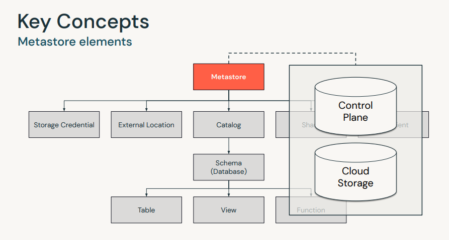
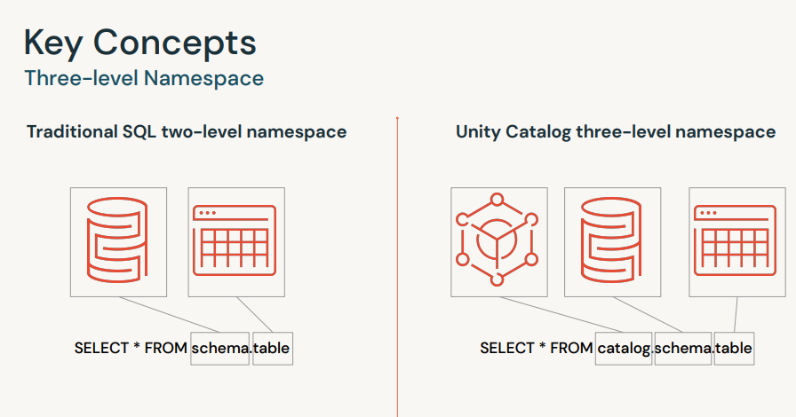
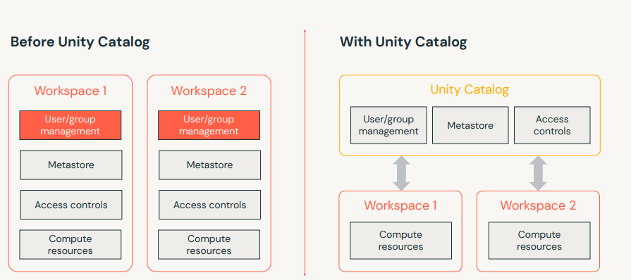
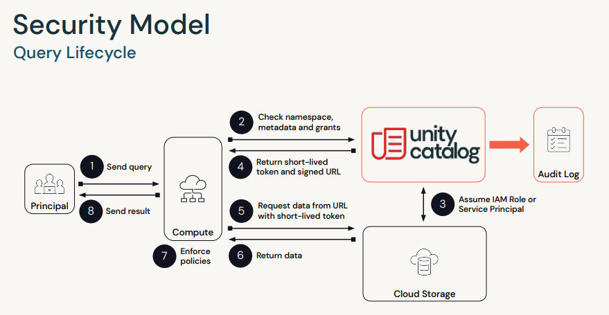
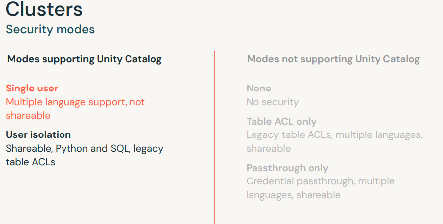
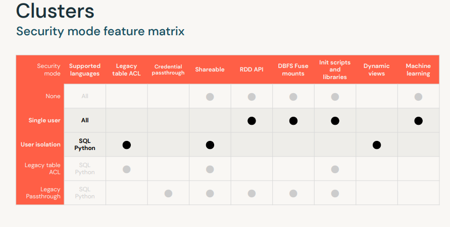
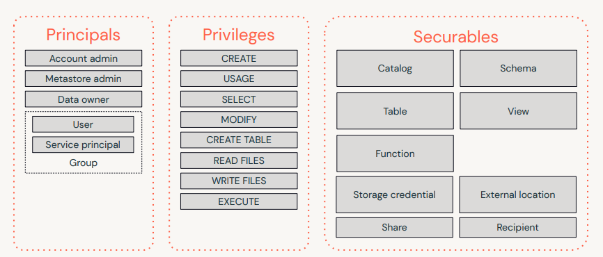
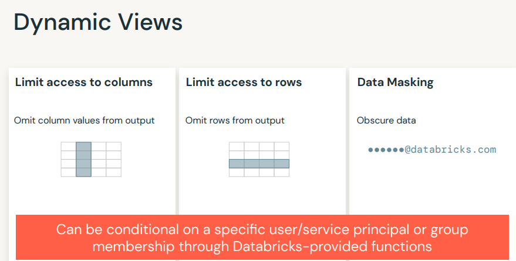
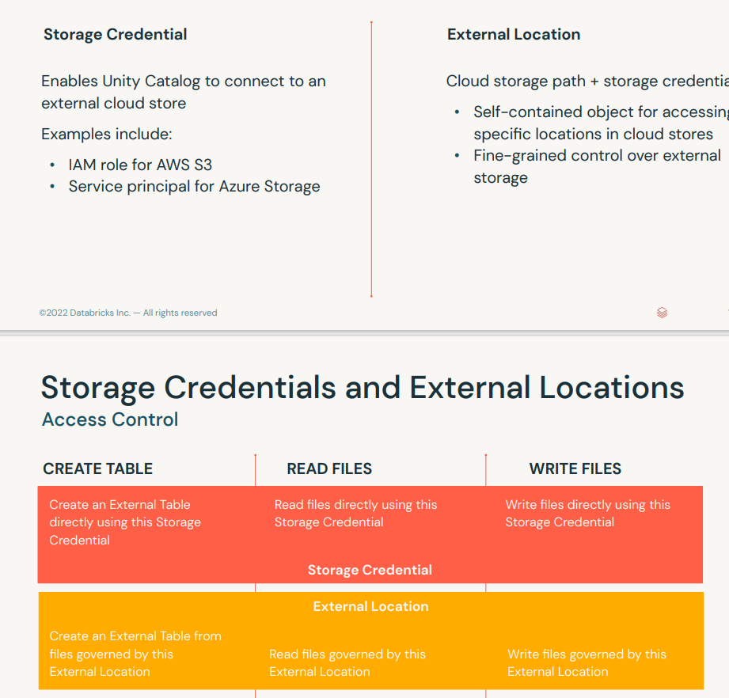

## Get Started with the databricks
-----------------------------------


**Two data engineers are collaborating on one notebook in the same repository. Each is worried that if they work on the notebook at different times, they might overwrite changes that the other has made to the code within the notebook.
Which of the following explains why collaborating in Databricks Notebooks prevents these problems from occurring? Select one response.**

 

&nbsp;&nbsp;&nbsp;&nbsp;Databricks Notebooks supports alerts and audit logs for easy monitoring and troubleshooting, so the data engineers will be alerted when changes are made to their code.  
&nbsp;&nbsp;&nbsp;&nbsp;**Databricks Notebooks supports real-time co-authoring, so the data engineers can work on the same notebook in real-time while tracking changes with detailed revision history.  
&nbsp;&nbsp;&nbsp;&nbsp;Databricks Notebooks are integrated into CI/CD pipelines by default, so the data engineers can work in separate branches without overwriting the other’s work.  
&nbsp;&nbsp;&nbsp;&nbsp;Databricks Notebooks automatically handles schema variations to prevent insertion of bad records during ingestion, so the data engineers will be prevented from overwriting data that does not match the table’s schema.  
&nbsp;&nbsp;&nbsp;&nbsp;Databricks Notebooks enforces serializable isolation levels, so the data engineers will never see inconsistencies in their data.  


**Due to the platform administrator’s policies, a data engineer needs to use a single cluster on one very large batch of files for an ETL workload.
The workload is automated, and the cluster will only be used by one workload at a time. They are part of an organization that wants them to minimize costs when possible.
Which of the following cluster configurations can the team use to satisfy their requirements? Select one response.**

&nbsp;&nbsp;&nbsp;&nbsp;Multi node all-purpose cluster  
&nbsp;&nbsp;&nbsp;&nbsp;Single node all-purpose cluster  
&nbsp;&nbsp;&nbsp;&nbsp;High concurrency all-purpose cluster  
&nbsp;&nbsp;&nbsp;&nbsp;Single node job cluster  
&nbsp;&nbsp;&nbsp;&nbsp;**Multi node job cluster**  


	Explination: First of all we have to analyce the scenarion 
	1)"single cluster requirement" --> workload have to be processed in a single cluster. 
	2)"very Large Batch of Files" --> there is a need to process a considerable amount of data.
	3)Wingle Workload at a Time: Only one ETL job will run on this cluster at any given moment
	4)need to minimice costing

	given that "Multi node job cluster" is the best fit.


**A data engineer wants to stop running a cluster without losing the cluster’s configuration. The data engineer is not an administrator.
Which of the following actions can the data engineer take to satisfy their requirements and why? Select one response.**

 

&nbsp;&nbsp;&nbsp;&nbsp;Delete the cluster; clusters are retained for 60 days after they are deleted.  
&nbsp;&nbsp;&nbsp;&nbsp;Delete the cluster; clusters are retained for 30 days after they are deleted.  
&nbsp;&nbsp;&nbsp;&nbsp;Edit the cluster; clusters can be saved as templates in the cluster configuration page before they are deleted.  
&nbsp;&nbsp;&nbsp;&nbsp;Detach the cluster; clusters are retained for 70 days after they are detached from a notebook.  
&nbsp;&nbsp;&nbsp;&nbsp;**Terminate the cluster; clusters are retained for 30 days after they are terminated.**  


**A data engineer is trying to merge their development branch into the main branch for a data project's repository.
Which of the following is a correct argument for why it is advantageous for the data engineering team to use Databricks Repos to manage their notebooks? Select one response.**

 

&nbsp;&nbsp;&nbsp;&nbsp;Databricks Repos allows integrations with popular tools such as Tableau, Looker, Power BI, and RStudio.  
&nbsp;&nbsp;&nbsp;&nbsp;Databricks Repos provides a centralized, immutable history that cannot be manipulated by users.  
&nbsp;&nbsp;&nbsp;&nbsp;**Databricks Repos REST API enables the integration of data projects into CI/CD pipelines.**
&nbsp;&nbsp;&nbsp;&nbsp;Databricks Repos provides access to available data sets and data sources, on-premises or in the cloud.  
&nbsp;&nbsp;&nbsp;&nbsp;Databricks Repos uses one common security model to access each individual notebook, or a collection of notebooks, and experiments.  


**Which of the following cluster configuration options can be customized at the time of cluster creation? Select all that apply.**

&nbsp;&nbsp;&nbsp;&nbsp;Access permissions
&nbsp;&nbsp;&nbsp;&nbsp;Restart policy
&nbsp;&nbsp;&nbsp;&nbsp;**Maximum number of worker nodes**
&nbsp;&nbsp;&nbsp;&nbsp;**Cluster mode**
&nbsp;&nbsp;&nbsp;&nbsp;**Databricks Runtime Version**


**Three data engineers are collaborating on a project using a Databricks Repo. They are working on the notebook at separate times of the day. 
Which of the following is considered best practice for collaborating in this way? Select one response.**

 

&nbsp;&nbsp;&nbsp;&nbsp;The engineers can set up an alert schedule to notify them when changes have been made to their code.  
&nbsp;&nbsp;&nbsp;&nbsp;The engineers can each design, develop, and trigger their own Git automation pipeline.  
&nbsp;&nbsp;&nbsp;&nbsp;The engineers can each create their own Databricks Repo for development and merge changes into a main repository for production.  
&nbsp;&nbsp;&nbsp;&nbsp;The engineers can use a separate internet-hosting service to develop their code in a single repository before merging their changes into a Databricks Repo.  
&nbsp;&nbsp;&nbsp;&nbsp;**The engineers can each work in their own branch for development to avoid interfering with each other.**  


**A data engineer is creating a multi-node cluster.Which of the following statements describes how workloads will be distributed across this cluster? Select one response.**

 

&nbsp;&nbsp;&nbsp;&nbsp;Workloads are distributed across available worker nodes by the executor.  
&nbsp;&nbsp;&nbsp;&nbsp;**Workloads are distributed across available worker nodes by the driver node.**  
&nbsp;&nbsp;&nbsp;&nbsp;Workloads are distributed across available memory by the executor.  
&nbsp;&nbsp;&nbsp;&nbsp;Workloads are distributed across available driver nodes by the worker node.  
&nbsp;&nbsp;&nbsp;&nbsp;Workloads are distributed across available compute resources by the executor.  


**Which of the following are data objects that can be created in the Databricks Data Science and Engineering workspace? Select two responses.**

&nbsp;&nbsp;&nbsp;&nbsp;Clusters  
&nbsp;&nbsp;&nbsp;&nbsp;SQL Warehouses  
&nbsp;&nbsp;&nbsp;&nbsp;**Tables**  
&nbsp;&nbsp;&nbsp;&nbsp;**Functions**  
&nbsp;&nbsp;&nbsp;&nbsp;MLflow Models  


**A data engineer needs to develop an interactive dashboard that displays the results of a query.
Which of the following services can they employ to accomplish this? Select one response.**

 

&nbsp;&nbsp;&nbsp;&nbsp;Delta Live Tables (DLT)  
&nbsp;&nbsp;&nbsp;&nbsp;Databricks Machine Learning  
&nbsp;&nbsp;&nbsp;&nbsp;Unity Catalog  
&nbsp;&nbsp;&nbsp;&nbsp;**Databricks SQL**  
&nbsp;&nbsp;&nbsp;&nbsp;Delta Lake  


**A data architect is proposing that their organization migrate from a data lake to a data lakehouse. 
The architect claims that this will improve and simplify the work of the data engineering team.
Which of the following describes the key benefits of why migrating from a data lake to a data lakehouse will be beneficial for the data engineering team? Select two responses.**

 

&nbsp;&nbsp;&nbsp;&nbsp;Data lakehouses are able to support cost-effective scaling.
&nbsp;&nbsp;&nbsp;&nbsp;**Data lakehouses are able to support data quality solutions like ACID-compliant transactions.**
&nbsp;&nbsp;&nbsp;&nbsp;Data lakehouses are able to support machine learning workloads.
&nbsp;&nbsp;&nbsp;&nbsp;**Data lakehouses are able to improve query performance by managing metadata and utilizing advanced data partitioning techniques.**
&nbsp;&nbsp;&nbsp;&nbsp;Data lakehouses are able to support programming languages like Python.


**Which of the following correctly lists the programming languages that Databricks Notebooks can have set as the default programming language? Select one response.**

&nbsp;&nbsp;&nbsp;&nbsp;**Python, R, Scala, SQL**  
&nbsp;&nbsp;&nbsp;&nbsp;HTML, Python, R, SQL  
&nbsp;&nbsp;&nbsp;&nbsp;Java, Pandas, Python, SQL  
&nbsp;&nbsp;&nbsp;&nbsp;HTML, Python, R, Scala  
&nbsp;&nbsp;&nbsp;&nbsp;Bash script, Python, Scala, SQL  


**Which of the following resources reside in the control plane of a Databricks deployment? Select two responses.**

&nbsp;&nbsp;&nbsp;&nbsp;**Notebook commands**  
&nbsp;&nbsp;&nbsp;&nbsp;**Job scheduler**  
&nbsp;&nbsp;&nbsp;&nbsp;JDBC and SQL data sources  
&nbsp;&nbsp;&nbsp;&nbsp;Databricks File System (DBFS)  
&nbsp;&nbsp;&nbsp;&nbsp;Job configurations  


**A data engineer has a long-running cluster for an ETL workload. Before the next time the workload runs,
they need to ensure that the image for the compute resources is up-to-date with the latest image version.
Which of the following cluster operations can be used in this situation? Select one response.**


 

&nbsp;&nbsp;&nbsp;&nbsp;Delete  
&nbsp;&nbsp;&nbsp;&nbsp;Start  
&nbsp;&nbsp;&nbsp;&nbsp;Terminate  
&nbsp;&nbsp;&nbsp;&nbsp;**Restart**   
&nbsp;&nbsp;&nbsp;&nbsp;Edit  


**A data engineer needs to run some SQL code within a Python notebook. Which of the following will allow them to do this? Select two responses.**

&nbsp;&nbsp;&nbsp;&nbsp;**They can wrap the SQL command in spark.sql().**  
&nbsp;&nbsp;&nbsp;&nbsp;They can run the import sql statement at the beginning of their notebook.  
&nbsp;&nbsp;&nbsp;&nbsp;**They can use the %sql command at the top of the cell containing SQL code.**  
&nbsp;&nbsp;&nbsp;&nbsp;They can use the %md command at the top of the cell containing SQL code.  
&nbsp;&nbsp;&nbsp;&nbsp;It is not possible to run SQL code from a Python notebook.  


**Which of the following pieces of information must be configured in the user settings of a workspace to integrate a Git service provider with a Databricks Repo? 
Select two responses.**

&nbsp;&nbsp;&nbsp;&nbsp;Administrator credentials for Git service provider account  
&nbsp;&nbsp;&nbsp;&nbsp;**Username for Git service provider account**   
&nbsp;&nbsp;&nbsp;&nbsp;**Personal Access Token**   
&nbsp;&nbsp;&nbsp;&nbsp;Two-factor authentication code from Git service provider  
&nbsp;&nbsp;&nbsp;&nbsp;Workspace Access Token


**A data engineer needs the results of a query contained in the third cell of their notebook.
It has been verified by another engineer that the query runs correctly. However, when they run the cell individually, they notice an error. 
Which of the following steps can the data engineer take to ensure the query runs without error? Select two responses.**

 

&nbsp;&nbsp;&nbsp;&nbsp;**The data engineer can choose “Run all above” from the dropdown menu within the cell.**    
&nbsp;&nbsp;&nbsp;&nbsp;The data engineer can choose “Run all below” from the dropdown menu within the cell.  
&nbsp;&nbsp;&nbsp;&nbsp;The data engineer can clear the execution state before re-executing the cell individually.  
&nbsp;&nbsp;&nbsp;&nbsp;The data engineer can clear all cell outputs before re-executing the cell individually.  
&nbsp;&nbsp;&nbsp;&nbsp;**The data engineer can run the notebook cells in order starting from the first command.**  


**A data engineering team is working on a shared repository. Each member of the team has cloned the target repository and is working in a separate branch.
Which of the following is considered best practice for the team members to commit their changes to the centralized repository? Select one response.**

 

&nbsp;&nbsp;&nbsp;&nbsp;The data engineers can each commit their changes to the main branch using an automated pipeline after a thorough code review by other members of the team.  
&nbsp;&nbsp;&nbsp;&nbsp;The data engineers can each sync their changes with the main branch from the Git terminal, which will automatically commit their changes.  
&nbsp;&nbsp;&nbsp;&nbsp;The data engineers can each call the Databricks Repos API to submit the code changes for review before they are merged into the main branch.
&nbsp;&nbsp;&nbsp;&nbsp;The data engineers can each run a job based on their branch in the Production folder of the shared repository so the changes can be merged into the main branch.  
&nbsp;&nbsp;&nbsp;&nbsp;**The data engineers can each create a pull request to be reviewed by other members of the team before merging the code changes into the main branch.**  


**Which of the following operations are supported by Databricks Repos? Select two responses.**

&nbsp;&nbsp;&nbsp;&nbsp;**Pull**  
&nbsp;&nbsp;&nbsp;&nbsp;Rebase  
&nbsp;&nbsp;&nbsp;&nbsp;**Clone**  
&nbsp;&nbsp;&nbsp;&nbsp;Sync  
&nbsp;&nbsp;&nbsp;&nbsp;Reset  


**A data engineer is working on an ETL pipeline. There are several utility methods needed to run the notebook, and they want to break them down into simpler, reusable components.
Which of the following approaches accomplishes this? Select one response.**

 

&nbsp;&nbsp;&nbsp;&nbsp;Create a separate task for the utility commands and make the notebook dependent on the task from the original notebook’s Directed Acyclic Graph (DAG).  
&nbsp;&nbsp;&nbsp;&nbsp;**Create a separate notebook for the utility commands and use the %run magic command in the original notebook to run the notebook with the utility commands.**  
&nbsp;&nbsp;&nbsp;&nbsp;Create a pipeline for the utility commands and run the pipeline from within the original notebook using the %md magic command.  
&nbsp;&nbsp;&nbsp;&nbsp;Create a separate notebook for the utility commands and use an import statement at the beginning of the original notebook to reference the notebook with the utility commands.  
&nbsp;&nbsp;&nbsp;&nbsp;Create a separate job for the utility commands and run the job from within the original notebook using the %cmd magic command.  


**Which of the following resources reside in the data plane of a Databricks deployment? Select one response.**

&nbsp;&nbsp;&nbsp;&nbsp;Web application  
&nbsp;&nbsp;&nbsp;&nbsp;Job scheduler  
&nbsp;&nbsp;&nbsp;&nbsp;**Databricks File System (DBFS)**  
&nbsp;&nbsp;&nbsp;&nbsp;Notebooks  
&nbsp;&nbsp;&nbsp;&nbsp;Cluster manager  


**Which of the following statements describes how to clear the execution state of a notebook? Select two responses.**

&nbsp;&nbsp;&nbsp;&nbsp;**Use the Clear State option from the Run dropdown menu.**    
&nbsp;&nbsp;&nbsp;&nbsp;Perform a Clean operation from the terminal.  
&nbsp;&nbsp;&nbsp;&nbsp;**Detach and reattach the notebook to a cluster.**    
&nbsp;&nbsp;&nbsp;&nbsp;Perform a Clean operation from the driver logs.  
&nbsp;&nbsp;&nbsp;&nbsp;Perform a Clear State operation from the Spark UI.  


## Transform Data with PySpark
---------------------


Databricks Learning
Skip to Main Content


Search content in the platform
Search content in the platform


11
Home
My Courses and Learning Plans
Data Engineer Learning Plan
Data Engineering with Databricks V3


EB
Sign Out
Enrique Benito Casado
enrique.benito-casado@lhind.dlh.de

Home
My Courses and Learning Plans
Course Catalog
My Activities
My Calendar
My Checklist
Admin Menu
Apps & Features
Welcome to Databricks training!

Transform Data with PySpark - Test your Knowledge
Final Score: 250/250
Single Choice
1)
A data engineer has the following query, where path is a variable that represents the location of a directory.

 

Query:

SELECT * FROM csv.`${path}`;

 

The query loads the contents of a directory of CSV files from a source table to a target table.
The query streams data from a directory of CSV files into a table.
The query displays the underlying file contents of a directory of CSV files.
The query converts a directory of files into CSV format.
The query displays the metadata of a directory of CSV files.
Score: 10.00
Single Choice
2)
A data engineer needs to extract the calendar date and time in human readable format from a DataFrame containing the timestamp column user_last_touch_timestamp.


Which of the following lines of code correctly fills in the blank by adding the column end_date of type date in human readable format? Select one response.

.withColumn(date_format("end_date"), user_last_touch_timestamp, "HH:mm:ss")
.withColumn(date_time("end_date"), user_last_touch_timestamp, "MMM d, yyyy")
.withColumn(date_time("end_date"),user_last_touch_timestamp, "HH:mm:ss")
.withColumn("end_date", CAST(user_last_touch_timestamp) as date_format)
.withColumn("end_date", date_format("user_last_touch_timestamp", "MMM d, yyyy"))
Score: 10.00
Single Choice
3)
A data engineer has a table records with a column email. They want to check if there are null values in the email column. 

 

Which of the following approaches accomplishes this? Select one response.

 

They can check if there is at least one record where email is null by adding a filter for when email IS NULL to a SELECT statement.
They can check if there is at least one record where email is null using SELECT DISTINCT records.
They can check if there is at least one record where email is null by pivoting the table on null values.
They can check if there is at least one record where email is null by running a regular expression function on email to filter out null values.
They can check if there is at least one record where email is null by creating a data expectation to drop null values.
Score: 10.00
Single Choice
4)
A data engineer has created a DataFrame exploded_eventsDF created from the table exploded_events defined here:

 

CREATE TABLE events (user_id string, event_name string, item_id string, events struct<coupon:string, event_id:string, event_revenue:double>);

 

They are using the following code with multiple array transformations to return a new DataFrame that shows the unique collection of the columns event_name and items. 

 

Code block:

 

from pyspark.sql.functions import array_distinct, collect_set, flatten

 

exploded_eventsDF

    .groupby("user_id")

    .agg(collect_set("event_name"),

     _____

 

Which of the following lines of code fills in the blank to create the column event_history as a unique collection of events? Select one response.

 

flatten(collect_set(explode(events:event_id))).alias("event_history")
flatten(array_distinct(events[event_id])).alias("event_history")
array_distinct(flatten(collect_set("events.event_id"))).alias("event_history")
array_distinct(extract(collect_set(events.event_id))).alias("event_history")
flatten(extract(events.event_id)).alias("event_history")
Score: 10.00
Single Choice
5)
A data engineer wants to extract lines as raw strings from a text file. 

 

Which of the following SQL commands accomplishes this task? Select one response.

 

SELECT * FROM `${dbfs:/mnt/datasets}/001.txt` as TEXT;
SELECT * FROM `${dbfs:/mnt/datasets}/001.txt`;
SELECT text(*) FROM ${dbfs:/mnt/datasets}/001.txt`;
SELECT (*) FROM ${dbfs:/mnt/datasets}/001.txt`;
SELECT * FROM text.`${dbfs:/mnt/datasets}/001.txt`;
Score: 10.00
Single Choice
6)
Which of the following commands returns a new DataFrame from the DataFrame usersDF without duplicates? Select one response.

usersDF.select(*)
usersDF.groupBy(nulls)
usersDF.drop()
usersDF.count().dropna()
usersDF.distinct()
Score: 10.00
Multiple Choice
7)
Which of the following lines of code counts null values in the column email from the DataFrame usersDF? Select two responses.

usersDF.drop()
usersDF.selectExpr("count_if(email IS NULL)")
usersDF.distinct()
usersDF.count().dropna()
usersDF.where(col("email").isNull()).count()
Score: 10.00
Single Choice
8)
A data engineer has a DataFrame events_df that has been registered against an external JSON file. The nested JSON fields have already been converted into struct types. The data engineer now needs to flatten the struct fields back into individual columns for the field event_type. The events_df DataFrame has the following schema:

 

date string

month string

event_type StructType<id string, size int>

 

Which of the following approaches allows the data engineer to retrieve id within event_type? Select one response.    

 

They can use . syntax to access id in event_type.
They can use event_type.* to pull out id into its own column.
They can use : syntax to access id in event_type.
They can use from_json() to parse the columns for id.
They can index the DataFrame by id.
Score: 10.00
Single Choice
9)
A data engineer has a query that directly updates the files underlying the external table emails. 

 

Which of the following correctly describes how to retrieve the number of rows in the updated table? Select one response.

 

REFRESH TABLE emails;
SELECT COUNT(*) FROM emails AS OF VERSION 1;
REFRESH TABLE emails;
SELECT DISTINCT_COUNT(*) FROM emails AS OF VERSION 1;
REFRESH TABLE emails;
SELECT COUNT(*) FROM emails WHEN UPDATED = TRUE;
REFRESH TABLE emails;
SELECT COUNT(*) FROM emails;
REFRESH TABLE emails;
SELECT DISTINCT_COUNT(*) FROM emails;
Score: 10.00
Single Choice
10)
A data engineer is using the following code block to create and register a function that returns the first letter of the string email. Another data engineer points out that there is a more efficient way to do this.

Code block:

from pyspark.sql.functions import udf

 

@udf("string")

def first_letter_function(email: str) -> str:

    return email[0]

 

first_letter_udf = spark.udf.register("sql_udf", first_letter_function)

 

Which of the following identifies how the data engineer can eliminate redundancies in the code? Select one response. 

 

They can eliminate the return statement at the end of the function.
They can eliminate the statement that registers the function.
They can eliminate the parameters in the function declaration.
They can eliminate the import statement in the beginning of the code block.
They can eliminate "sql_udf" from the statement that registers the function.
Score: 10.00
Single Choice
11)
A data engineer needs to query a JSON file whose location is represented by the variable path.

 

Which of the following commands do they need to use? Select one response.

 

SHOW TABLE json.`${path}`;
SELECT * FROM path LOCATION `${path}`;
DISPLAY TABLE json.`${path}`;
RETURN json.`${path}`;
SELECT * FROM json.`${path}`;
Score: 10.00
Single Choice
12)
A data engineer has a DataFrame with string column email_address. They are using a regular expression that returns a string with a matching pattern when it is in the following format: 

user.address@domain.com

Which of the following lines of code creates a new column domain that contains the domain from the email_address column? Select one response. 

 

.withColumn("domain", regexp_extract("email_address", "(?<=@).+", 0))
.withColumn("domain", collect_set("email_address", "(?<=@).+", 0))
.withColumn("domain", flatten("email_address", "(?<=@).+", 0))
.withColumn("domain", array_distinct("email_address", "(?<=@).+", 0))
Score: 10.00
Single Choice
13)
A data engineer has a table high_temps with the following schema, where avg_high_temp represents the monthly average high temperatures for each unique year-month combination. 

 

year string

month string

avg_high_temp string

 

They need to reformat the data with years as the primary record key and months as the columns. The existing average high temperature value for each year-month combination needs to be in the month columns. 

 

How can the data engineer accomplish this? Select one response.

 

The data engineer can rotate the data from wide to long format using the .pivot() function.
The data engineer can rotate the data from long to wide format using the .transform()clause.
The data engineer can rotate the data from wide to long format using the .transform() clause.
The data engineer can rotate the data from long to wide format using the .pivot() function.
The data engineer can rotate the data from long to wide format using the .groupBy()clause.
Score: 10.00
Single Choice
14)
A data engineer has a DataFrame events_df that has been registered against an external JSON file.  They need to access the field date within events_df. The events_df DataFrame has the following schema:

 

date string

month string

event_type string

 

Which of the following approaches can the data engineer use to accomplish this? Select one response.    

 

They can index the query by subfield using events[date] syntax.
They can use date.* to pull out the subfields of events_df into their own columns.
They can use . syntax to access date in events_df.
They can use : syntax to access date in events_df.
They can use from_json() to parse the column for date.
Score: 10.00
Single Choice
15)
Which of the following statements about querying tables defined against external sources is true? Select one response.

 

When defining tables or queries against external data sources, the storage path, external location, and storage credential are displayed for users who have been granted USAGE access to the table.
When defining tables or queries against external data sources, the performance guarantees associated with Delta Lake and Lakehouse cannot be guaranteed.
None of these statements about external table behavior are true.
When defining tables or queries against external data sources, older cached versions of the table are automatically deleted.
When defining tables or queries against external data sources, older cached versions of the table are automatically added to the event log.
Score: 10.00
Multiple Choice
16)
Which of the following statements about the difference between views and temporary views are correct? Select two responses.

Temporary views reside in the third layer of Unity Catalog’s three-level namespace Views lie in the metastore.
Temporary views have names that must be qualified. Views have names that must be unique.
Temporary views do not contain a preserved schema. Views are tied to a system preserved temporary schema global_temp.
Temporary views are session-scoped and dropped when the Spark session ends. Views can be accessed after the session ends.
Temporary views skip persisting the definition in the underlying metastore. Views have metadata that can be accessed in the view’s directory.
Score: 10.00
Single Choice
17)
A data engineer needs a reference to the results of a query that can be referenced across multiple queries within the scope of the environment session. The data engineer does not want the reference to exist outside of the scope of the environment session.

 

Which of the following approaches accomplishes this without explicitly dropping the data object? Select one response. 

 

They can store the results of their query within a common table expression (CTE).
They can store the results of their query within a table.
They can store the results of their query within a reusable user-defined function (UDF).
They can store the results of their query within a view.
They can store the results of their query within a temporary view.
Score: 10.00
Single Choice
18)
A data engineer is using the following query to confirm that each unique string value in the phone_number column in the usersDF DataFrame is associated with at most one user_id. They want the query to return true if each phone_number is associated with at most 1 user_id. When they run the query, they notice that the query is not returning the expected result. 

 

Code block:

from pyspark.sql.functions import countDistinct

 

usersDF

    .groupBy("phone_number")

    .agg(countDistinct("user_id").alias("unique_user_ids")) 

 

Which of the following explains why the query is not returning the expected result? Select one response.

 

A .dropDuplicates() statement needs to be added after the .agg() function.
A .merge statement on row_count == count(phone_number) needs to be added after the groupBy() function.
A .select(max("unique_user_ids") <= 1)function needs to be added after the .agg() function.
.groupBy("phone_number") needs to be changed to count(*).when(user_id != null).
.groupBy("phone_number") needs to be changed to .countDistinct(phone_number).
Score: 10.00
Single Choice
19)
A data engineer is registering a table in Databricks using the table users from an external SQL database. One of their colleagues gives them the following code to register the table. However, when the data engineer runs the code, they notice an error.

 

Code block:

CREATE TABLE users_jdbc
USING JDBC
OPTIONS (
  url = "jdbc:sqlite:${DA.paths.ecommerce_db}"
)

 

Which of the following correctly identifies why running the code is resulting in an error? Select one response.

A username and password need to be added to OPTIONS.
The line dbtable = "users" needs to be added to OPTIONS.
USING JDBC needs to be changed to USING SQL.
CREATE TABLE needs to be changed to CREATE JDBC TABLE.
None of these responses correctly identify the cause of the error.
Score: 10.00
Single Choice
20)
A data engineer has created the following Spark DataFrame sales_df that joins the previously created table sales with the Spark DataFrame items_df when sales and items_df have matching values in the sales_id column in both data objects. 

 

Code block:

 

sales_df = (spark

    .table("sales")

    .withColumn("item", explode("items"))

)

 

items_df = spark.table("item_lookup")

 

item_purchasesDF = (sales_df

   ______________________)

 

Which of the following lines of code correctly fills in the blank? Select one response.

 

.innerJoin(items_df, sales_df.sales_id == items_df.sales_id)
.merge(items_df, sales_df, on = "item_id")
.join(items_df, sales_df.sales_id == items_df.sales_id)
.outerJoin(items_df, sales.sales_id == items_df.sales_id)
.join(items_df, sales.sales_id == items_df.sales_id, how = "cross")
Score: 10.00

BACK TO RESULTS
Data Engineering with Databricks V3
ID: E-VR287169 / 69 lessons completed

DOWNLOAD YOUR CERTIFICATE
How would you rate this course? 4
Welcome to the Course
3 / 3
Get Started with Databricks Data Science and Engineering Workspace
9 / 9
Transform Data with Spark
10 / 10
Data Objects in the Lakehouse
Video
Lecture
Query Files Directly
Video
Demo
Providing Options for External Sources
Video
Demo
DE 2.3L - extract data lab
Video
Cleaning Data
Video
Demo
Complex Transformations
Video
Demo
DE 2.6L - reshape data lab
Video
SQL User-Defined Functions
Video
Demo
Python User-Defined Functions
Video
Demo
Transform Data with PySpark - Test your Knowledge
Test
Manage Data with Delta Lake
6 / 6
Build Data Pipelines with Delta Live Tables
13 / 13
Deploy Workloads with Databricks Workflows
5 / 5
Manage Data Access with Unity Catalog
22 / 22
Course Summary and Next Steps
Lesson

Course Description
Welcome to Data Engineering with Databricks V3.


This course prepares data professionals to leverage the Databricks Lakehouse Platform to productionalize ETL pipelines. Students will use Delta Live Tables to define and schedule pipelines that incrementally process new data from a variety of data sources into the Lakehouse. Students will also orchestrate tasks with Databricks Workflows and promote code with Databricks Repos.


Learning objectives
Use the Databricks Data Science and Engineering Workspace to perform common code development tasks in a data engineering workflow.
Use Spark SQL or PySpark to extract data from a variety of sources, apply common cleaning transformations, and manipulate complex data with advanced functions.
Define and schedule data pipelines that incrementally ingest and process data through multiple tables in the lakehouse using Delta Live Tables in Spark SQL or Python.
Orchestrate data pipelines with Databricks Workflow Jobs and schedule dashboard updates to keep analytics up-to-date.
Configure permissions in Unity Catalog to ensure that users have proper access to databases for analytics and dashboarding. 

Prerequisites
Prerequisites for both versions of this course (Spark SQL and PySpark):

Beginner familiarity with cloud computing concepts (virtual machines, object storage, etc.)
Production experience working with data warehouses and data lakes
Familiarity with basic SQL concepts (select, filter, groupby, join, etc)


Additional prerequisites for the Python version of this course (PySpark):

Beginner programming experience with Python (syntax, conditions, loops, functions)
Beginner programming experience with the Spark DataFrame API:
Configure DataFrameReader and DataFrameWriter to read and write data
Express query transformations using DataFrame methods and Column expressions
Navigate the Spark documentation to identify built-in functions for various transformations and data types


The PySpark programming skills required for the Python version of this course can be learned by taking the Get Started with PySpark Programming course by Databricks Academy.


Last course update
August 2023
 

Learning Plan

Data Engineer Learning Plan
20% progress66h 9m / 25h 2m
2023 © Databricks, Inc. All Rights Reserved | Support | Privacy Notice (Updated) | Terms of Use | Your Privacy Choices | Your California Privacy Rights 

## Theorie


**A data engineer wants to extract lines as raw strings from a text file. Which of the following SQL commands accomplishes this task? Select one response.**

```
SELECT text(*) FROM ${dbfs:/mnt/datasets}/001.txt`;
SELECT * FROM `${dbfs:/mnt/datasets}/001.txt` as TEXT;
SELECT (*) FROM ${dbfs:/mnt/datasets}/001.txt`;
SELECT * FROM `${dbfs:/mnt/datasets}/001.txt`;
SELECT * FROM text.`${dbfs:/mnt/datasets}/001.txt`;  --> the correct one

```

**A data engineer has the following query, where path is a variable that represents the location of a directory.**


Query:

```
SELECT * FROM csv.`${path}`;
```
 

&nbsp;&nbsp;&nbsp;&nbsp;The query converts a directory of files into CSV format.  
&nbsp;&nbsp;&nbsp;&nbsp;The query displays the underlying file contents of a directory of CSV files.  
&nbsp;&nbsp;&nbsp;&nbsp;**The query displays the metadata of a directory of CSV files.**  
&nbsp;&nbsp;&nbsp;&nbsp;The query streams data from a directory of CSV files into a table.  
&nbsp;&nbsp;&nbsp;&nbsp;The query loads the contents of a directory of CSV files from a source table to a target table.  


**Which of the following commands returns a new DataFrame from the DataFrame usersDF without duplicates? Select one response.**

&nbsp;&nbsp;&nbsp;&nbsp;usersDF.drop()    
&nbsp;&nbsp;&nbsp;&nbsp;**usersDF.distinct()**   
&nbsp;&nbsp;&nbsp;&nbsp;usersDF.groupBy(nulls)  
&nbsp;&nbsp;&nbsp;&nbsp;usersDF.select(*)  
&nbsp;&nbsp;&nbsp;&nbsp;usersDF.count().dropna()  


**A data engineer needs to create and register a user-defined function (UDF) CREATE_USER using the Python function createUser and apply
it to array column username in the table users.They have the following lines of code.**

```
spark.sql("SELECT createUser(username) AS user FROM users") 
spark.sql("SELECT CREATE_USER(username) AS user FROM users") -->solution
spark.udf.register("CREATE_USER", createUser) --> solution
spark.udf.register(createUser(username)) 
```


**Which of the following statements about querying tables defined against external sources is true? Select one response.**

 
&nbsp;&nbsp;&nbsp;&nbsp;When defining tables or queries against external data sources, older cached versions of the table are automatically added to the event log.
&nbsp;&nbsp;&nbsp;&nbsp;When defining tables or queries against external data sources, older cached versions of the table are automatically deleted.
&nbsp;&nbsp;&nbsp;&nbsp;None of these statements about external table behavior are true.
&nbsp;&nbsp;&nbsp;&nbsp;When defining tables or queries against external data sources, the storage path, external location, and storage credential are displayed for users who have been granted USAGE access to the table.
&nbsp;&nbsp;&nbsp;&nbsp;**When defining tables or queries against external data sources, the performance guarantees associated with Delta Lake and Lakehouse cannot be guaranteed.**
&nbsp;&nbsp;&nbsp;&nbsp;*Explination: External data sources can vary in their performance characteristics, and the optimizations present in solutions like Delta Lake may not apply when reading from these sources.
Delta Lake and Lakehouse provide certain optimizations and ACID (Atomicity, Consistency, Isolation, Durability) guarantees for data that is stored and managed within them.*


**A data engineer is using the following code block to create a table using an external CSV file as its source.
They need to specify that the fields are separated by | and that there is a header.**

 

```
CREATE TABLE IF NOT EXISTS sales_csv

  (order_id LONG, email STRING, transactions_timestamp LONG, total_item_quantity INTEGER, purchase_revenue_in_usd DOUBLE, unique_items INTEGER, items STRING)

USING CSV

_____

LOCATION "${dbfs:/mnt/datasets}"

 ```

Which of the following correctly fills in the blank for the table options? Select one response.

```

OPTIONS (
  header = "true",
  delimiter = "|"
) --> the correct one

KEYS (
header = "true",
delimiter = "|"
)
COMMENTS (
header = "true",
delimiter = "|"
)
VALUES (
header = "true",
delimiter = "|"
)
TBLPROPERTIES (
header = "true",
delimiter = "|"
)
```


**Which of the following statements about the difference between views and temporary views are correct? Select two responses.**

&nbsp;&nbsp;&nbsp;&nbsp;Temporary views do not contain a preserved schema. Views are tied to a system preserved temporary schema global_temp.   
&nbsp;&nbsp;&nbsp;&nbsp;**Temporary views skip persisting the definition in the underlying metastore. Views have metadata that can be accessed in the view’s directory.**  
&nbsp;&nbsp;&nbsp;&nbsp;Temporary views reside in the third layer of Unity Catalog’s three-level namespace Views lie in the metastore.  
&nbsp;&nbsp;&nbsp;&nbsp;**Temporary views are session-scoped and dropped when the Spark session ends. Views can be accessed after the session ends.**  
&nbsp;&nbsp;&nbsp;&nbsp;Temporary views have names that must be qualified. Views have names that must be unique.  

**Which of the following lines of code counts null values in the column email from the DataFrame usersDF? Select two responses.**

```
usersDF.distinct()
usersDF.where(col("email").isNull()).count()
usersDF.drop()
usersDF.count().dropna()
usersDF.selectExpr("count_if(email IS NULL)")
```
**Answer**

```
usersDF.where(col("email").isNull()).count()
usersDF.selectExpr("count_if(email IS NULL)")
```

´**A data engineer needs to extract the calendar date and time in human readable format from a DataFrame containing the timestamp column user_last_touch_timestamp.
Which of the following lines of code correctly fills in the blank by adding the column end_date of type date in human readable format? Select one response.**

*1 clue: The type have to be date so it means HH:mm:ss can not be as ist not data but hour*

```
.withColumn("end_date", CAST(user_last_touch_timestamp) as date_format)
.withColumn(date_time("end_date"),user_last_touch_timestamp, "HH:mm:ss")
.withColumn(date_format("end_date"), user_last_touch_timestamp, "HH:mm:ss")
.withColumn(date_time("end_date"), user_last_touch_timestamp, "MMM d, yyyy")
.withColumn("end_date", date_format("user_last_touch_timestamp", "MMM d, yyyy"))  --> Correct one
```


**A data engineer has a table records with a column email. They want to check if there are null values in the email column.
Which of the following approaches accomplishes this? Select one response.**

 

&nbsp;&nbsp;&nbsp;&nbsp;They can check if there is at least one record where email is null by creating a data expectation to drop null values.  
&nbsp;&nbsp;&nbsp;&nbsp;They can check if there is at least one record where email is null using SELECT DISTINCT records.  
&nbsp;&nbsp;&nbsp;&nbsp;They can check if there is at least one record where email is null by pivoting the table on null values.  
&nbsp;&nbsp;&nbsp;&nbsp;**They can check if there is at least one record where email is null by adding a filter for when email IS NULL to a SELECT statement.**  
&nbsp;&nbsp;&nbsp;&nbsp;They can check if there is at least one record where email is null by running a regular expression function on email to filter out null values.  


**A data engineer is registering a table in Databricks using the table users from an external SQL database. 
One of their colleagues gives them the following code to register the table. However, when the data engineer runs the code, they notice an error.**

 

```

CREATE TABLE users_jdbc
USING JDBC
OPTIONS (
  url = "jdbc:sqlite:${DA.paths.ecommerce_db}"
)
```

Which of the following correctly identifies why running the code is resulting in an error? Select one response.

&nbsp;&nbsp;&nbsp;&nbsp;USING JDBC needs to be changed to USING SQL    
&nbsp;&nbsp;&nbsp;&nbsp;None of these responses correctly identify the cause of the error.  
&nbsp;&nbsp;&nbsp;&nbsp;CREATE TABLE needs to be changed to CREATE JDBC TABLE.  
&nbsp;&nbsp;&nbsp;&nbsp;**The line dbtable = "users" needs to be added to OPTIONS.**  
&nbsp;&nbsp;&nbsp;&nbsp;A username and password need to be added to OPTIONS.  
 

**A data engineer has created a DataFrame exploded_eventsDF created from the table exploded_events defined here: 
They are using the following code with multiple array transformations to return a new DataFrame that shows the unique collection of the columns event_name and items.**

 
```
CREATE TABLE events (user_id string, event_name string, item_id string, events struct<coupon:string, event_id:string, event_revenue:double>);
 
from pyspark.sql.functions import array_distinct, collect_set, flatten

exploded_eventsDF

    .groupby("user_id")

    .agg(collect_set("event_name"),

     _____

```


Which of the following lines of code fills in the blank to create the column event_history as a unique collection of events? Select one response.

 

&nbsp;&nbsp;&nbsp;&nbsp;**array_distinct(flatten(collect_set("events.event_id"))).alias("event_history")**  
&nbsp;&nbsp;&nbsp;&nbsp;flatten(array_distinct(events[event_id])).alias("event_history")  
&nbsp;&nbsp;&nbsp;&nbsp;flatten(collect_set(explode(events:event_id))).alias("event_history")  
&nbsp;&nbsp;&nbsp;&nbsp;array_distinct(extract(collect_set(events.event_id))).alias("event_history")  
&nbsp;&nbsp;&nbsp;&nbsp;flatten(extract(events.event_id)).alias("event_history")  


	Explanation:The collect_set function is used to collect unique values of a column into a set.
	The flatten function is used to convert an array of arrays into a single array.
	The array_distinct function ensures the resulting array has only unique values


**A data engineer needs to query a JSON file whose location is represented by the variable path.  Which of the following commands do they need to use? Select one response.**

 

&nbsp;&nbsp;&nbsp;&nbsp;RETURN json.`${path}`;  
&nbsp;&nbsp;&nbsp;&nbsp;**SELECT * FROM json.`${path}`;**
&nbsp;&nbsp;&nbsp;&nbsp;SELECT * FROM path LOCATION `${path}`;   
&nbsp;&nbsp;&nbsp;&nbsp;DISPLAY TABLE json.`${path}`;  
&nbsp;&nbsp;&nbsp;&nbsp;SHOW TABLE json.`${path}`  ;

# COMMAND ----------

%md
##### 14 A senior data engineer has registered the Python function create_users to be used by the rest of their team. They have written the function in Python 3.6. Another data engineer wants to know what the expected inputs are. 

Which of the following is considered a best practice to do this? Select one response.


**The data engineer can use type hints to clarify the input and return types of the function.**  

The data engineer can add the input and output types to the table using @options()   

The data engineer can add a return string line to the end of their UDF to specify the input and return types of the function.  

The data engineer can add a comment to the table properties to clarify the input and return types of the function.  

The data engineer can declare the function with @udf("string") syntax to specify the input and return types of the function.  

*Example*

```
def create_users(user_id: int, user_name: str) -> User:
    ...
```

# COMMAND ----------

%md
##### 15 A data engineer needs a reference to the results of a query that can be referenced across multiple queries within the scope of the environment session. The data engineer does not want the reference to exist outside of the scope of the environment session.

 

Which of the following approaches accomplishes this without explicitly dropping the data object? Select one response. 

 

They can store the results of their query within a common table expression (CTE).  
**They can store the results of their query within a view.**  
They can store the results of their query within a table.  
They can store the results of their query within a reusable user-defined function (UDF).  
They can store the results of their query within a temporary view.  

# COMMAND ----------

%md
###### 16- A data engineer has a DataFrame with string column email_address. They are using a regular expression that returns a string with a matching pattern when it is in the following format: 

user.address@domain.com

Which of the following lines of code creates a new column domain that contains the domain from the email_address column? Select one response. 

 

**.withColumn("domain", regexp_extract("email_address", "(?<=@).+", 0))**  
.withColumn("domain", flatten("email_address", "(?<=@).+", 0))  
.withColumn("domain", array_distinct("email_address", "(?<=@).+", 0))  
.withColumn("domain", collect_set("email_address", "(?<=@).+", 0))   

# COMMAND ----------

%md
##### 17-A data engineer has a query that directly updates the files underlying the external table emails. 


Which of the following correctly describes how to retrieve the number of rows in the updated table? Select one response.

 
```
REFRESH TABLE emails;
SELECT DISTINCT_COUNT(*) FROM emails;

REFRESH TABLE emails;
SELECT COUNT(*) FROM emails AS OF VERSION 1;

REFRESH TABLE emails;
SELECT DISTINCT_COUNT(*) FROM emails AS OF VERSION 1;

REFRESH TABLE emails;
SELECT COUNT(*) FROM emails;

REFRESH TABLE emails;
SELECT COUNT(*) FROM emails WHEN UPDATED = TRUE;
```


# COMMAND ----------

%md
##### 18 - A data engineer has a table high_temps with the following schema, where avg_high_temp represents the monthly average high temperatures for each unique year-month combination. 

 

year string

month string

avg_high_temp string

 

They need to reformat the data with years as the primary record key and months as the columns. The existing average high temperature value for each year-month combination needs to be in the month columns. 

 

How can the data engineer accomplish this? Select one response.

 

The data engineer can rotate the data from wide to long format using the .pivot() function.  
The data engineer can rotate the data from wide to long format using the .transform() clause.  
The data engineer can rotate the data from long to wide format using the .pivot() function.  
**The data engineer can rotate the data from long to wide format using the .groupBy()clause.**
The data engineer can rotate the data from long to wide format using the .transform()clause.  

# COMMAND ----------

%md 
#### 19-A data engineer is using the following query to confirm that each unique string value in the phone_number column in the usersDF DataFrame is associated with at most one user_id. They want the query to return true if each phone_number is associated with at most 1 user_id. When they run the query, they notice that the query is not returning the expected result. 

 

```
from pyspark.sql.functions import countDistinct


usersDF

    .groupBy("phone_number")

    .agg(countDistinct("user_id").alias("unique_user_ids")) 

```

Which of the following explains why the query is not returning the expected result? Select one response.

```
A .select(max("unique_user_ids") <= 1)function needs to be added after the .agg() function.
.groupBy("phone_number") needs to be changed to .countDistinct(phone_number).
.groupBy("phone_number") needs to be changed to count(*).when(user_id != null).
A .merge statement on row_count == count(phone_number) needs to be added after the groupBy() function.
A .dropDuplicates() statement needs to be added after the .agg() function.
```

**Solution**

```
from pyspark.sql.functions import countDistinct, max

result = (usersDF
          .groupBy("phone_number")
          .agg(countDistinct("user_id").alias("unique_user_ids"))
          .select(max("unique_user_ids").alias("max_unique_user_ids"))
          .collect()[0]["max_unique_user_ids"] <= 1)

```


# COMMAND ----------

%md
#### 20 A data engineer has a DataFrame events_df that has been registered against an external JSON file. The nested JSON fields have already been converted into struct types. The data engineer now needs to flatten the struct fields back into individual columns for the field event_type. The events_df DataFrame has the following schema:

 

date string
month string
event_type StructType<id string, size int>

Which of the following approaches allows the data engineer to retrieve id within event_type? Select one response.    

 


They can use event_type.* to pull out id into its own column.

They can index the DataFrame by id.

They can use from_json() to parse the columns for id.

They can use . syntax to access id in event_type.

**They can use : syntax to access id in event_type.**


Let's say your DataFrame has a single column data containing raw JSON strings:

json
```
{"name": "John", "address": {"city": "NY"}}
{"name": "Jane", "address": {"city": "LA"}}
```

To extract the name field from the raw JSON strings using SQL-like syntax, you might do something like:

`SELECT data:name AS extracted_name FROM table`

However, if you've already parsed the JSON and it's in a StructType, then you'd use the dot . syntax:

`df.select("address.city")`

Given your original question, where you have the date field in the DataFrame's schema and it's not a subfield within a JSON string, you wouldn't typically use the : syntax. But now that you've provided the context about the : syntax being used to access subfields in raw JSON strings, it's clearer. In your specific scenario, the dot . syntax would still be appropriate for accessing the date column since it's not a subfield within a raw JSON string.


# COMMAND ----------

%md
##### 21 A data engineer has a DataFrame events_df that has been registered against an external JSON file. The nested JSON fields have already been converted into struct types. The data engineer now needs to flatten the struct fields back into individual columns for the field event_type. The events_df DataFrame has the following schema:

 

date string
month string
event_type StructType<id string, size int>

 

Which of the following approaches allows the data engineer to retrieve id within event_type? Select one response.    

 

They can use event_type.* to pull out id into its own column.  
They can index the DataFrame by id.  
They can use from_json() to parse the columns for id.  
**They can use . syntax to access id in event_type.**  
They can use : syntax to access id in event_ty  


In this case the importan thing here is <span style="color: red">The nested JSON fields have already been converted into struct types</span>
that is the difference between `.` and `:`


# COMMAND ----------

%md
#### A data engineer has created the following Spark DataFrame sales_df that joins the previously created table sales with the Spark DataFrame items_df when sales and items_df have matching values in the sales_id column in both data objects. 

```
sales_df = (spark

    .table("sales")

    .withColumn("item", explode("items"))

)

items_df = spark.table("item_lookup")
item_purchasesDF = (sales_df

   ______________________)
```

Which of the following lines of code correctly fills in the blank? Select one response.

 
```
.outerJoin(items_df, sales.sales_id == items_df.sales_id)
.merge(items_df, sales_df, on = "item_id")
.innerJoin(items_df, sales_df.sales_id == items_df.sales_id)
.join(items_df, sales.sales_id == items_df.sales_id) -- > the correct one
.join(items_df, sales.sales_id == items_df.sales_id, how = "cross")
```

# COMMAND ----------

%md

##### 23
A data engineer has created a custom Python function that returns an input variable of type double after it has been incremented by 1.  

 

Which of the following identifies the most efficient type of UDF the engineer can use in terms of complexity, as well as the correct method to specify the type of UDF? Select one response.

The data engineer can specify that the UDF has row-at-a-time execution using @pandas_udf("double", PandasUDFType.VECTORIZED) syntax.  
The data engineer can specify that the UDF is vectorized using @pandas_udf("double", PandasUDFType.VECTORIZED) syntax.  
The data engineer can specify that the UDF has row-at-a-time execution using @pandas_udf("double", PandasUDFType.SCALAR) syntax.  
**The data engineer can specify that the UDF is vectorized using @pandas_udf("double", PandasUDFType.SCALAR) syntax.  **
The data engineer can specify that the UDF is vectorized using type hints.


# COMMAND ----------

%md
##### 24Which of the following identifies a performance challenge associated with Python UDFs? Select three responses

**Python UDFs have to deserialize row data from Spark's native binary format to pass to the UDF, and the results are serialized back into Spark's native format.**
*This is true. When a Python UDF is called, Spark's native format has to be transformed into a format Python can understand. Once the function is processed, the result needs to be converted back into Spark's format. This serialization and deserialization process can be quite costly in terms of performance.*

Python UDFs cannot contain column aggregations or data optimizations.  
*False*  

Python UDFs cannot use vector or scalar transformations.    
*False*  

**Python UDFs have interprocess communication overhead between the executor and a Python interpreter running on each worker node.**  
*True: True. For each partition of data, a Python process is started on the worker node, and there's overhead associated with this interprocess communication*  

**Python UDFs cannot be optimized by the Catalyst Optimizer**
*This is true. The Catalyst Optimizer, which is Spark's internal optimization engine, can't optimize Python UDFs because the UDF's operations are a black box to it. The optimizer can handle built-in Spark functions but not custom Python UDFs.*

# COMMAND ----------

%sql
--A data engineer has a query that directly updates the files underlying the external table emails. 
--Which of the following correctly describes how to retrieve the number of rows in the updated table? Select one response.


REFRESH TABLE emails;
SELECT DISTINCT_COUNT(*) FROM emails AS OF VERSION 1; -- using version 1 would give me the origian

REFRESH TABLE emails;
SELECT COUNT(*) FROM emails WHEN UPDATED = TRUE;  -- doest exist

REFRESH TABLE emails;
SELECT COUNT(*) FROM emails;  -- correct one

REFRESH TABLE emails;
SELECT DISTINCT_COUNT(*) FROM emails; -- disticnt count

REFRESH TABLE emails;
SELECT COUNT(*) FROM emails AS OF VERSION 1; -- This is trying to count rows of the table's version 1. If the table has been updated since then, it won't give the count for the updated table

# COMMAND ----------

A senior data engineer has registered the Python function create_users to be used by the rest of their team. They have written the function in Python 3.6. Another data engineer wants to know what the expected inputs are. 

Which of the following is considered a best practice to do this? Select one response.

 


The data engineer can declare the function with @udf("string") syntax to specify the input and return types of the function.

The data engineer can use type hints to clarify the input and return types of the function.

The data engineer can add a comment to the table properties to clarify the input and return types of the function.

The data engineer can add a return string line to the end of their UDF to specify the input and return types of the function.

The data engineer can add the input and output types to the table using @options()


# COMMAND ----------

%md
#### Extra  -  What kind of UDF functions do you know

`@udf` and `@pandas_udf`

**Performance and Internal Workings:**

`@udf`: This is the basic UDF in Spark, which works row-at-a-time. For each row, the UDF function is invoked, which can lead to a significant performance overhead, especially when using Python, because of serialization and deserialization between the JVM and the Python interpreter for every row.

`@pandas_udf`: Introduced in Spark 2.3, this UDF leverages the power of the Pandas library to perform operations on data in a vectorized manner (i.e., column-wise operations rather than row-wise). This means that instead of working on individual rows, it operates on a column or a batch of rows as Pandas Series. This reduces the serialization/deserialization overhead, leading to a huge performance boost.


**Function Argument and Return Types:**

`@udf`: The function decorated with @udf takes individual rows (typically as tuples) and returns individual values.

`@pandas_udf`: The function decorated with @pandas_udf takes one or more Pandas Series (for each input column) and returns a Pandas Series.

**Use Cases:**

`@udf`: General-purpose UDF, applicable for a wide range of scenarios where you want to apply a custom transformation at the row level.

`@pandas_udf`: Ideal for more complex operations that can benefit from Pandas functionalities, like operations on time series data, operations requiring window functions, etc.

**Syntax:**

`@udf:` You can specify the return type, e.g., @udf(StringType()).

`@pandas_udf:` You need to specify the type for the entire column being returned, e.g., @pandas_udf("string").

**Optimization:**

`@udf:` Cannot leverage the Catalyst optimizer fully since operations inside the UDF are a black box to Spark.

`@pandas_udf:` While still not as optimizable as native Spark functions, the vectorized nature of Pandas UDFs offers more optimization opportunities.

**Important to note**

`Native Spark Operations vs. UDFs:`

Native Spark operations (those that are built into Spark itself) are always preferred when dealing with large-scale data processing tasks in Spark. This is because these operations can be fully optimized by Spark's Catalyst optimizer.

UDFs (whether @udf or @pandas_udf) are essentially black boxes to the Catalyst optimizer, so they don't get the same level of optimization. Using UDFs can lead to suboptimal execution plans.

`@udf vs. @pandas_udf:`

If you do need custom functionality that isn't provided by native Spark functions, and you have to resort to UDFs, then between the two, @pandas_udf is often the more performant choice due to its vectorized nature.

However, note that @pandas_udf still can't match the optimization level of native Spark functions. It's just typically faster than the row-at-a-time @udf.

`When to use UDFs:`

Only use UDFs if you have functionality that cannot be achieved using native Spark functions.
If you must use a UDF, try to use @pandas_udf over the regular @udf if possible, and if you're familiar with Pandas.
If your operation is complex and cannot be vectorized easily, or if it involves functionality that Pandas doesn't support, then you might still need to use the traditional @udf.

`Spark's Ecosystem and Pandas:`

While Pandas is a powerful library, it's designed for single-node, in-memory compute. When you use @pandas_udf, Spark takes a chunk of rows, converts them to a Pandas DataFrame (or Series), runs the UDF, and then converts it back. This adds overhead, but due to the vectorized nature of Pandas, it can still be faster than processing row by row with @udf.
When you're dealing with truly large datasets, native Spark operations that distribute and optimize tasks across a cluster will often be the most performant.
In conclusion, while @pandas_udf can offer significant performance advantages over traditional @udf, it's always best to first see if the task can be accomplished with native Spark operations. If custom logic is necessary and cannot be achieved through native functions, then resorting to UDFs, preferably vectorized Pandas UDFs, is a viable choice.

# COMMAND ----------


## Data Pipelines with Delta Live Tables, Spark SQL & PySpark


### Theorie

**DLT vs Stream DLT**  
`DLT` for (mini or often)batch processing and automates data managemen, while `Stream DLT` enables real-time.

**DLT vs DT**  
`DLT` are specifically designed for scnearios where pipeles are continuosly running and data is constanly being ingested, transformed and validated.  
`DT`: Less frequent batch updates.  

**Stream Live Table (SLT):** For real-time streaming data ingestion and processing.  
**Delta Live Table (DLT):** For frequent batch processing (like every few minutes). Offers automated pipeline management and quality checks.  
**Delta Table:** For less frequent batch updates (e.g., daily or weekly). Provides the foundational features for versioning, ACID transactions, and optimized querying.  

**Auto Loader** When you have data landing in cloud storage continuously or in upredictable intervals. Instead of scheduling periodic scans of the entiredirectofy,
Auto Loader will automatically pick up an process just the new data as it arrives, making the ingestion process more timely and cost-effective.


**What are DLT designed for** Delta Live Tables (DLT) is designed for defining reliable and maintainable pipelines. DLT is not intended for interactive execution in a notebook.  

**What happend when you query a DLT that is not attached to a DLT pipeline inside of a notebook ?**  
When you query a DLT in a notebook that is not attached to a DLT pipeline, you are querying the table as it is at that moment, no the live streaming version.
When you are querying a DLT outside of the pipeline, you are essentially querying the current state of the Delta table. Whether the table was defined as batch or streaming doesnt´

**How much time could preserve the data the DLT ?**  
Delta Lake allows for multiple versions of data to co-exist. Every time you modify a dataset, Delta Lake retains a new version of that dataset. This is how Time travel works by keeping multiple version.
But... retention perios matter, if every change is retained idenfinitely you storage usage would grow rapidly, especially in active dataset with frequent modification. 
Thats why Delta Lake allows you to set a retention prediod for how long to keep old versionof th data.

**Metastore**  
Metastore keeps track of all the table metadata, like the schema and the location of the data. When you create a table in Delta Lake or DAtabricks, the details bout the table,
including where its data is stored, are saved in the metastored.

**Table directory** In a concern of distributed file storage systems, a table directory typically refers to the underlying location in the distributed storage
where the data is stored. Referring to: Location, Physical Files, Metadata and Logs. For example consider a Delta Lake table saved in a Azure Data Lake Storage(ADLS).
The table directory could be a path like `abfss://my-data-lake-container@mydatalakeaccount.dfs.core.windows.net/my-delta-table/` whithn this directory, you´d find 
multiple Parquet Files and Transaction Logs. `_delta_log`  

**Event Log**
Event log is about logging events or changes. In context of Delta Lake, the Event Log keeps track of transactions but doesn´t serve as a direct way to
view the contents of the table directory. Are desing to capure various acxtivities.

**Checkpointing directory** Checkpointing typically refers to a mechanism that saves the state of a stream at regular intervals, ensuring fault-tolerance for streamimg operations.

**What DAG primarily does?**  
DAG visualizes the sequence and dependencies of taks. There you can go to the Pipeline Details page and click on the individual tables.  

**Task Details** Typically provide information about the task´s execution, status, duration.	

** Workflow vs Pipeline**    
Task orchestration = Workflow  
Data transofrmation and movement (pipeline)

**Flow Definition** In a ETL concept Flow definition is how our data is beeing transformated by the following steps we are using for the ETL.
In visual tools like Azure Data Factory, Apache NiFi, or Talend, the flow definition might be represented visually as a flowchart or diagram where you can see
how different data sources, transformations, and destinations (sinks) are connected. By examining this visual representation, 
you can understand how data is flowing and being transformed.

In a more code-based environment, or if you're using something like Databricks notebooks, the flow definition might be best understood by examining the sequence of SQL queries,
Python transformations, or other code snippets. For example, seeing a sequence of SQL queries that extract data from Table A, transform it, and then insert it into Table B.

** Workflow orchestration patterns.

**Fan-out Pattern:** A single task or job is followed by multiple tasks that can be executed in parallel  

**Funnel Pattern** Multiple task or jobs that run in parallel are followed by a single tas that stgart afther all parallel task completed  

**Hourglas Pattern** Combine Fan-out and Funnel

**Sequence Pattern** Task or jobs are organized in a sgtrict sequence, where each task starts only after the previous one has completed.

**Multi-sequence Pattern** Multi sequences of task that can run in parallel with each other.

**Example of Silver and Gold**
Silver tables enrich data by joining fields from bronze tables. Gold tables provide business level aggregates often used for reporting and dashboarding.  

**Job Runs Page**: Provide a detailed overview of all the jobs executed, including those from DLT pipelines.
Clicking on individual tables or task within a job run will providespecifics bout that task.

**Databricks Tables** Allows you to create tables which are essentially metadata definitions on top of your data. These tables can point to data stored in various formats like 
parquet, Avro, CSV, JSON, etc...  

**Storage Systems** Databricks can be integrated with different distributed storage systems like Azure Blob Storage, Azure Data Lake, AWS S3 and more.


## Exam Questions

**A data engineer is creating a live streaming table to be used by other members of their team. They want to indicate that the table contains silver quality data.
Which of the following describes how the data engineer can clarify this to other members of their team? Select two responses.**

 

&nbsp;&nbsp;&nbsp;&nbsp;WHEN QUALITY = SILVER THEN PASS  
&nbsp;&nbsp;&nbsp;&nbsp;**TBLPROPERTIES ("quality" = "silver")**  
&nbsp;&nbsp;&nbsp;&nbsp;None of these answer choices are correct.  
&nbsp;&nbsp;&nbsp;&nbsp;**COMMENT "This is a silver table"**
&nbsp;&nbsp;&nbsp;&nbsp;EXPECT QUALITY = SILVER"  


CHECK AGAIN!!
** A data engineer needs to examine how data is flowing through tables within their pipeline.Which of the following correctly describes how they can accomplish this? Select one.

&nbsp;&nbsp;&nbsp;&nbsp;**The data engineer can query the flow definition for the direct predecessor of each table and then combine the results.**  
*This implies tracing the data flow by identifying the table (or data source) that directly feeds data to the current table in question.
By determining the immediate predecessor for each table in the pipeline and combining these results,
the engineer can piece together the data flow from start to finish.*

&nbsp;&nbsp;&nbsp;&nbsp;The data engineer can view the flow definition of each table in the pipeline from the Pipeline Events log.  
&nbsp;&nbsp;&nbsp;&nbsp;The data engineer can combine the flow definitions for all of the tables into one query.  
&nbsp;&nbsp;&nbsp;&nbsp;The data engineer can query the flow definition for each table and then combine the results.  
&nbsp;&nbsp;&nbsp;&nbsp;The data engineer can query the flow definition for the direct successor of the table and then combine the results.  


** A data engineer is configuring a new DLT pipeline and is unsure what mode to choose.They are working with a small batch of unchanging data and need to minimize the costs associated with the pipeline.
** Which of the following modes do they need to use and why? Select one.

	**my opinion**: It depends to of how for who and how going to be that data consume, for example if we had a source raw data that is beeing incremented every 5 minutes with new resuls
	but the at the end after the transformations from raw data to Gold data, the people taht is examinating that data they are just doing that one a week o one a day, it doesnt make
	sense to have a DTL with his cost continuesly inserting data if we can acchive the same results with a manual trigger once a day (or a week)

 
&nbsp;&nbsp;&nbsp;&nbsp;Continuous; continuous pipelines ingest new data as it arrives.  
&nbsp;&nbsp;&nbsp;&nbsp;Triggered; triggered pipelines update once and cannot be updated again for 24 hours.  
&nbsp;&nbsp;&nbsp;&nbsp;Triggered; triggered pipelines update once and cannot be updated again until they are manually run.  
&nbsp;&nbsp;&nbsp;&nbsp;**Triggered; triggered pipelines run once and then shut down until the next manual or scheduled update.**  
&nbsp;&nbsp;&nbsp;&nbsp;Continuous; continuous pipelines run at set intervals and then shut down until the next manual or scheduled update.


** Which of the following correctly describes how to access contents of the table directory? Select one response.


&nbsp;&nbsp;&nbsp;&nbsp;The contents of the table directory can be viewed through the checkpointing directory.  
&nbsp;&nbsp;&nbsp;&nbsp;The contents of the table directory can be viewed through the Auto Loader directory.  
&nbsp;&nbsp;&nbsp;&nbsp;**The contents of the table directory can be viewed through the metastore.**  
&nbsp;&nbsp;&nbsp;&nbsp;*The metastore is where the metadata of tables, including their locations schema and other properties are sotred.By querying the metastore you can find out wherethe data*    
&nbsp;&nbsp;&nbsp;&nbsp;for a particular table is stored and access its directory path.  
&nbsp;&nbsp;&nbsp;&nbsp;The contents of the table directory can be viewed through the flow definition’s output dataset.  
&nbsp;&nbsp;&nbsp;&nbsp;The contents of the table directory can be viewed through the event log.  


** A data engineer has built and deployed a DLT pipeline. They want to see the output for each individual task. 
** Which of the following describes how to explore the output for each task in the pipeline? Select one response.

*note  that the question is "ouput of task" no the ouput of every table or the result, here the focus is just on task*

 
&nbsp;&nbsp;&nbsp;&nbsp;They can run the commands connected to each task from within the DLT notebook after deploying the pipeline.
&nbsp;&nbsp;&nbsp;&nbsp;*Not typically how pipelines are debugged, command manually from the notebook to verify task outpus can be inefficient and can also create unnecessary executions*

&nbsp;&nbsp;&nbsp;&nbsp;They can display the output for each individual command from within the notebook using the %run command.
&nbsp;&nbsp;&nbsp;&nbsp;*doenst make sense that answer*

&nbsp;&nbsp;&nbsp;&nbsp;They can specify a folder for the task run details during pipeline configuration.

&nbsp;&nbsp;&nbsp;&nbsp;They can go to the Job Runs page and click on the individual tables in the job run history.

&nbsp;&nbsp;&nbsp;&nbsp;**They can go to the Pipeline Details page and click on the individual tables in the resultant Directed Acyclic Graph (DAG).**


** A data engineer has created the following query to create a streaming live table from transactions.

 
```
Code block:

CREATE OR REFRESH STREAMING LIVE TABLE transactions

AS SELECT timestamp(transaction_timestamp) AS transaction_timestamp, * EXCEPT (transaction_timestamp, source)

________________________

```

Which of the following lines of code correctly fills in the blank? Select two responses.

 

&nbsp;&nbsp;&nbsp;&nbsp;FROM STREAMING LIVE.transactions  
&nbsp;&nbsp;&nbsp;&nbsp;FROM DELTA STREAM(LIVE.transactions)  
&nbsp;&nbsp;&nbsp;&nbsp;**FROM STREAM(LIVE.transactions)**  
&nbsp;&nbsp;&nbsp;&nbsp;FROM STREAMING LIVE (transactions)  
&nbsp;&nbsp;&nbsp;&nbsp;**FROM LIVE.transactions**  


** Which of the following data quality metrics are captured through `row_epectations´ in a pipeline’s event log? Select three responses.

 

&nbsp;&nbsp;&nbsp;&nbsp;**Failed records**  
&nbsp;&nbsp;&nbsp;&nbsp;**Name**  
&nbsp;&nbsp;&nbsp;&nbsp;Flow progress  
&nbsp;&nbsp;&nbsp;&nbsp;**Dataset**  
&nbsp;&nbsp;&nbsp;&nbsp;Update ID  


** A data engineer is using the code below to create a new table transactions_silver from the table transaction_bronze. 
** However, when running the code, an error is thrown.

 
```
CREATE OR REFRESH STREAMING LIVE TABLE transactions_silver

(CONSTRAINT valid_date EXPECT (order_timestamp > "2022-01-01") ON VIOLATION DROP ROW)

FROM LIVE.transactions_bronze

```

** Which of the following statements correctly identifies the error and the stage at which the error was thrown? Select one response.

&nbsp;&nbsp;&nbsp;&nbsp;LIVE.orders_bronze needs to be changed to STREAM(LIVE.orders_bronze). The error will be detected during the Initializing stage.  
&nbsp;&nbsp;&nbsp;&nbsp;**A SELECT statement needs to be added to create the columns for the transactions_silver table. The error will be detected during the Initializing stage.**  
&nbsp;&nbsp;&nbsp;&nbsp;The EXPECT statement needs to be changed to EXPECT (order_timestamp is NOT NULL). The error will be detected during the Setting Up Tables stage.  
&nbsp;&nbsp;&nbsp;&nbsp;A SELECT statement needs to be added to create the columns for the transactions_silver table. The error will be detected during the Setting Up Tables stage.  
&nbsp;&nbsp;&nbsp;&nbsp;LIVE.orders_bronze needs to be changed to STREAM(LIVE.orders_bronze). The error will be detected during the Setting Up Tables stage.  


** Which of the following statements accurately describes the difference in behavior between 	Live Views and live tables? Select one response.  

*remembering*
**Live Tables**: Tables that are define within a DLT pipeline. The data within these tables is written to disk,
they support features like enforcing data quality, versioning and transactional guarantees.  
**Live Views**: They are intermediate or temporary views taht are used within the context of a DLT pipeline. They allow you to manipulate and transform datga within a pipeline,
but do not store results to a disk as a persistent table does.


&nbsp;&nbsp;&nbsp;&nbsp;Live tables can be used to enforce data quality, while views do not have the same guarantees in schema enforcement.  
&nbsp;&nbsp;&nbsp;&nbsp;**The results of live tables are stored to disk, while the results of views can only be referenced from within the DLT pipeline in which they are defined.**  
&nbsp;&nbsp;&nbsp;&nbsp;Live tables can be used with a stream as its source, while live views are incompatible with structured streaming.  
&nbsp;&nbsp;&nbsp;&nbsp;Metrics for live tables can be collected and reported, while data quality metrics for views are abstracted to the user.  
&nbsp;&nbsp;&nbsp;&nbsp;The results of live tables can be viewed through a Directed Acyclic Graph (DAG), while the results for live views cannot.  


**A data engineer needs to add a file path to their DLT pipeline. They want to use the file path throughout the pipeline as a parameter for various statements and functions.
Which of the following options can be specified during the configuration of a DLT pipeline in order to allow this? Select one response.**  

&nbsp;&nbsp;&nbsp;&nbsp;They can add a widget to the notebook and then perform a string substitution of the file path.  
&nbsp;&nbsp;&nbsp;&nbsp;*Widgets in Databricks notebooks allow for paremeteized inputs* However requires human interaction to set its.  
&nbsp;&nbsp;&nbsp;&nbsp;They can specify the file path in the job scheduler when deploying the pipeline.  
&nbsp;&nbsp;&nbsp;&nbsp;They can set the variable in a notebook command and then perform a variable substitution of the file path.  
&nbsp;&nbsp;&nbsp;&nbsp;**They can add a key-value pair in the Configurations field and then perform a string substitution of the file path.**  
&nbsp;&nbsp;&nbsp;&nbsp;They can add a parameter when scheduling the pipeline job and then perform a variable substitution of the file path.


** Which of the following correctly describes how code from one library notebook can be referenced by code from another library notebook? Select one response.


&nbsp;&nbsp;&nbsp;&nbsp;**Within a DLT Pipeline, code in any notebook library can reference tables and views created in any other notebook library.**  
&nbsp;&nbsp;&nbsp;&nbsp;Within a DLT Pipeline, code in a notebook library can reference tables and views created in another notebook library as long as the referenced notebook library is installed on the other notebook library’s cluster.  
&nbsp;&nbsp;&nbsp;&nbsp;Within a DLT Pipeline, code in a notebook library can reference tables and views created in another notebook library that is running on the same cluster.  
&nbsp;&nbsp;&nbsp;&nbsp;Within a DLT Pipeline, code in a notebook library can reference tables and views created in another notebook library as long as one notebook library references the other notebook library.  
&nbsp;&nbsp;&nbsp;&nbsp;Within a DLT Pipeline, code in notebook libraries cannot reference tables and views created in a different notebook library.  

**A data engineer needs to review the events related to their pipeline and the pipeline’s configurations.
Which of the following approaches can the data engineer take to accomplish this? Select one response.**


&nbsp;&nbsp;&nbsp;&nbsp;The data engineer can select events of type user_action in the resultant DAG.
&nbsp;&nbsp;&nbsp;&nbsp;*Dag display sequence and dependencies of task*

&nbsp;&nbsp;&nbsp;&nbsp;The data engineer can query events of type user_action from the configured storage location.
&nbsp;&nbsp;&nbsp;&nbsp;*vague option*

&nbsp;&nbsp;&nbsp;&nbsp;**The data engineer can query events of type user_action from the event log.**

&nbsp;&nbsp;&nbsp;&nbsp;The data engineer can query events of type user_action from the checkpoint directory.
&nbsp;&nbsp;&nbsp;&nbsp;*The checkpoint directory is mainly used for storing the progress of streaming queries to ensure fault-tolerance. It does not store pipeline-specific events or configurations.*

&nbsp;&nbsp;&nbsp;&nbsp;The data engineer can select events of type user_action in the output table of the pipeline.


** A data engineer needs to ensure the table updated_history, which is derived from the table history, contains all records from history.
Each record in both tables contains a value for the column user_id.
Which of the following approaches can the data engineer use to create a new data object from updated_history and history containing the records with
matching user_id values in both tables? Select one response.**

 


The data engineer can merge the history and updated_history tables on user_id.

The data engineer can create a new dynamic view by querying the history and updated_history tables.

**The data engineer can create a new view by joining the history and updated_history tables.**

The data engineer can create a new temporary view by querying the history and updated_history tables.

The data engineer can create a new common table expression from the history table that queries the updated_history table.
Single Choice


** A data engineer wants to query metrics on the latest update made to their pipeline. The pipeline has multiple data sources.
Despite the input data sources having low data retention, the data engineer needs to retain the results of the query indefinitely.
Which of the following statements identifies the type of table that needs to be used and why? Select one response.

 


**Streaming live table; streaming live tables can preserve data indefinitely.**


Streaming live table; streaming live tables record live metrics on the query.
*recording metrics doesnt´ necessarily correlate with indefinite data retention*

Streaming live table; streaming live tables are always "correct", meaning their contents will match their definition after any update.

Live table; live tables retain the results of a query for up to 30 days.
*30 days would not be enought *

Live table; live tables only support reading from "append-only" streaming sources.


** A data engineer has configured and deployed a DLT pipeline that contains an error. The error is thrown at the third stage of the pipeline,
but since DLT resolves the order of tables in the pipeline at different steps, they are not sure if the first stage succeeded.
Which of the following is considered a good practice to determine this? Select one response.

 


The data engineer can fix the tables using iterative logic, starting at their earliest dataset.

The data engineer can fix the tables using iterative logic, starting at the dataset containing the error.

The data engineer can fix the tables from the Directed Acyclic Graph (DAG), starting at their earliest dataset.

The data engineer can fix the tables from the Directed Acyclic Graph (DAG), starting at the dataset containing the error.

**The data engineer can fix one table at a time, starting at their earliest dataset.**


** Which of the following are guaranteed when processing a change data capture (CDC) feed with APPLY CHANGES INTO? Select three responses.

 

**APPLY CHANGES INTO automatically orders late-arriving records using a user-provided sequencing key.**
APPLY CHANGES INTO automatically quarantines late-arriving data in a separate table.
APPLY CHANGES INTO supports insert-only and append-only data.
**APPLY CHANGES INTO defaults to creating a Type 1 SCD table.**
**APPLY CHANGES INTO assumes by default that rows will contain inserts and updates.**


** A data engineer has a Delta Live Tables (DLT) pipeline that uses a change data capture (CDC) data source. 
They need to write a quality enforcement rule that ensures that records containing the values INSERT or UPDATE
in the operation column cannot contain a null value in the name column. The operation column can contain one of three values: INSERT, UPDATE, and DELETE.
If the constraint is violated, then the entire transaction needs to fail.  
Which of the following constraints can the data engineer use to enforce this rule? Select one response.

 
**Summarize**
- If `operation` is INSERT or UPDATE, then `name` should not be NULL
- If the condition is vilated, the entire transaction should fail.


**CONSTRAINT valid_name EXPECT (name IS NOT NULL or operation = "DELETE") ON VIOLATION FAIL UPDATE**

CONSTRAINT valid_operation EXPECT (valid_operation IS NOT NULL and valid_operation = "INSERT") ON VIOLATION DROP ROW
*no even comparing the name column*

CONSTRAINT valid_operation EXPECT (operation IS NOT NULL) ON VIOLATION DROP ROW

*Wrong as not even consider "name is not null"*


CONSTRAINT valid_name EXPECT (name IS NOT NULL or operation = "DELETE") ON VIOLATION DROP ROW
*This comes close, but the action is to drop the row insted of failing the update* 

CONSTRAINT valid_id_not_null EXPECT (valid_id IS NOT NULL or operation = "INSERT")ON VIOLATION FAIL UPDATE
*not even comparing the name column*


** Which of the following correctly describes how Auto Loader ingests data? Select one response.


**Auto Loader incrementally ingests new data files in batches.**

Auto Loader automatically writes new data files continuously as they land.

Auto Loader writes new data files in incremental batches.

Auto Loader only detects new data files during scheduled update intervals.

Auto Loader automatically detects new data files during manual or scheduled updates.


** A data engineer wants to query metrics on the latest update made to their pipeline. They need to be able to see the event type and timestamp for each update.
Which of the following approaches allows the data engineer to complete this task? Select one response. CHECK AGAIN


The data engineer can view the update ID from the Pipeline Details page in the user_action table.  
*This option does not explicit mention querying for the event type or timestamp*

**The data engineer can query the update ID from the events log where the event type is create_update.**
*That seem to be the correct one cause sounds like it might refer to updates made to the pipeline*  

The data engineer can query the update ID from the events log where the action type is user_action.  
*It doesn´t specify thatt this action type would have the event type and timestamp of pipeline updates*

The data engineer can query the update ID from the events log where the event type is last_update.
*last update could be the most recent update but we need to see "each update"*

The data engineer can view the update ID from the Pipeline Details page in the create_update table.
*Does not explicitly state that the data engineer can see the event type and timestamp*


**A data engineer needs to query a Delta Live Table (DLT) in a notebook. The notebook is not attached to a DLT pipeline.
Which of the following correctly describes the form of results that the query returns? Select one response.**


Queries outside of DLT will return the most recent version from DLT tables only if they were defined as a streaming table

Live queries outside of DLT will return snapshot results from DLT tables only if they were defined as a batch table.

Queries outside of DLT will return the most recent version from DLT tables, regardless of how they were defined.

Queries outside of DLT will return snapshot results from DLT tables only if they were defined as a streaming table

**Queries outside of DLT will return snapshot results from DLT tables, regardless of how they were defined.**


** A data engineer needs to identify the cloud provider and region of origin for each event within their DLT pipeline.
Which of the following approaches allows the data engineer to view this information? Select one response. 


The data engineer can view this information in the Task Details page for each task in the pipeline.
*The Task Details page would typically provide information about the task's execution status, duration,*

The data engineer can use a SELECT query to directly query the cloud_details field of the event.

The data engineer can use a utility command in Python to list information about each update made to a particular data object.
*This doesn´t address the specific need*

The data engineer can view the event details for the pipeline from the resultant Directed Acyclic Graph (DAG).
*While the DAG visualizes the sequence and dependencies of tasks, it doesnt typically display detailed event information*

**The data engineer can load the contents of the event log into a view and display the view.**
*This method would be suitable if the event log already captures the required information*


** A data engineer is running a Delta Live Tables (DLT) notebook. They notice that several commands display the following message:

This Delta Live Tables query is syntactically valid, but you must create a pipeline in order to define and populate your table.
Which of the following statements explains this message? Select one response.

 


DLT notebooks must be run at scheduled intervals using the job scheduler.

DLT queries must be connected to a pipeline using the pipeline scheduler.

DLT does not support the execution of Python and SQL notebooks within a single pipeline.

**DLT is not intended for interactive execution in a notebook.**

DLT does not support the execution of Python commands.


** Which of the following are advantages of using a Delta Live Tables (DLT) pipeline over a traditional ETL pipeline in Databricks? Select two responses.

DLT automates data management through physical data optimizations and schema evolution.  
DLT decouples compute and storage costs regardless of scale.  
**DLT has built-in quality controls and data quality monitoring.**
**DLT provides granular observability into pipeline operations and automatic error handling.**
DLT leverages additional metadata over other open source formats such as JSON, CSV, and Parquet.  


** A data engineer has built and deployed a DLT pipeline. They want to perform an update that writes a batch of data to the output directory. 
Which of the following statements about performing this update is true? Select one response.

 


All newly arriving data will be continuously processed through their pipeline. Metrics will be reported for the current run if specified during pipeline deployment.

**With each triggered update, all newly arriving data will be processed through their pipeline. Metrics will always be reported for the current run.**

With each triggered update, all newly arriving data will be processed through their pipeline. Metrics will not be reported for the current run.

With each triggered update, all newly arriving data will be processed through their pipeline. Metrics will be reported if specified during pipeline deployment.

All newly arriving data will be continuously processed through their pipeline. Metrics will always be reported for the current run.


** A data engineer has a Delta Live Tables (DLT) pipeline that uses a change data capture (CDC) data source. 
They need to write a quality enforcement rule that ensures that values in the column operation do not contain null values.
If the constraint is violated, the associated records cannot be included in the dataset. 

 

Which of the following constraints does the data engineer need to use to enforce this rule? Select two responses.


CONSTRAINT valid_operation EXCEPT (operation) ON VIOLATION DROP ROW

CONSTRAINT valid_operation EXCEPT (operation != null) ON VIOLATION FAIL UPDATE

CONSTRAINT valid_operation ON VIOLATION FAIL UPDATE

CONSTRAINT valid_operation EXPECT (operation IS NOT NULL)

**CONSTRAINT valid_operation EXPECT (operation IS NOT NULL) ON VIOLATION DROP ROW**
*here is the key "if the constrain is violated the records cannot be included" if it were "If the constraint is violated, then the entire transaction needs to fail" then 
we would need "ON VIOLATION FAIL UPDATE" 

CONSTRAINT valid_operation EXCEPT (operation) ON VIOLATION DROP ROW


```

Code block:

@dlt.table

def orders_bronze():

    return (

        spark.readStream

            .format("cloudFiles")

            .option("cloudFiles.format", "json")

            .option("cloudFiles.inferColumnTypes", True)

            _____

            .select(

                F.current_timestamp().alias("processing_time"), 

                F.input_file_name().alias("source_file"), 

                "*"

            )

    )

 ```

Which of the following lines of code correctly fills in the blank? Assume the variable path represents the string file path to the data source. Select one response.

 


.loadStream(f"{path}")   

**.load(f"{path}")**  

.writeStream(f"{path}")  

.read(f"{path}")  

.write(f"{path}")  


** A data engineer has created the following code block to create the view subscribed_order_emails from orders_silver and customers_silver.

 


```
@dlt.view

def subscribed_order_emails_v():

    return (

        dlt.read("orders_silver").filter("notifications = 'Y'").alias("a")

            _____

            ).select(

                "a.customer_id", 

                "a.order_id", 

                "b.email"

            )

    )

```

.join(
dlt.read("customers_silver").alias("a"),
on="customer_id"   

**.join(dlt.read("customers_silver").alias("b"),on="customer_id"** 

.join(
dlt.readStream("customers_silver").alias("a"),
on="customer_id"   

.join(
dlt.merge("customers_silver").alias("b"),
on="customer_id"  


.join(
dlt.readStream("customers_silver").alias("b"),
on="customer_id"  


**A data engineer has created the following code block to create a streaming live table from orders_bronze.

```

@dlt.table

def orders_bronze():

    return (

        spark.readStream

            .format("cloudFiles")

            .option("cloudFiles.format", "json")

            .option("cloudFiles.inferColumnTypes", True)

            _____

            .select(

                F.current_timestamp().alias("processing_time"), 

                F.input_file_name().alias("source_file"), 

                "*"

            )

    )
```
Which of the following lines of code correctly fills in the blank? Assume the variable path represents the string file path to the data source. Select one response.


.loadStream(f"{path}")  
.load(f"{path}")  
.writeStream(f"{path}")  
**.read(f"{path}")** 
.write(f"{path}")  

A data engineer is using the following code block to create a live table. After running the code block, they notice an error. 

 

```

@dlt.view

def subscribed_order_emails():

    return (

        dlt.read("orders_silver").filter("notifications = 'Y'").alias("a")

            .join(

                dlt.read("status_silver").alias("b"), 

                on="status_id"

            ).select(

                "a.status_id", 

                "a.order_id", 

                "b.email"

            )

    )

```
Which of the following statements correctly identifies the error? Select one response.

 

"a.status_id" needs to be changed to "b.status_id" in the .select() function.
"left" needs to be added to the .join() function.
The .join() function needs to be changed to .merge().
None of these statements correctly identifies the error.
**The .read() function needs to be changed to .readStream().**


## Deploy Workloads with Databricks Workflows


**Databricks Workflows: ** refers to the orchestration and automation capabilities in Databricks that allow users to create, schedule and monitoring complex data pipelines.
Its purpose is to streamline and simplify the creation and management of end-to-end data processing task, ensuring efficient execution and timely delivery of datga insights

**Platform administrator** is a user role with the highest level of privileges, A platform administrator can manage all aspects of the Databricks workspace including user acces, cluster, jobs and worspace settings
Their primary responsibility is to oversee the entire Dtabricks platformm, ensuring user have the approviate permissions and resources are used efficiently.

**Workspace administrator** has comprehensive permissions within a specific Databricks workspace, can manage users, groups and access permissions within that workspace.


** A data engineering team needs to be granted access to metrics on a job run. Each team member has user access without any additional privileges.
** Which of the following tasks can be performed by an administrator so that each member of the team has access to the metrics? Select one response.

 


&nbsp;&nbsp;&nbsp;&nbsp;The workspace administrator can set the maximum number of users who can access the table at the group level.

&nbsp;&nbsp;&nbsp;&nbsp;**The platform administrator can set who can view job results or manage runs of a job with access control lists at the user or group level.**

&nbsp;&nbsp;&nbsp;&nbsp;The platform administrator can set who can search for jobs by id or grant access permissions with access control lists at the user or group level.

&nbsp;&nbsp;&nbsp;&nbsp;The platform administrator can set who can grant access permissions or view job history with access control lists at the user level.

&nbsp;&nbsp;&nbsp;&nbsp;The workspace administrator can set the maximum number of users who can access the table at the user level.


** A data engineer has a notebook that ingests data from a single data source and stores it in an object store. 
** The engineer has three other notebooks that read from the data in the object store and perform various data transformations.
** The engineer would like to run these three notebooks in parallel after the ingestion notebook finishes running.
** Which of the following workflow orchestration patterns do they need to use to meet the above requirements? Select one response. 

 


&nbsp;&nbsp;&nbsp;&nbsp;Funnel pattern

&nbsp;&nbsp;&nbsp;&nbsp;Hourglass pattern

&nbsp;&nbsp;&nbsp;&nbsp;Multi-sequence pattern

&nbsp;&nbsp;&nbsp;&nbsp;**Fan-out pattern**

&nbsp;&nbsp;&nbsp;&nbsp;Sequence pattern

** A data engineer is running a workflow orchestration on a shared job cluster.
** They notice that the job they are running is failing and want to use the repair tool to fix the pipeline. 
** Which of the following statements describes how Databricks assigns a cluster to the repaired job run? Select one response.

 
&nbsp;&nbsp;&nbsp;&nbsp;**A new job cluster will be automatically created with the same configuration as the shared job cluster to run the repair tool on the job run.**  

&nbsp;&nbsp;&nbsp;&nbsp;The same job cluster will temporarily pause until the job has been repaired. A new job cluster will be created to run the repair tool on the job run.

&nbsp;&nbsp;&nbsp;&nbsp;A new single-user job cluster will be created to run the repair tool on the job run.

&nbsp;&nbsp;&nbsp;&nbsp;A new all-purpose job cluster will be created to run the repair tool on the job run.

&nbsp;&nbsp;&nbsp;&nbsp;The same shared job cluster will be used to run the repair tool on the job run.


** A data engineer needs to view whether each task within a job run succeeded.
** Which of the following steps can the data engineer complete to view this information? Select one response. CHECK!!


&nbsp;&nbsp;&nbsp;&nbsp;**They can review the job run history from the Job run details page.**

&nbsp;&nbsp;&nbsp;&nbsp;They can review the task output from the notebook commands.

&nbsp;&nbsp;&nbsp;&nbsp;They can review the job run history from the Workflow Details page.

&nbsp;&nbsp;&nbsp;&nbsp;They can review job run output from the resultant directed acyclic graph (DAG).

&nbsp;&nbsp;&nbsp;&nbsp;They can review the task history by clicking on each task in the workflow.


** A data engineering team has been using a Databricks SQL query to monitor the performance of an ELT job. 
** The ELT job is triggered when a specific number of input records are ready to be processed. 
** The Databricks SQL query returns the number of records added since the job’s most recent runtime.
** The team has manually reviewed some of the records and knows that at least one of them will be successfully processed without violating any constraints.
** Which of the following approaches can the data engineering team use to be notified if the ELT job did not complete successfully? Select one response.


&nbsp;&nbsp;&nbsp;&nbsp;They can set up an alert for the job to notify them when a record has been added to the target dataset.

&nbsp;&nbsp;&nbsp;&nbsp;**They can set up an alert for the job to notify them if the returned value of the SQL query is less than 1.**

&nbsp;&nbsp;&nbsp;&nbsp;This type of alerting is not possible in Databricks.

&nbsp;&nbsp;&nbsp;&nbsp;They can set up an alert for the job to notify them when a record has been flagged as invalid.

&nbsp;&nbsp;&nbsp;&nbsp;They can set up an alert for the job to notify them when a constraint has been violated.


** Which of the following tools can be used to create a Databricks Job? Select three responses.

&nbsp;&nbsp;&nbsp;&nbsp;**Job Scheduler UI**  
&nbsp;&nbsp;&nbsp;&nbsp;External Git repository  
&nbsp;&nbsp;&nbsp;&nbsp;**Databricks CLI**  
&nbsp;&nbsp;&nbsp;&nbsp;**Jobs REST API**  
&nbsp;&nbsp;&nbsp;&nbsp;Data Explorer  
&nbsp;&nbsp;&nbsp;&nbsp;Single Choice  

** A data engineer is using Workflows to run a multi-hop (medallion) ETL workload. They notice that the workflow will not complete because one of the tasks is failing.
** Which of the following describes the order of execution when running the repair tool? Select one response.


&nbsp;&nbsp;&nbsp;&nbsp;**The data engineer can use the repair feature to re-run only the failed task and sub-tasks.**

&nbsp;&nbsp;&nbsp;&nbsp;The data engineer can use the repair feature to re-run only the sub-tasks of the failed task.

&nbsp;&nbsp;&nbsp;&nbsp;The data engineer can use the repair feature to re-run only the failed task and the task it depends on.

&nbsp;&nbsp;&nbsp;&nbsp;The data engineer can use the repair feature to re-run only the failed task and the tasks following it.

&nbsp;&nbsp;&nbsp;&nbsp;The data engineer can use the repair feature to re-run only the failed sub-tasks.


** Which of the following workloads can be configured using Databricks Workflows? Select three responses.

&nbsp;&nbsp;&nbsp;&nbsp;**A job running on a triggered schedule with dependent tasks**
&nbsp;&nbsp;&nbsp;&nbsp;**An ETL job with batch and streaming data**
&nbsp;&nbsp;&nbsp;&nbsp;A job with Python, SQL, and Scala tasks
&nbsp;&nbsp;&nbsp;&nbsp;A data analysis job that uses R notebooks
&nbsp;&nbsp;&nbsp;&nbsp;**A custom task where data is extracted from a JAR file**


** A data engineer needs their pipeline to run every 12 minutes. 
** Which of the following approaches automates this process? Select one response.


&nbsp;&nbsp;&nbsp;&nbsp;**The data engineer can set the job’s schedule with custom cron syntax.**

&nbsp;&nbsp;&nbsp;&nbsp;The data engineer can call the Apache AirFlow API to set the job’s schedule.

&nbsp;&nbsp;&nbsp;&nbsp;The data engineer can use custom Python code to set the job’s schedule.

&nbsp;&nbsp;&nbsp;&nbsp;The data engineer can manually pause and start the job every 12 minutes.

&nbsp;&nbsp;&nbsp;&nbsp;This type of scheduling cannot be done with Databricks Workflows.


** A data engineer needs to configure the order of tasks to run in their ETL workload. The workload has two tasks, Task A and Task B, where Task B can only be run if Task A succeeds.
** Which of the following statements describes the dependencies that the data engineer needs to configure and the order they need to be run in? Select one response.

 

&nbsp;&nbsp;&nbsp;&nbsp;**They need to add Task B as a dependency of Task A and run the tasks in sequence.**

&nbsp;&nbsp;&nbsp;&nbsp;They need to add Task B as a subtask of Task A and run the tasks in sequence.

&nbsp;&nbsp;&nbsp;&nbsp;They need to add Task B as a dependency of Task A and run the tasks in parallel.

&nbsp;&nbsp;&nbsp;&nbsp;They need to add Task B as a subtask of Task A and run the tasks in parallel.

&nbsp;&nbsp;&nbsp;&nbsp;They need to add Task A as a dependency of Task B and run the tasks in sequence.


** A data engineer has a job that creates and displays a result set of baby names by year, where each row has a unique year. 
** They want to display the results for baby names from the past three years only.
** Which of the following approaches allows them to filter rows from the table by year? Select one response.

 


&nbsp;&nbsp;&nbsp;&nbsp;They can add a filter condition to the job’s configuration.

&nbsp;&nbsp;&nbsp;&nbsp;**They can re-run the job with new parameters for the task.**

&nbsp;&nbsp;&nbsp;&nbsp;They can add widgets to the notebook and re-run the job.

&nbsp;&nbsp;&nbsp;&nbsp;They can add an import statement to input the year.

&nbsp;&nbsp;&nbsp;&nbsp;They can edit the table to remove certain rows in the Job Details page.


** A data engineer has a workload that includes transformations of batch and streaming data, with built-in constraints to ensure each record meets certain conditions.
** Which of the following task types is considered best practice for the data engineer to use to configure this workload? Select one response.


&nbsp;&nbsp;&nbsp;&nbsp;**Delta Live Tables pipeline**

&nbsp;&nbsp;&nbsp;&nbsp;Python script

&nbsp;&nbsp;&nbsp;&nbsp;Notebook

&nbsp;&nbsp;&nbsp;&nbsp;Spark submit

&nbsp;&nbsp;&nbsp;&nbsp;dbt


** A data engineer has a Python workload they want to run as a job. The code for the workload is located in an external cloud storage location.
** Which of the following task types and sources can the data engineer use to configure this job? Select one response.

 


&nbsp;&nbsp;&nbsp;&nbsp;Python script with Workspace source

&nbsp;&nbsp;&nbsp;&nbsp;Delta Live Tables pipeline with Workspace source

&nbsp;&nbsp;&nbsp;&nbsp;Notebook with local path source

&nbsp;&nbsp;&nbsp;&nbsp;Notebook with DBFS source

&nbsp;&nbsp;&nbsp;&nbsp;**Python script with DBFS source**


** A data engineer has multiple data sources that they need to combine into one. The combined data sources then need to go through a multi-task 
** ETL process to refine the data using multi-hop (medallion) architecture. It is a requirement that the source data jobs need to be run in parallel.
** Which of the following workflow orchestration patterns do they need to use to meet the above requirements? Select one response. 

 
&nbsp;&nbsp;&nbsp;&nbsp;Funnel to fan-out pattern

&nbsp;&nbsp;&nbsp;&nbsp;Sequence to fan-out pattern

&nbsp;&nbsp;&nbsp;&nbsp;Parallel to multi-sequence pattern

&nbsp;&nbsp;&nbsp;&nbsp;**Funnel to sequence pattern**

&nbsp;&nbsp;&nbsp;&nbsp;Fan-out to sequence pattern


** A data engineer has a notebook in a remote Git repository. The data from the notebook needs to be ingested into a second notebook that is hosted in Databricks Repos.
** Which of the following approaches can the data engineer use to meet the above requirements? Select one response.

 


&nbsp;&nbsp;&nbsp;&nbsp;The data engineer can configure the notebook in a new local repository as a task and make the second notebook dependent on it.

&nbsp;&nbsp;&nbsp;&nbsp;**The data engineer can configure the notebook in the remote repository as a job and make the second notebook dependent on it.**

&nbsp;&nbsp;&nbsp;&nbsp;The data engineer can configure the notebook in the remote repository as a task and make it a dependency of the second notebook.

&nbsp;&nbsp;&nbsp;&nbsp;The data engineer can configure the notebook in a new local remote repository as a job and make it a dependency of the second notebook.

&nbsp;&nbsp;&nbsp;&nbsp;The data engineer can configure the notebook in a new local repository as a job and make the second notebook dependent on it.


** A data engineer is running multiple notebooks that are triggered on different job schedules. Each notebook is part of a different task orchestration workflow.
** They want to use a cluster with the same configuration for each notebook.
** Which of the following describes how the data engineer can use a feature of Workflows to meet the above requirements? Select one response.

 

&nbsp;&nbsp;&nbsp;&nbsp;They can refresh the cluster after each notebook has finished running in order to use the cluster on a new notebook.

&nbsp;&nbsp;&nbsp;&nbsp;**They can use the same cluster to run the notebooks as long as the cluster is a shared cluster.**

&nbsp;&nbsp;&nbsp;&nbsp;They can use a sequence pattern to make the notebooks depend on each other in a task orchestration workflow and run the new workflow on the cluster.

&nbsp;&nbsp;&nbsp;&nbsp;They can configure each notebook’s job schedule to swap out the cluster after the job has finished running.

&nbsp;&nbsp;&nbsp;&nbsp;They can use an alert schedule to swap out the clusters after each job has completed.


**A data engineer has run a Delta Live Tables pipeline and wants to see if there are records that were not added to the target dataset due to constraint violations.
*Which of the following approaches can the data engineer use to view metrics on failed records for the pipeline? Select two responses.**

 

&nbsp;&nbsp;&nbsp;&nbsp;They can view how many records were added to the target dataset from the accompanying SQL dashboard.  
&nbsp;&nbsp;&nbsp;&nbsp;They can view information on the percentage of records that succeeded each data expectation from the audit log.  
&nbsp;&nbsp;&nbsp;&nbsp;They can view the duration of each task from the Pipeline details page.  
&nbsp;&nbsp;&nbsp;&nbsp;**They can view how many records were dropped from the Pipeline details page.**  
&nbsp;&nbsp;&nbsp;&nbsp;**They can view the percentage of records that failed each data expectation from the Pipeline details page.**  


** A data engineer needs to view the metadata concerning the order that events in a DLT pipeline were executed.
** Which of the following steps can the data engineer complete to view this information? Select one response.


&nbsp;&nbsp;&nbsp;&nbsp;The data engineer can query the event log from a new notebook.

&nbsp;&nbsp;&nbsp;&nbsp;**The data engineer can view the DLT metrics from the Pipeline Details page.**

&nbsp;&nbsp;&nbsp;&nbsp;The data engineer can view the DLT metrics from the resultant Directed Acyclic Graph (DAG).

&nbsp;&nbsp;&nbsp;&nbsp;The data engineer can view the DLT metrics from the bar graph that is generated within the notebook.

&nbsp;&nbsp;&nbsp;&nbsp;The data engineer can query the metrics column of the event log for DLT metrics


** Which of the following statements about the advantages of using Workflows for task orchestration are correct? Select three responses.

&nbsp;&nbsp;&nbsp;&nbsp;Workflows provides a centralized repository for data visualization tools.  
&nbsp;&nbsp;&nbsp;&nbsp;**Workflows supports built-in data quality constraints for logging purposes.**  
&nbsp;&nbsp;&nbsp;&nbsp;**Workflows can be used to make external API calls.**  
&nbsp;&nbsp;&nbsp;&nbsp;**Workflows is fully managed, which means users do not need to worry about infrastructure.**  
&nbsp;&nbsp;&nbsp;&nbsp;Workflows can be configured to use external access control permissions.  


** A lead data engineer needs the rest of their team to know when an update has been made to the status of a job run within a Databricks Job.
** How can the data engineer notify their team of the status of the job? Select one response.


&nbsp;&nbsp;&nbsp;&nbsp;They can schedule an email alert to themselves for when the job begins.

&nbsp;&nbsp;&nbsp;&nbsp;They can schedule a Dashboard alert to the whole team for when the job succeeds.

&nbsp;&nbsp;&nbsp;&nbsp;**They can schedule an email alert to the whole team for when the job completes.**

&nbsp;&nbsp;&nbsp;&nbsp;They can schedule a Dashboard alert to themselves for when the job succeeds.

&nbsp;&nbsp;&nbsp;&nbsp;They can schedule a Dashboard alert to a group containing all members of the team for when the job completes.


** Which of the following configurations are required to specify when scheduling a job? Select two responses.   

&nbsp;&nbsp;&nbsp;&nbsp;Time zone  
&nbsp;&nbsp;&nbsp;&nbsp;**Trigger type**  
&nbsp;&nbsp;&nbsp;&nbsp;Start time  
&nbsp;&nbsp;&nbsp;&nbsp;**Trigger frequency**  
&nbsp;&nbsp;&nbsp;&nbsp;Maximum number of runs  


** Which of the following are managed by Databricks Workflows?  Select three responses.

&nbsp;&nbsp;&nbsp;&nbsp;**Cluster management**  
&nbsp;&nbsp;&nbsp;&nbsp;**Error reporting**  
&nbsp;&nbsp;&nbsp;&nbsp;Git version control  
&nbsp;&nbsp;&nbsp;&nbsp;Table access control lists (ACLs)  
&nbsp;&nbsp;&nbsp;&nbsp;**Task orchestration**


** A data engineer is running a job every 15 minutes. They want to stop the job schedule for an hour before starting it again.
** Which of the following allows the data engineer to stop the job during this interval and then
** start it again without losing the job’s configuration? Select two responses.

 
&nbsp;&nbsp;&nbsp;&nbsp;They can stop the job schedule and then refresh the query within the job after an hour.  
&nbsp;&nbsp;&nbsp;&nbsp;They can stop the job schedule and then refresh the notebook that is attached to the task after an hour.  
&nbsp;&nbsp;&nbsp;&nbsp;**They can set the Schedule Type to Manual in the Job details panel and change it back to Scheduled after an hour.**  
&nbsp;&nbsp;&nbsp;&nbsp;**They can click Pause in the Job details panel.**  
&nbsp;&nbsp;&nbsp;&nbsp;They can detach the job from its accompanying dashboard and then reattach and refresh the dashboard after an hour  


** Which of the following task types can be combined into a single workflow? Select three responses.

&nbsp;&nbsp;&nbsp;&nbsp;**SQL notebooks**  
&nbsp;&nbsp;&nbsp;&nbsp;SQL warehouses  
&nbsp;&nbsp;&nbsp;&nbsp;**JAR files**  
&nbsp;&nbsp;&nbsp;&nbsp;**Python notebooks**
&nbsp;&nbsp;&nbsp;&nbsp;Alert destinations

** Which of the following components are necessary to create a Databricks Workflow? Select three responses.

&nbsp;&nbsp;&nbsp;&nbsp;**Tasks**  
&nbsp;&nbsp;&nbsp;&nbsp;**Schedule**  
&nbsp;&nbsp;&nbsp;&nbsp;Alert  
&nbsp;&nbsp;&nbsp;&nbsp;Experiment  
&nbsp;&nbsp;&nbsp;&nbsp;**Cluster**  


## Data Access Control and Unity Catalog
------------------------------------------------------

### Theorie

**Unity Catalog**: Centralized and managed metastore that provides a unified way to manage, discover and govern data across multiple workspaces.  
**Data Access Control**: Control who has access to which data.  
**Data Access Audit**: Capture and record all access to data.  
**Data Lineage**: Capture upstream sources and downstream --> refers to the process of tracking and understanding data flow and dependencies within a data pipeline or system.   
&nbsp;&nbsp;&nbsp;&nbsp;**Upstream sources** refers to the origins of datga ow where data comes from.    
&nbsp;&nbsp;&nbsp;&nbsp;**Downstream** refers where the data go ather being processed or transformed.  


**Challenges in the Data Lake**  
&nbsp;&nbsp;&nbsp;&nbsp;No fine-grained access controls   
&nbsp;&nbsp;&nbsp;&nbsp;No common metadata layer  
&nbsp;&nbsp;&nbsp;&nbsp;Non-standar cloud-specific governance model  
&nbsp;&nbsp;&nbsp;&nbsp;Hard to audit  
&nbsp;&nbsp;&nbsp;&nbsp;No common governance model for different data asset types.  

**Unity Catalog**  
&nbsp;&nbsp;&nbsp;&nbsp;Unify governance across clouds --> Fine-grained governance for data lakes across clouds - based on open standard ANSI SQL.    
&nbsp;&nbsp;&nbsp;&nbsp;Unify data and AI assets --> Centrally share, audit, secure and manage all data types with one simple interface.   
&nbsp;&nbsp;&nbsp;&nbsp;Unify existing catalogs --> Works in concert with existing data, storage and catalogs - no hard migration required.  


**Key Concepts**  
&nbsp;&nbsp;&nbsp;&nbsp;**Metastore elements**  
&nbsp;&nbsp;&nbsp;&nbsp;
&nbsp;&nbsp;&nbsp;&nbsp;**Three-level Namespace**  
&nbsp;&nbsp;&nbsp;&nbsp;
&nbsp;&nbsp;&nbsp;&nbsp;**Before and after unity Catalog**  
&nbsp;&nbsp;&nbsp;&nbsp;


**Unity Catalog Roles**

&nbsp;&nbsp;&nbsp;&nbsp;**Cloud Administrator** Administer underlying cloud resources   
&nbsp;&nbsp;&nbsp;&nbsp;&nbsp;&nbsp;&nbsp;&nbsp;- Storage accounts/buckets   
&nbsp;&nbsp;&nbsp;&nbsp;&nbsp;&nbsp;&nbsp;&nbsp;- role/service Principals/Managed Identities.     


&nbsp;&nbsp;&nbsp;&nbsp;**Identity Administrator** Administer underlying identity   
&nbsp;&nbsp;&nbsp;&nbsp;&nbsp;&nbsp;&nbsp;&nbsp;- Identity provider provision users and groups into the account  
&nbsp;&nbsp;&nbsp;&nbsp;&nbsp;&nbsp;&nbsp;&nbsp;- Avoids need to manually create and manage identities  


&nbsp;&nbsp;&nbsp;&nbsp;**Account Administrator** Administer the account  
&nbsp;&nbsp;&nbsp;&nbsp;&nbsp;&nbsp;&nbsp;&nbsp;- Creates, deletes and assigns metastores to workspaces  
&nbsp;&nbsp;&nbsp;&nbsp;&nbsp;&nbsp;&nbsp;&nbsp;- Creates, deletes and assigns users and groups to workspaces  
&nbsp;&nbsp;&nbsp;&nbsp;&nbsp;&nbsp;&nbsp;&nbsp;- Integrates account with an identity provider  
&nbsp;&nbsp;&nbsp;&nbsp;&nbsp;&nbsp;&nbsp;&nbsp;- Full access to all data objects  

&nbsp;&nbsp;&nbsp;&nbsp;**Metastore Administrator** Administer the metastore    
&nbsp;&nbsp;&nbsp;&nbsp;&nbsp;&nbsp;&nbsp;&nbsp;- Creates and drops catalogs and other data objects  
&nbsp;&nbsp;&nbsp;&nbsp;&nbsp;&nbsp;&nbsp;&nbsp;- Grant privileges on data objects  
&nbsp;&nbsp;&nbsp;&nbsp;&nbsp;&nbsp;&nbsp;&nbsp;- Changes ownership of data objects  
&nbsp;&nbsp;&nbsp;&nbsp;&nbsp;&nbsp;&nbsp;&nbsp;- Designated by an account administrator  

&nbsp;&nbsp;&nbsp;&nbsp;**Data Owner** Owns data objects they created  
&nbsp;&nbsp;&nbsp;&nbsp;&nbsp;&nbsp;&nbsp;&nbsp;- Creates nested objects  
&nbsp;&nbsp;&nbsp;&nbsp;&nbsp;&nbsp;&nbsp;&nbsp;- Grant privileges to others on owned objects  
&nbsp;&nbsp;&nbsp;&nbsp;&nbsp;&nbsp;&nbsp;&nbsp;- Changes ownership of owned objects  


&nbsp;&nbsp;&nbsp;&nbsp;**Workspace Administrator** Administer a workspace  
&nbsp;&nbsp;&nbsp;&nbsp;&nbsp;&nbsp;&nbsp;&nbsp;- Manage permissions on workspace assets  
&nbsp;&nbsp;&nbsp;&nbsp;&nbsp;&nbsp;&nbsp;&nbsp;- Restricts access to cluster creation  
&nbsp;&nbsp;&nbsp;&nbsp;&nbsp;&nbsp;&nbsp;&nbsp;- Add or remove users  
&nbsp;&nbsp;&nbsp;&nbsp;&nbsp;&nbsp;&nbsp;&nbsp;- Elevate users permissions  
&nbsp;&nbsp;&nbsp;&nbsp;&nbsp;&nbsp;&nbsp;&nbsp;- Grant privileges to others  
&nbsp;&nbsp;&nbsp;&nbsp;&nbsp;&nbsp;&nbsp;&nbsp;- Change job ownership  


**Identities**

&nbsp;&nbsp;&nbsp;**User**  
&nbsp;&nbsp;&nbsp;**Account administrator**  
&nbsp;&nbsp;&nbsp;**Service Principal + Service Principal with administrative privileges**  
&nbsp;&nbsp;&nbsp;**Groups**   analyst, developers  

**Security Model**   
  


**Cluter Security Model**   
  

**Matrix Security Model**   
  

**Security Model Principals Privileges Securables**   


**Dynamic Views**



**Storage Credentials and External Locations**



**Identity Federation** Typically means integrating an exernal identitiy provider to allow for a single source of truth for user identities and a more streamline authentication process.

**Delta Sharing** Open protocol for sharing data across organizations in a secure and governed manner, regardless of which platform they are using.


**A data engineer has a storage credential whose file path is represented by the variable path.
They need to grant the group students permission to query the table at the external location without allowing them to edit the table.
Which of the following commands does the data engineer need to run to complete this task? Select one response.**

	Explination: permision to query = slect, the table is in the external location = from external location
	 

&nbsp;&nbsp;&nbsp;&nbsp;GRANT READ FILES ON STORAGE CREDENTIAL `${path}` TO `students`;  
&nbsp;&nbsp;&nbsp;&nbsp;GRANT WRITE FILES ON STORAGE CREDENTIAL `${path}` TO `students`;  
&nbsp;&nbsp;&nbsp;&nbsp;**GRANT READ FILES ON EXTERNAL LOCATION `${path}` TO `students`;**  
&nbsp;&nbsp;&nbsp;&nbsp;GRANT CREATE TABLE ON EXTERNAL LOCATION `${path}` TO `students`;  
&nbsp;&nbsp;&nbsp;&nbsp;GRANT WRITE FILES ON EXTERNAL LOCATION `${path}` TO `students`;  


**Which of the following describes the query lifecycle within the context of Unity Catalog? Select one response.(dacoclo)**

&nbsp;&nbsp;&nbsp;&nbsp;**The transfer of data between the data principal, compute resources, and cloud storage.**    
&nbsp;&nbsp;&nbsp;&nbsp;The transfer of data between the service principal, groups, and cloud storage.  
&nbsp;&nbsp;&nbsp;&nbsp;The transfer of data between the namespace, metadata layer, and service principal.  
&nbsp;&nbsp;&nbsp;&nbsp;The transfer of data between the service principal, compute resources, and audit log.  
&nbsp;&nbsp;&nbsp;&nbsp;The transfer of data between the data principal, storage credentials, and cloud storage.  


**A data engineer needs to modify a table’s data and metadata. They are not the owner of the table.
Which of the following steps need to be completed in order for the data engineer to make modifications to the table data and metadata? Select three responses.**


&nbsp;&nbsp;&nbsp;&nbsp;The data engineer needs to be granted USAGE permissions on the table.     
&nbsp;&nbsp;&nbsp;&nbsp;The data engineer needs to be granted SELECT permissions to modify the table data.    
&nbsp;&nbsp;&nbsp;&nbsp;**The data engineer needs to use the INSERT and/or DELETE commands to modify the table data.**  
&nbsp;&nbsp;&nbsp;&nbsp;**The data engineer needs to be granted MODIFY permissions on the table.**    
&nbsp;&nbsp;&nbsp;&nbsp;**The data engineer needs to use the ALTER command to modify the table metadata.**    


**Which of the following is a recommended best practice to segregate data within an organization? Select one response**

	Here the key-word is `organizations` if we wante to segregate in the same organization but for project the anwer would be segregate by schemas

&nbsp;&nbsp;&nbsp;&nbsp;**It is recommended to segregate data using catalogs.**  
&nbsp;&nbsp;&nbsp;&nbsp;It is recommended to segregate data using schemas.  
&nbsp;&nbsp;&nbsp;&nbsp;It is recommended to segregate data using clusters.  
&nbsp;&nbsp;&nbsp;&nbsp;It is recommended to segregate data using tables.  
&nbsp;&nbsp;&nbsp;&nbsp;It is recommended to segregate data using metastores.  


**A data engineering team is working to migrate some existing data files into Delta format.For the time being, they need to be able to query those files in their original
data format.Which of the following tables does the data engineering team need to use and why? Select one response.**

 

&nbsp;&nbsp;&nbsp;&nbsp;Managed tables; Unity Catalog does not drop the underlying data for managed tables.  
&nbsp;&nbsp;&nbsp;&nbsp;External tables; only external tables support Delta format.  
&nbsp;&nbsp;&nbsp;&nbsp;**External tables; external tables support Delta and other formats.**  
&nbsp;&nbsp;&nbsp;&nbsp;Managed tables; only managed tables support Delta format.  
&nbsp;&nbsp;&nbsp;&nbsp;Managed tables; Unity Catalog retains the underlying data for up to 30 days.  

**Which of the following data objects can a schema contain in a Unity Catalog namespace? Select three responses.**

&nbsp;&nbsp;&nbsp;&nbsp;**Views**  
&nbsp;&nbsp;&nbsp;&nbsp;Storage credentials   
&nbsp;&nbsp;&nbsp;&nbsp;**Functions**   
&nbsp;&nbsp;&nbsp;&nbsp;Eternal locations  
&nbsp;&nbsp;&nbsp;&nbsp;**Tables**  


**A data engineer needs to upgrade the Delta table records_silver from the old schema records to a Unity Catalog table updated_silver within the catalog customers
and the new schema updated_records. Which of the following queries correctly upgrades the table to be managed by Unity Catalog? Select one response.**

*Answer*:  catalog.schema.table  

catalog = `customers`  
schema = `update_records`   
table = `updated_silver`  


```
CREATE TABLE customers.updated_records.updated_silver --> correct
AS SELECT * FROM hive_metastore.records.records_silver;

CREATE TABLE customers.records.records_silver
AS SELECT * FROM hive_metastore.records.records_silver;

CREATE TABLE records.customers.records_silver
AS SELECT * FROM hive_metastore.records_silver.records;

CREATE TABLE customers.records.records_silver
AS SELECT * FROM hive_metastore.customers.records;

CREATE TABLE records.customers.records_silver
AS SELECT * FROM hive_metastore.records.records_silver;
```


**A data engineer needs to configure their cluster to enable Unity Catalog. They have workspace administrator privileges only. (CHECK)
Which of the following steps needs to be completed for the data engineer to enable Unity Catalog on their cluster? Select two responses.**

 

&nbsp;&nbsp;&nbsp;&nbsp;**The data engineer must use a supported cluster mode.**    
&nbsp;&nbsp;&nbsp;&nbsp;The data engineer must have a storage credential to access the cluster.    
&nbsp;&nbsp;&nbsp;&nbsp;**The data engineer must have permission to create clusters.**   
&nbsp;&nbsp;&nbsp;&nbsp;The data engineer must be the data owner of the cluster.  
&nbsp;&nbsp;&nbsp;&nbsp;The data engineer must be explicitly granted access to the cluster.  

**Which of the following lists the four key functional areas of data governance? Select one response.**

&nbsp;&nbsp;&nbsp;&nbsp;Data history, data access control, data integrity, data validation  
&nbsp;&nbsp;&nbsp;&nbsp;Data optimization, data access audit, data analysis, data discovery  
&nbsp;&nbsp;&nbsp;&nbsp;Data integrity, data optimization, data lineage, data science  
&nbsp;&nbsp;&nbsp;&nbsp;Data science, data integrity, data lineage, data versioning  
&nbsp;&nbsp;&nbsp;&nbsp;**Data access control, data access audit, data lineage, data discovery**  

**Which of the following statements correctly identifies the benefits of using a managed table over an external table? Select two responses.(CHECK)**

&nbsp;&nbsp;&nbsp;&nbsp;**Additional storage credentials are not needed to manage access to the underlying cloud storage for a managed table.**  
&nbsp;&nbsp;&nbsp;&nbsp;Unity Catalog supports managed tables, but does not support external tables.  
&nbsp;&nbsp;&nbsp;&nbsp;External tables support multiple formats, while managed tables only support Delta format.  
&nbsp;&nbsp;&nbsp;&nbsp;**When managed tables are dropped, the underlying data and metadata are dropped as well.**  
&nbsp;&nbsp;&nbsp;&nbsp;Managed tables support multiple formats, while external tables only support external formats.  

**In which of the following locations are the metadata related to metastore-managed data objects (like a table’s columns and data types) stored? Select one response.** (CHECK)

&nbsp;&nbsp;&nbsp;&nbsp;A separate cloud storage container specific to the Databricks workspace  
&nbsp;&nbsp;&nbsp;&nbsp;A separate cloud storage container in the data plane  
&nbsp;&nbsp;&nbsp;&nbsp;A separate external database outside of Databricks  
&nbsp;&nbsp;&nbsp;&nbsp;**A separate cloud storage container in the control plane **   
&nbsp;&nbsp;&nbsp;&nbsp;A separate external database managed by Databricks  


**Which of the following security modes supports Unity Catalog? Select two responses.**

&nbsp;&nbsp;&nbsp;&nbsp;Passthrough only mode  
&nbsp;&nbsp;&nbsp;&nbsp;Table ACL only mode  
&nbsp;&nbsp;&nbsp;&nbsp;None (no security)  
&nbsp;&nbsp;&nbsp;&nbsp;**User isolation mode**  
&nbsp;&nbsp;&nbsp;&nbsp;**Single user mode**  


**A metastore administrator has enabled identity federation for a Unity Catalog namespace.(acawokex2)
Which of the following correctly describes the privileges that users who have access to the catalog now have? Select two responses.**


	Identity federation for Unity Catalog in Databricks allows the integration of external identity providers (like Azure AD or Okta) with the Unity Catalog,
	enabling centralized user management and seamless access to data assets while leveraging existing organizational identities and security policies. 

&nbsp;&nbsp;&nbsp;&nbsp;The users can be assigned from the workspace to the account by an account administrator through the account console.  
&nbsp;&nbsp;&nbsp;&nbsp;The users can be assigned from the workspace to the account by the workspace administrator through their workspace administration console.  
&nbsp;&nbsp;&nbsp;&nbsp;**The users can be assigned from the account to the workspace by the workspace administrator through their workspace administration console.**  
&nbsp;&nbsp;&nbsp;&nbsp;The users can be assigned from the workspace to the account by a workspace user through the identity provider.  
&nbsp;&nbsp;&nbsp;&nbsp;**The users can be assigned from the account to the workspace by the account administrators through the account console.**  


**A data engineering team has members at several different geographic locations. Each member of the team needs to be able to access the securables 
in the team's Unity Catalog namespace from their location. How can the data be managed in a way that each team member’s
region has access to the securables within the catalog? Select one response.**

 

&nbsp;&nbsp;&nbsp;&nbsp;The metastore administrator needs to create one metastore to be used in all regions.  
&nbsp;&nbsp;&nbsp;&nbsp;The metastore administrator needs to create a catalog for each region.  
&nbsp;&nbsp;&nbsp;&nbsp;The account administrator needs to create a metadata layer for each region.  
&nbsp;&nbsp;&nbsp;&nbsp;**The metastore administrator needs to create a metastore for each region.**  
&nbsp;&nbsp;&nbsp;&nbsp;The account administrator needs to create a metadata layer to be used in all regions.  


**A data engineer is reading data from multiple external sources. They are only writing the data to one local file.
Which of the following recommendations is considered a best practice in this situation? Select one response.**

 

&nbsp;&nbsp;&nbsp;&nbsp;**Keep the table managed and use Delta Sharing for external consumption.**  
&nbsp;&nbsp;&nbsp;&nbsp;Make a copy of the table in an external location and use Delta Sharing for external consumption.  
&nbsp;&nbsp;&nbsp;&nbsp;Move the table to an external location and use Delta Sharing to capture upstream sources only.  
&nbsp;&nbsp;&nbsp;&nbsp;Keep the table managed and use Delta Sharing to capture upstream sources only.  
&nbsp;&nbsp;&nbsp;&nbsp;Move the table to an external location and use Delta Sharing for external consumption.  


**Which of the following is a major data governance challenge presented in a traditional data lake backed by cloud storage services? Select one response.**

	Traditional data lakes, when backed by cloud storage services like AWS S3 or Azure Blob Storage, often have a limitation when it comes to fine-grained access control.
	Their primary level of data access control is at the file or object level, rather than at a more granular level like row or column.
	This means that when you want to restrict access to data in a data lake, you typically can only do so by granting or denying access to entire files.
	This is less flexible than being able to grant access to specific rows or columns within a file.

&nbsp;&nbsp;&nbsp;&nbsp;Cloud storage services do not provide scaling for storage costs.  
&nbsp;&nbsp;&nbsp;&nbsp;Cloud storage services do not allow access control for groups.  
&nbsp;&nbsp;&nbsp;&nbsp;Cloud storage services do not support unstructured and semistructured data.  
&nbsp;&nbsp;&nbsp;&nbsp;**Cloud storage services only provide access control at the file level through cloud-specific interfaces.**  
&nbsp;&nbsp;&nbsp;&nbsp;Cloud storage services are usually based on their own proprietary data format, increasing vendor lock-in.  


**A metastore administrator needs to create data access control policies for a workspace. They need to provide several users access to a single file in a scalable, efficient way.
Which of the following correctly describes the Databricks-recommended best practice to complete this task? Select one response.**

 

&nbsp;&nbsp;&nbsp;&nbsp;The metastore administrator can assign access to the file by individually assigning access to each user who needs access to the file.    
&nbsp;&nbsp;&nbsp;&nbsp;None of the provided answer choices are correct.  
&nbsp;&nbsp;&nbsp;&nbsp;The metastore administrator can assign access to the file by creating a storage credential and sharing it individually with anyone who needs access to the file.  
&nbsp;&nbsp;&nbsp;&nbsp;**The metastore administrator can assign access to the file by creating a group of all of the users who need access to the file and assigning access to the group.**  
&nbsp;&nbsp;&nbsp;&nbsp;The metastore administrator can assign access to the file by creating a storage credential and sharing it with a group that includes everyone who needs access to the file.  


**A data engineer needs to copy an external table from their default Hive metastore to the Unity Catalog metastore.(creuppa)
Which of the following are required to upgrade the table to be managed by Unity Catalog? Select three responses.**

 

&nbsp;&nbsp;&nbsp;&nbsp;The data engineer must create their own Hive metastore.  
&nbsp;&nbsp;&nbsp;&nbsp;**The data engineer must have a storage credential with an IAM role that authorizes Unity Catalog to access the tables’ location path.**  
&nbsp;&nbsp;&nbsp;&nbsp;**The data engineer must be granted CREATE EXTERNAL TABLE permission on the external location of the table to be upgraded.**  
&nbsp;&nbsp;&nbsp;&nbsp;The data engineer must have workspace administrator level privileges.  
&nbsp;&nbsp;&nbsp;&nbsp;**The data engineer must have the file path to an external location that references the storage credential.**  


**Which of the following privileges do storage credentials AND external locations support? Select three responses.**

&nbsp;&nbsp;&nbsp;&nbsp;**READ FILES**  
&nbsp;&nbsp;&nbsp;&nbsp;**WRITE FILES**  
&nbsp;&nbsp;&nbsp;&nbsp;EXECUTE  
&nbsp;&nbsp;&nbsp;&nbsp;DELETE  
&nbsp;&nbsp;&nbsp;&nbsp;**CREATE EXTERNAL TABLE**

**Which of the following statements describes the relationship between Unity Catalog and data access control in the overall Databricks Lakehouse architecture? (gema-aw)**

&nbsp;&nbsp;&nbsp;&nbsp;Users, identities, and access control on securables are centrally managed across workspaces.  
&nbsp;&nbsp;&nbsp;&nbsp;Groups, metastores, and audit control on securables are centrally managed across accounts.  
&nbsp;&nbsp;&nbsp;&nbsp;**Groups, metastores, and access control on securables are centrally managed across workspaces.**  
&nbsp;&nbsp;&nbsp;&nbsp;Identities, groups, and access control on securables are centrally managed across accounts.  
&nbsp;&nbsp;&nbsp;&nbsp;Accounts, workspaces, and audit control on securables are centrally managed across catalogs.  


**A data engineer needs to connect the output of their Unity Catalog-supported Databricks SQL workload to an external BI tool.
Which of the following describes what needs to be done to complete this task? Select one response.**

 

&nbsp;&nbsp;&nbsp;&nbsp;The data engineer needs to attach their query to a new job cluster.  
&nbsp;&nbsp;&nbsp;&nbsp;The data engineer needs to attach their query to a new Databricks SQL dashboard.  
&nbsp;&nbsp;&nbsp;&nbsp;**The data engineer needs to attach their query to a new SQL warehouse.**  
&nbsp;&nbsp;&nbsp;&nbsp;*In some scenarions, organizations might want to move their processed data to a SQL warehouse like Snowflake or Redshift*  
&nbsp;&nbsp;&nbsp;&nbsp;The data engineer needs to attach their query to an existing all-purpose cluster.  
&nbsp;&nbsp;&nbsp;&nbsp;The data engineer needs to attach their query to a new pipeline.  

**A lead data engineer needs to create a new workspace for their team. They only have workspace administrator privileges.(iaa-aa)
Which of the following tasks needs to be performed so that the data engineer is granted the necessary permissions to create the workspace? Select one response.**

 

&nbsp;&nbsp;&nbsp;&nbsp;The identity administrator needs to assign the data engineer a unique access token to authenticate the platform at an identity administrator level.  
&nbsp;&nbsp;&nbsp;&nbsp;The identity administrator needs to generate new storage credentials with account administrator level permissions for the data engineer to use  
&nbsp;&nbsp;&nbsp;&nbsp;The account administrator needs to assign the data engineer a unique access token to authenticate the platform at an identity administrator level.  
&nbsp;&nbsp;&nbsp;&nbsp;The account administrator needs to generate new storage credentials with account administrator level permissions for the data engineer to use.  
&nbsp;&nbsp;&nbsp;&nbsp;**The identity administrator needs to assign the data engineer a unique access token to authenticate the platform at an account administrator level**  

**Which of the following describes an additional benefit of the three-level namespace provided by Unity Catalog? Select one response.**

 

&nbsp;&nbsp;&nbsp;&nbsp;The three-level namespace provides access to advanced options to optimize data through versioning techniques.  
&nbsp;&nbsp;&nbsp;&nbsp;The three-level namespace enforces a list of privilege grants for each securable data object in the Hive metastore.  
&nbsp;&nbsp;&nbsp;&nbsp;**The three-level namespace provides more data segregation options while still making legacy Hive metastore data easily accessible.**  
&nbsp;&nbsp;&nbsp;&nbsp;The three-level namespace enforces data governance through cluster modes over data objects in the Hive metastore.  
&nbsp;&nbsp;&nbsp;&nbsp;The three-level namespace allows implicit access grants so permissions can easily be inherited by securable data objects.  


*A data engineer has a notebook that queries and alters a dynamic view in both Python and SQL.
There are no additional libraries that need to be installed on the cluster to run the notebook.
Which of the following clusters does the data engineer need to attach to their notebook ?**

 

&nbsp;&nbsp;&nbsp;&nbsp;High concurrency cluster  
&nbsp;&nbsp;&nbsp;&nbsp;Single-user cluster  
&nbsp;&nbsp;&nbsp;&nbsp;Multi-user cluster  
&nbsp;&nbsp;&nbsp;&nbsp;**User isolation cluster**  
&nbsp;&nbsp;&nbsp;&nbsp;This type of workload is not supported by any cluster mode  


