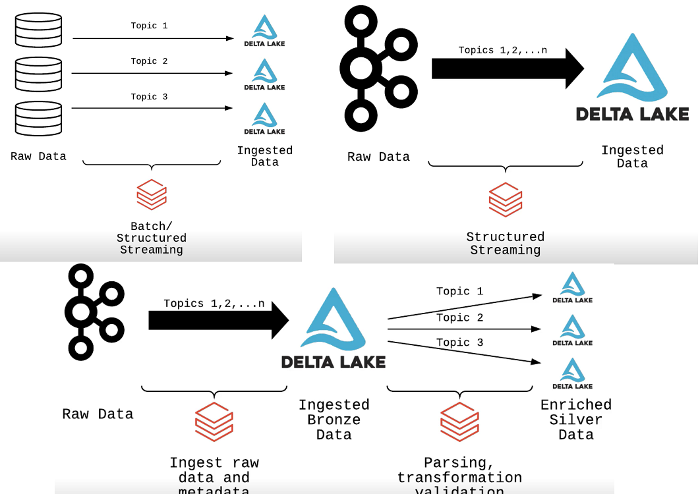
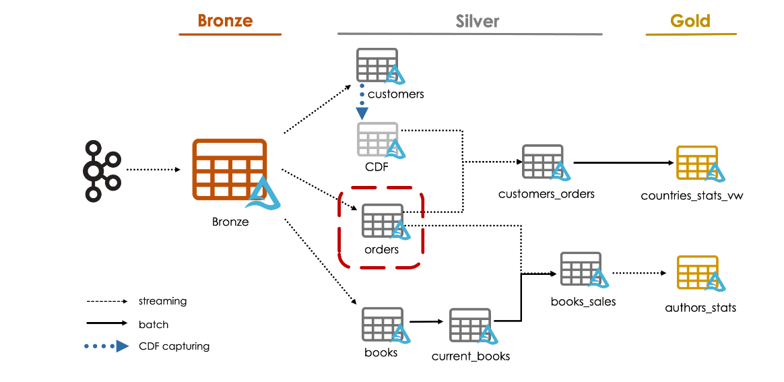

# Databricks Data Engineer Professional

Here we have the two learning path I followed for the Professional the Udemy and the Databricks curseware.

## Databricks 

### Architeching for the Lakehouse

**Data Lakehouse**  

`Data Lakes:`  Is a centralized repository designed to store, process, and secure large amounts of structured, semistructured, and unstructured data. They 
are good for Machine Learning and Big Data but are lacking in BI and face challenges in the Data Governance.  

on the oder side.

`Data Warehouse` Is a centralized repository for storing large volumens of data from multiple sources. It is designed for query and analysis, often used for business Intelligence activities.


`Data Lakehause` Join the best of both worlds from `Data Lake` and `Data Warehouse`

	

### Bronze Ingestions Patterns

**Bronze Layer**   
- Replaces the raditional data lake.  
- Represents the full, unprocessed history of the data.  
- Captures the provenance(what,when and from where) of data loaded intoe the lakehouse.  
- Data is stored efficiently using Delta Lakehouse.  
- If downstream layers discover later they need to ingest more, they can come back to the Bronze source to obtain it.  

**Bronze Layer Principles**  
- The goal is data capture and provenance: Capture exactly what is ingested, without parsing or change.
- Typically a Delta Lake table with these fields in each row:
	- Date received/ingested  
	- Data source (filename,external system etc)  
	- Text field with raw unparsed JSON, CSV or other data  
	- Other metadata  
- Should be append only(batch or streaming)  
- Plan ahead if data must be deleted for regulatory purposes  
	- Retain all records when possible  
	- Soft-deletes if necessary  
	- Hard-deletes may be required by regulatory processes.  

**Bronze Inmgestion Patterns**  
- **Singleplex Ingestion**: Every Raw data to a Delta Lake, usually works well fro Batch processing.     
- **Mutiplex Ingestion**: For nearly real-time data ingestion, normaly from a pop up system.  
	- Do not use the pop up system as bronze leyer as they are not real tables and have limited time of retention. Normally every topic will be later split in tables, but at first from the Stream system to Data Lakehause are all together in one table.
  
   
    
	
	

**Auto Load to Multiplex Bronze**  

The initialization script has loaded a **`date_lookup`** table. This table has a number of pre-computed date values.
 Note that additional fields indicating holidays or financial quarters might often be added to this table for later data enrichment
 
*Note: I dont know why Databricks consider to make the join with the lookup table from raw to bronze and not later from Bronze to Silver..bronze should be just to store data from data sources*  

```python
query = (spark.readStream
              .format(cloudFiles) # that configure the Auto Loader
              .option("cloudFiles.format", "json") # configure Auto Loader to use the JSON format
              .option("cloudFiles.schemaLocation", f"{DA.paths.checkpoints}/bronze_schema")
              .load(DA.paths.source_daily)
              .join(F.broadcast(date_lookup_df), F.to_date((F.col("timestamp")/1000).cast("timestamp")) == F.col("date"), "left") # Perform a broadast join with the date_lookup table
              .writeStream
              .option("checkpointLocation", f"{DA.paths.checkpoints}/bronze")
              .partitionBy("topic", "week_part") # Partition by topic and week part
              .trigger(availableNow=True)
              .table("bronze"))
```

**.broadcast**  
In the context of ApacheSpark is related to optimizing join operations. In Spark, when you join two Data frames, the engine tries to distribute the join operation 
across multiple nodes in the cluster. Howerver for cetain types of joins **where one DataFrame is much smaller than the other** shuffling data across the network 
can be expensive and  time consuming.
The function **F.broadcast** is a hint to Spark taht the given dataframe (date_lookpu_df) is samll enough that it should be sent to all worker nodes in the cluster. This way
 each node has a fully copy of the smaller DataFrame in memory and can perform the join locally without any network shuffling. This can significantly speed up the join operation.
 
**Streaming vs Auto Load**  
*Streaming* is a method of processing data in real-time as it's generated, without waiting for batch intervals. *Auto-load*, especially in the context
 of cloud data platforms like Databricks, refers to the automatic detection and ingestion of new data into the system, often combined with both batch
 and streaming processing methods.  
 
**Streaming from Multiplex Bronze**    

We going to proceed with stream read agains a bronze table, the bronze table recive data from kafka.  
- When are just interested in the topic 'bpm'  

```python
from pyspark.sql import functions as F

json_schema = "device_id LONG, time TIMESTAMP, heartrate DOUBLE"

(spark
   .readStream.table("bronze")
   .filter("topic = 'bpm'")
   .select(F.from_json(F.col("value").cast("string"), json_schema).alias("v"))
   .select("v.*") # select all sufields of previous column
   .writeStream
       .option("checkpointLocation", f"{DA.paths.checkpoints}/heart_rate")
       .option("path", f"{DA.paths.user_db}/heart_rate_silver.delta")
       .trigger(availableNow=True)
       .table("heart_rate_silver"))

query.awaitTermination()
```


### Promoting to Silver

**Silver Layer**   
- Easier to query than the non-curated Bronzed   
	- Data is clean  
	- Transactions have ACID guarantees  
- Represent the "Enterprise Data Model"  
- Captures the full history of business action modeled  
	- Each record processes is preserved  
	- All records can be efficiently queried  
- Reduces data stroage complexity, latency and redundancy  
	- Built for both ETL throughput AND analytic query performance.  
	
- Silver Layer guiding Principles  

	- Uses Delta Lake tables(with SQL table names)  
	- Preserves grain of original data(no aggregation)  
	- Eliminate duplicate records   
	- Production schema enforced   
	- Data quality checks passed  
	- Corrupt data guarantine   
	- Data stored to support production workloads  
	- Optimized for long-term retention and ad-hoch queries  
	
**Promotion Bronze to Silver**  

- Schema enforcement  
	- Prevents bad records from entering table   
	- Mismatch in Type or field name.  
- Schema evolution   
	- Allows new fields to be added  
	- Useful when schema changes in production/new fields added to nested data   
	- All previous records will show newly added as Null   
		- For previously written records, the underlying file isn´t modified.   
		- The additional field is simply defined in the metadata and dynamically read as null.   


**Streaming Deduplication**

How to eliminte duplicate records while working with Structure Streaming and Delta Lake.  
While Spark Structure Streaming provides exactly-once preocessing guaranteees, many source system will introduce duplicate records

**Quality Enforcemnt**  

- Add Check contrains to Delta tables.  
- Describe and implement a quarantine table.  
- Apply logic to add a data quality tags to Delta tables.  


```sql 
ALTER TABLE heart_rate_silver ADD CONSTRAINT date_within_range CHECK (time > '2017-01-01');
```   

**Quarantine** The Idea behind quarantin is that a bad records will be written to a separate location,
 This allows good data to be processed efficiently while additional logicand or manual review of erroneous records can be dfine and executed away from the main pipeline.

**Flagging** You may choose to implement a flagging system to warn about violatins while avoiding job failures.

```python 
F.when(F.col("heartrate") <= 0, "Negative BPM").otherwise("OK").alias("bpm_check")
```

**Promotion to Silver**

- Apply table constrains   
- Flagging to identify records    
- Apply de-duplication within an incremental microbatch  
- Use **MERGE** to avoid inserting duplicate recores to a Delta Lake table.  


### Gold Query Layer

**Gold Layer**
- Powers ML applications, reporting, dashboards, ad hoch analytics
- Reduces costs associated with ad hoch queries on silver tables
- Allow fine grained permissions
- Reduces strain on production systems  
- Shifts query updates to production workloads

**Lakehouse and the Query Layer**

- Stores refined datasets for use by data scientists  
- Serves results for pre-computed ML models  
- Contains enriched, aggregated views for use by analysts  
- Star-schemas and data marts for BI queries  
- Power data-driver applications, dashboards and reports.  
	
**Gold Tables**   

- Refined typically aggregated views of data saved using Delta Lake.  
- Can be update with batch or stream processing  
- Configure and schedule as part of ETL workloads  
- Results compute on write  
- Read is simple deserialization, additional filters can be applied with pushdowns.  
	
**Databricks SQL Endpoints**  
- Clusters optimized for SQL queries   
- Serverless option for quick cluster startup and autoscaling   
- Photon-enable for vectorized execution  
- Enhanced throughput for exchanging data with exeternal SQL systems  
- Optimized connectos for popular BI tools.  

**Recommendations**   
- Use saved views when filtering silver tables.  
- Use Delta tables for common partial aggregates.    
- Share Databricks SQL queries and dashboards within teams.  
- Analyze query history to identify new candidate gold tables.  
- Transitioning these queries to gold tables and scheduling as engineering jobs may reduce total operation costs.  
- Query history can also be useful for identifying predicates used most frequently; useful for ZORDER indexing during optimization.   

**Stored Views**  

- Display the query plan associate with a view: A Spark Dataframe and a view re nearly identical constructs.
 calling **explain** we can see our source table. `df.explain("formatted")`  

**Register View and check your job**

```sql 
CREATE VIEW IF NOT EXISTS gym_user_stats AS (...)
```

```python
# Check your work
assert spark.sql("SHOW TABLES").filter("tableName='gym_user_stats'").count() >= 1, "View 'gym_user_stats' does not exist."
assert spark.sql("SHOW TABLES").filter("tableName='gym_user_stats'").first()["isTemporary"]==False, "View 'gym_user_stats' should be not temporary."
assert spark.sql("DESCRIBE EXTENDED gym_user_stats").filter("col_name='Type'").first()['data_type']=='VIEW', "Found a table 'gym_user_stats' when a view was expected."
assert spark.table("gym_user_stats").count() == 304, "Incorrect query used for view 'gym_user_stats'."
print("All tests passed.")
```
	

**Materialized Gold Tables**

To make things run faster and more cost-effectively, its a good practice to save frequently-used query results in a specialized table (gold table in Delta lake) instead of the traditional method of materialized view.


### Storing Data Securely

**Salting before hashing**
When hash personal data or sensitive information  we transform original data into a fix-size string that look like random but that in fact same imput will always produce same hash
it had the vulnerabilities that if two persons have same password will produce the same hash, `salt` play with the concept that adding minimal input values(words to our passowrd) will produce a extremly different hash.
So the concept of salt is just adding some words to the passwords before to hash it to make it much more secure.

```python 
salt = 'BEANS'
spark.conf.set("da.salt", salt)
```

```sql
SELECT *, sha2(concat(user_id,"${da.salt}"), 256) AS alt_id
FROM registered_users
```


**Deidentified PII Access**

Apply dynamic views to sensitive data to obscure columns containing PII
Use dynamic views to filter data, only showing relevant rows to relevant audiences

**Condtion on Column level**  
```sql
CREATE OR REPLACE VIEW users_vw AS
  SELECT
    alt_id,
    CASE 
      WHEN is_member('ade_demo') THEN dob
      ELSE 'REDACTED'
    END AS dob,
    sex,
    gender,
    CASE 
      WHEN is_member('ade_demo') THEN first_name
      ELSE 'REDACTED'
    END AS first_name,
    CASE 
      WHEN is_member('ade_demo') THEN last_name
      ELSE 'REDACTED'
    END AS last_name,
    CASE 
      WHEN is_member('ade_demo') THEN street_address
      ELSE 'REDACTED'
    END AS street_address,
    city,
    state,
    CASE 
      WHEN is_member('ade_demo') THEN zip
      ELSE 'REDACTED'
    END AS zip,
    updated
  FROM users
```

**Adding Conditiona Row Access**  

Adding views with **WHERE** caluses to filter source data on different conditions for teams.
```sql
CREATE OR REPLACE VIEW users_la_vw AS
SELECT * FROM users_vw
WHERE 
  CASE 
    WHEN is_member('ade_demo') THEN TRUE
    ELSE city = "Los Angeles" AND updated > "2019-12-12"
  END
```

**Generalize PII in Aggregate Tables**

```Python
def age_bins(dob_col):
    age_col = F.floor(F.months_between(F.current_date(), dob_col)/12).alias("age")
    
    return (F.when((age_col < 18), "under 18")
             .when((age_col >= 18) & (age_col < 25), "18-25")
             .when((age_col >= 25) & (age_col < 35), "25-35")
             .when((age_col >= 35) & (age_col < 45), "35-45")
             .when((age_col >= 45) & (age_col < 55), "45-55")
             .when((age_col >= 55) & (age_col < 65), "55-65")
             .when((age_col >= 65) & (age_col < 75), "65-75")
             .when((age_col >= 75) & (age_col < 85), "75-85")
             .when((age_col >= 85) & (age_col < 95), "85-95")
             .when((age_col >= 95), "95+")
             .otherwise("invalid age").alias("age"))
```


### Propagating Updated and Deletes

**Change Data Feed**

**Operations that break stream composability:**  
- **Complete aggregations** You can´t aggregate over the entire dataset because it´s infinite. However, you can perform aggregations over windows of data, like computing the sum of values in the last 5 minutes,, or counting in the last hour.  
- **Delete** Deleting specific rows from a streaming DataFrame isn´t supported. This is because in a streaming context, data is continuosly arriving and being processed, delete could complicate teh processin logic.  
- **UPDATE/MERGE** Similar to delete, but there are ways to handle scenarios that require updates, like using the `foreachBatch`   


**Processing Records from Change Data Feed**

Tables that were not create with CDF enables will no have it turned on by default, but can be altered to capture changes.

```sql
ALTER TABLE silver 
SET TBLPROPERTIES (delta.enableChangeDataFeed = true);
```

`.outputMode`: Determinate how the output of a streaming DataFrame will be written to the sink. Whenthere are new rows and/or updates to exisitng rows in the streaming
- **Append Mode ("append")**: Only new rows added to the DataFrame/Dataset will be written to the sink.  
- **Complete Mode("complete")**: Whole DataFrame will be written to the sink after every trigger. This mode is typically used for aggregations where the result can change with new data.
- **Update Mode("update")**: Only the rows in the DataFrame/Dataset that were updates will be written to the sink.

```python
def upsert_to_delta(microBatchDF, batchId):
    microBatchDF.createOrReplaceTempView("updates")
    microBatchDF._jdf.sparkSession().sql("""
        MERGE INTO silver s
        USING updates u
        ON s.mrn = u.mrn
        WHEN MATCHED AND s.dob <> u.dob 
            THEN UPDATE SET *
        WHEN NOT MATCHED
            THEN INSERT *
    """)
	
query = (spark.readStream
              .table("bronze")
              .writeStream
              .foreachBatch(upsert_to_delta)
              .outputMode("update")
              # .trigger(availableNow=True)
              .trigger(processingTime='5 seconds')
              .start())
```

Silver to Gold

````python
silver_stream_df = (spark.readStream
                         .format("delta")
                         .option("readChangeData", True)
                         .option("startingVersion", 0)
                         .table("silver"))
```

```python
from pyspark.sql import functions as F

new_df = (silver_stream_df
         .filter(F.col("_change_type").isin(["update_postimage", "insert"]))
         .selectExpr("mrn",
                     "street_address AS new_street_address",
                     "_commit_timestamp AS processed_timestamp"))
                                                                                         
goold_df = (silver_stream_df
         .filter(F.col("_change_type").isin(["update_preimage"]))
         .selectExpr("mrn",
                     "street_address AS old_street_address",
                     "_commit_timestamp AS processed_timestamp"))
```

```python

query = (new_df.withWatermark("processed_timestamp", "3 minutes")
               .join(gold_df, ["mrn", "processed_timestamp"], "left")
               .filter("new_street_address <> old_street_address OR old_street_address IS NULL")
               .writeStream
               .outputMode("append")
               #.trigger(availableNow=True)
               .trigger(processingTime="5 seconds")
               .option("checkpointLocation", f"{DA.paths.checkpoints}/gold")
               .table("gold"))

```


**Propagating Deletes with CDF**

The most importan delete requestes are those that allow companies to maintain compliance with privacy regulations such as GDPR. Most companies have stated SLAs around how long these request will take the process.


### Orchestration and Scheduling

**Orchestration and Scheduling with Multi-Task Jobs**


**Job**  
	- **Task**: What ?
	- **Schedule**: When ?  
	- **Cluster**: How ?
	
**Workflow orchestration patterns.**

- **Fan-out Pattern:**A single task or job is followed by multiple tasks that can be executed in parallel  
- **Funnel Pattern**Multiple task or jobs that run in parallel are followed by a single tas that stgart afther all parallel task completed  
- **Hourglas Pattern**Combine Fan-out and Funnel
- **Sequence Pattern**Task or jobs are organized in a sgtrict sequence, where each task starts only after the previous one has completed.
- **Multi-sequence Pattern**Multi sequences of task that can run in parallel with each other.

**Multi-Task Jobs**: Orchestate the need previos patterns by "Depend on"

**Promoting Code with Repos**   
- CI/CD Integration: Version, Review, Test 
- Supported Git Providers: Azure DevOps, GitHub, GitLab, Bitbucket.


## Udemy

## Modeling Data Management Solutions.  




#### Multiplex Bronze Code

```python
from pyspark.sql import functions as F

def process_bronze():
  
    schema = "key BINARY, value BINARY, topic STRING, partition LONG, offset LONG, timestamp LONG"

    query = (spark.readStream
                        .format("cloudFiles")
                        .option("cloudFiles.format", "json")
                        .schema(schema)
                        .load(f"{dataset_bookstore}/kafka-raw")
                        .withColumn("timestamp", (F.col("timestamp")/1000).cast("timestamp"))  
                        .withColumn("year_month", F.date_format("timestamp", "yyyy-MM"))
                  .writeStream
                      .option("checkpointLocation", "dbfs:/mnt/demo_pro/checkpoints/bronze")
                      .option("mergeSchema", True) # If the dataset changes and there is a new column is added there is not problem (schema evolution)
                      .partitionBy("topic", "year_month")
                      .trigger(availableNow=True) # All data will processed in multiple micro batching untill not more data ise available.
                      .table("bronze"))

    query.awaitTermination()
```

### Streaming from Multiplex Bronze (code)  

  
```python
(spark.readStream
      .table("bronze")
      .createOrReplaceTempView("bronze_tmp"))
```


```sql
CREATE OR REPLACE TEMPORARY VIEW orders_silver_tmp AS
  SELECT v.*
  FROM (
    SELECT from_json(cast(value AS STRING), "order_id STRING, order_timestamp Timestamp, customer_id STRING, quantity BIGINT, total BIGINT, books ARRAY<STRUCT<book_id STRING, quantity BIGINT, subtotal BIGINT>>") v
    FROM bronze_tmp
    WHERE topic = "orders")
```


  
```python
query = (spark.table("orders_silver_tmp")
               .writeStream
               .option("checkpointLocation", "dbfs:/mnt/demo_pro/checkpoints/orders_silver")
               .trigger(availableNow=True)
               .table("orders_silver"))

query.awaitTermination()
```  

Fully in Python


```python
from pyspark.sql import functions as F

json_schema = "order_id STRING, order_timestamp Timestamp, customer_id STRING, quantity BIGINT, total BIGINT, books ARRAY<STRUCT<book_id STRING, quantity BIGINT, subtotal BIGINT>>"

query = (spark.readStream.table("bronze")
        .filter("topic = 'orders'")
        .select(F.from_json(F.col("value").cast("string"), json_schema).alias("v"))
        .select("v.*")
     .writeStream
        .option("checkpointLocation", "dbfs:/mnt/demo_pro/checkpoints/orders_silver")
        .trigger(availableNow=True)
        .table("orders_silver"))

query.awaitTermination() # Its used to keep the streaming job alivem, allowing it to coninuosly process icoming data.
```

### Quality Enforcement (code)


Check contrains will be appear under Table Properties when we run the code `DESCRIBE EXTENDED my_table`

Thanks to ACID in this case, the "A" standos for Atomicity. This means that a transaciton will either fully succeed or it will fail; its not possible for only a part of it to suceed".


`ALTER TABLE orders_silver ADD CONSTRAINT timestamp_within_range CHECK (order_timestamp >= '2020-01-01');`    
drop the Constraint    
`ALTER TABLE orders_silver DROP CONSTRAINT timestamp_within_range;`   


### Streaming Deduplication

`Watermark`  
A watermark is a moving threshold in time, which helps Spark to keep track of the progress of the stream. By definig a watermark, you are essentially telling Spark
Structure Streaming how long you´re willingo to wait for out of oder or late data.

Watermark determines how late(in terms of system processing time) and event can arrive and still be included in its respective window. Watermark its directly attached to the 
concern of latency. I we were somehow 100% certain that:  

- Data always arrives in order and There is no latency, meaning that events are processed nstantly or within thei respective windows the we wouldn´t need to use a watermark.
Every event would be processend in its correct time window, and there would be no need to provide a buffer for late-arriving data.

Example.  
 
**Use Case** In a streaming system where we are trying to compute hourly sales.  

**Problem**  Due to the fact aht the shops are located in different geogfraphical location aroun the world they sometimes take time to arrive, so how could I process the sales having a window latency of 10 minutes`?   
	
**Solution** By using `watermark`  we can indicate to our system to compute by ranks in that case we can use a watermark of 10 minutes    
	
**Second Problem** we have set a watermark of 10 minutes to account for pssible latencies. If I m aggregating sales for two time windows says  2-3pm and 3-4pm and a order comes in at 3:07 the watermark ensures that this lates orger gest accounted for in the 2-3 pm window, provide the actual order timesteamp indicates it was mede within that hour. 
		Howerver, how does the system differentiate between an order that genuinely took place at 3:07 pm and an order that was made earlier but only processed at 3:07 due to system latencies?
	How does the system ensure that each order is placed in the correct aggregation window based on its actual timestam and not the processing time?

**Solution 2** When we are processing streaming data, each event typically has a timestam associate with it. This timestamp, which in our example is `order_timestamp`, represent when the order was actually made. This is different from the processing time.  

		- In our example:  
			- An order made at 2:57 but arriving at 3:07 hast an `order_timestamp` of 2:57 pm. The system processing time is 3:07  
			- An order actually made at 3:07 has an `oder_timestamp` of 3:07  

The watermark works with the oder_timestamp no the system processing time.


**Other use of watermark**  

Deleting duplicate records.

```python
deduped_df = (spark.readStream
                   .table("bronze")
                   .filter("topic = 'orders'")
                   .select(F.from_json(F.col("value").cast("string"), json_schema).alias("v"))
                   .select("v.*")
                   .withWatermark("order_timestamp", "30 seconds")
                   .dropDuplicates(["order_id", "order_timestamp"]))
				   
```

In that case will just wait 30 seg to drop the duplicates if a duplicate row come 35 delate will be inserted.	That is the difference between streaming and batch procesing mean in batch processing we could process all our data
in streaming the data its continuosly comming and therefore we must set a range of time for our operations(range of latency)	
		 

When using `dropDuplicates()` in conjuntion with `watermarks`, it ensures that the system will deduplicate records based on the provided columns,
but only within the bound of the watermark. After the watermak has passed a certain timestamp, Spark won´t deduplicate old data with that timestamp.


```python
def upsert_data(microBatchDF, batch):
    microBatchDF.createOrReplaceTempView("orders_microbatch")
    
    sql_query = """
      MERGE INTO orders_silver a
      USING orders_microbatch b
      ON a.order_id=b.order_id AND a.order_timestamp=b.order_timestamp
      WHEN NOT MATCHED THEN INSERT *
    """
    
    microBatchDF.sparkSession.sql(sql_query)
```


```python
query = (deduped_df.writeStream
                   .foreachBatch(upsert_data)
                   .option("checkpointLocation", "dbfs:/mnt/demo_pro/checkpoints/orders_silver")
                   .trigger(availableNow=True)
                   .start())
```


### Slowly Changing Dimensions 

- **Type 0**: The type 0 dimensions attributes never change.7  
- **Type 1**: Overwrite old with new data and therefore does not track historical data.  
- **Type 2**: Add a new row, tracks historical data by creating amultiple records for a given natural key. We could add "effective date" columns.  

| Supplier_Key | Supplier_Code | Supplier_Name  | Supplier_State | Start_Date           | End_Date             |
|--------------|---------------|----------------|----------------|----------------------|----------------------|
| 123          | ABC           | Acme Supply Co | CA             | 2000-01-01T00:00:00  | 2004-12-22T00:00:00  |
| 124          | ABC           | Acme Supply Co | IL             | 2004-12-22T00:00:00  | NULL                 |


Another method from SCD2 uses an effective date and current flag.

| Supplier_Key | Supplier_Code | Supplier_Name  | Supplier_State | Effective_Date       | Current_Flag |
|--------------|---------------|----------------|----------------|----------------------|--------------|
| 123          | ABC           | Acme Supply Co | CA             | 2000-01-01T00:00:00  | N            |
| 124          | ABC           | Acme Supply Co | IL             | 2004-12-22T00:00:00  | Y            |


- **Type 3**: Add a new attribute  

This methos tracks changes using separate columsn and preservers limited history.

| Supplier_Key | Supplier_Code | Supplier_Name  | Original_Supplier_State | Effective_Date       | Current_Supplier_State |
|--------------|---------------|----------------|-------------------------|----------------------|------------------------|
| 123          | ABC           | Acme Supply Co | CA                       | 2004-12-22T00:00:00  | IL                    |

- **Type 4**: Same as Type 3 but win unlimited histroy by using a **separate history table**

Supplier Table:
| Supplier_Key | Supplier_Code | Supplier_Name              | Supplier_State |
|--------------|---------------|----------------------------|----------------|
| 124          | ABC           | Acme & Johnson Supply Co   | IL             |

Supplier_History Table
| Supplier_Key | Supplier_Code | Supplier_Name              | Supplier_State | Create_Date           |
|--------------|---------------|----------------------------|----------------|----------------------|
| 123          | ABC           | Acme Supply Co             | CA             | 2003-06-14T00:00:00  |
| 124          | ABC           | Acme & Johnson Supply Co   | IL             | 2004-12-22T00:00:00  |


- **Type 5** Type 4 + Type 1
- **Type 6** Type 1,2 and 3


### Type2 SCD (code)


Setup:

Target_table (existing data, acts as our dimension table)

Supplier_Key	Supplier_Code	Supplier_Name	Supplier_State	Start_Date	End_Date


Incoming_data (incoming data):

Supplier_Key	Supplier_Code	Supplier_Name	Supplier_State

```sql
MERGE INTO Target_table AS Target
USING Incoming_data AS Source
ON Target.Supplier_Key = Source.Supplier_Key

-- When matched and all columns are the same, update the End_Date
WHEN MATCHED AND 
   (Target.Supplier_Name = Source.Supplier_Name AND Target.Supplier_State = Source.Supplier_State) THEN
    UPDATE SET End_Date = CURRENT_DATE 

-- When matched and any column is different, insert as a new record
WHEN MATCHED AND 
   (Target.Supplier_Name <> Source.Supplier_Name OR Target.Supplier_State <> Source.Supplier_State) THEN
    INSERT (Supplier_Key, Supplier_Code, Supplier_Name, Supplier_State, Start_Date, End_Date)
    VALUES (Source.Supplier_Key, Source.Supplier_Code, Source.Supplier_Name, Source.Supplier_State, CURRENT_DATE, NULL)

-- When not matched by target, insert the record
WHEN NOT MATCHED THEN
    INSERT (Supplier_Key, Supplier_Code, Supplier_Name, Supplier_State, Start_Date, End_Date)
    VALUES (Source.Supplier_Key, Source.Supplier_Code, Source.Supplier_Name, Source.Supplier_State, CURRENT_DATE, NULL);
```

## Data Processing

### Change Data Capture
Its a technique to identify and capture changes made to data. The changes can be inserts, updates or deletes. The primary goal is to ensure data synchronization, replication, or loading without needing to scan the entire databse or data source.


Imagine we have an e-commerce website with a database taht stores production information. Each day, new products are added, old ones are updated, and some might be removed. Using traditional methods, if you wanted to synchronize this production
data to a data warehouse for analytics, you would have to extract ALL product data nightly, which is bor resource-intensive and time-consuming.

With CDC, instead of extracting all the products, you had only capture the changes made since the last extraction. If 50 products were added, 30 pudated and 10 deleted you had only process those 90 records. This save a lot of computational resources and time.

**microBatchDF**  
In structured streaming, certain operations, like window functions, required processing in discrete chunks rather than on a continuous stream. this is achive using micro-batches
`microBatchDF` represents the data of a single micro-batch, allowing stateful operations to be applied efficiently on streamed data.

### Processing CDC (code)

CDC is a concept or pattern in data integration that identifies anc captures changes in soure data so that downstream systems can consume and reflect those changes. its not 
tied to a specific piece of code or a single technology. Rather, its an approach to data synchronization and integration.

Some features in Databricks facilites the CDC.

**Delta MERGE**: Delta Lakes `MERGE INTO` command allows you to efficiently upsert data making it easier to handle inserts, updates and deltes base on incoming change.  
**Stream Processing** Databrics support structure streaming, which can consume data in a near real -time, allowing for more real-time CDC  
**Delta Lake Time Travel** This Features allows you to query previous versins of your Delta table, which can be usedful in CDC scenarios to understadn how data has changed over time.

**CDC vs ETL**  

We can see CDC as specific type of ETL that focuses oncapturing and processing changes in the source data. While the overall concept is similar, there are some unique consierations and mechanisms associate with CDC.

**Change Tracking** Unlike traditional batch ETL process, that might process all data, CDC focuses on only processing new or change data.  
**Low Latency** CDC often aims for near rea-time processing, so changs in the source system are reflected in the target system with minimal delay.  
**Handling Updates & Deletes** Traditional ETL might be more focused on inserting new data. With CDC you need mechanisms to handle updates and deltes, not just inserts.  

```python
# Using Delta Lake in Databricks

# Create the Bronze table
spark.sql("""
CREATE TABLE IF NOT EXISTS bronze (
    id INT,
    name STRING,
    age INT,
    change_type STRING,
    timestamp TIMESTAMP
) USING delta
""")

# Insert some initial data into the Bronze table
spark.sql("""
INSERT INTO bronze VALUES
(1, 'Alice', 25, 'INSERT', CURRENT_TIMESTAMP),
(2, 'Bob', 30, 'INSERT', CURRENT_TIMESTAMP),
(3, 'Charlie', 35, 'INSERT', CURRENT_TIMESTAMP)
""")

# Create the Silver table
spark.sql("""
CREATE TABLE IF NOT EXISTS silver (
    id INT,
    name STRING,
    age INT
) USING delta
""")

# Create the Gold table
spark.sql("""
CREATE TABLE IF NOT EXISTS gold (
    id INT,
    name STRING,
    age INT
) USING delta
""")
```
**CDC process**  


```python
def process_changes_bronze_to_silver():
    # Read new changes from the Bronze table
    changes = spark.sql("SELECT * FROM bronze ORDER BY timestamp DESC")

    for row in changes.collect():
        if row.change_type == 'INSERT':
            spark.sql(f"INSERT INTO silver VALUES ({row.id}, '{row.name}', {row.age})")
        elif row.change_type == 'UPDATE':
            spark.sql(f"UPDATE silver SET name='{row.name}', age={row.age} WHERE id={row.id}")
        elif row.change_type == 'DELETE':
            spark.sql(f"DELETE FROM silver WHERE id={row.id}")

    # After processing, we might want to archive or delete processed records from the Bronze table
    # For this example, I'll delete them.
    spark.sql("DELETE FROM bronze")
```


```python

def process_changes_silver_to_gold():
    # Read from Silver and write to Gold. For this example, I'll overwrite the Gold table.
    silver_df = spark.sql("SELECT * FROM silver")
    silver_df.write.format("delta").mode("overwrite").saveAsTable("gold")
```

Simulate Bronze to Gold

```python
# Simulate new changes in Bronze table
spark.sql("""
INSERT INTO bronze VALUES
(4, 'David', 40, 'INSERT', CURRENT_TIMESTAMP),
(2, 'Bob Jr.', 31, 'UPDATE', CURRENT_TIMESTAMP),
(3, 'Charlie', null, 'DELETE', CURRENT_TIMESTAMP)
""")

# Process changes from Bronze to Silver
process_changes_bronze_to_silver()

# Process changes from Silver to Gold
process_changes_silver_to_gold()
```

Create a Windows function to insert the most recent records. The SQL code would be as follows.

```sql
SELECT newest.*
FROM 
(
    SELECT 
        *,
        RANK() OVER (PARTITION BY customer_id ORDER BY row_time DESC) AS rank
    FROM 
        customer_window
) AS newest
WHERE 
    newest.rank = 1;
```

The goal is to package that code into a function so that we can launch it in Stream.

```python
from pyspark.sql import functions as F
from pyspark.sql.window import Window

# Assuming you've already loaded the data into a DataFrame
df = spark.read.table("customer_window")

# Define the window specification
window_spec = Window.partitionBy("customer_id").orderBy(F.desc("row_time"))

# Use the rank function over the window specification
ranked_df = df.withColumn("rank", F.rank().over(window_spec))

# Filter the rows where rank is 1
newest_df = ranked_df.filter(F.col("rank") == 1).drop("rank")

# If you need to show or collect the result
newest_df.show()

```

Declare function

```python
from pyspark.sql.window import Window

def batch_upsert(microBatchDF, batchId):
    window = Window.partitionBy("customer_id").orderBy(F.col("row_time").desc())
    
    (microBatchDF.withColumn("rank", F.rank().over(window))
                 .filter("rank == 1")
                 .drop("rank")
                 .createOrReplaceTempView("ranked_updates"))
    
    query = """
        MERGE INTO customers_silver c
        USING ranked_updates r
        ON c.customer_id=r.customer_id
            WHEN MATCHED AND c.row_time < r.row_time
              THEN UPDATE SET *
            WHEN NOT MATCHED
              THEN INSERT *
    """
    
    microBatchDF.sparkSession.sql(query)

```

```python
query = (spark.readStream
                  .table("bronze")
                  .filter("topic = 'customers'")
                  .select(F.from_json(F.col("value").cast("string"), schema).alias("v"))
                  .select("v.*")
                  .join(F.broadcast(df_country_lookup), F.col("country_code") == F.col("code") , "inner")
               .writeStream
                  .foreachBatch(batch_upsert)
                  .option("checkpointLocation", "dbfs:/mnt/demo_pro/checkpoints/customers_silver")
                  .trigger(availableNow=True)
                  .start()
          )

query.awaitTermination()
```

### Delta Lake CDF

**CDF** Stands for Change Data Feed  
- Automatically generate CDC feed about Delta Lake Tables.    
- Records row-level changes for all data written into a Delta table.  
	- Row data + metadata (whether row was inserted, deleted or updated)  
	
**USE CDF when**  
- Table´s changes include updates and/or deletes
- Small fraction of records updated in each batch(from CDC feed)

**Dont use CDF when**  
- Tables´s change are append only
- Most records in the table updated in each batch

### CDF (Code)

`delta.enableChangeDataFeed` The primary purpose of this future is to generate a log of changes made to a Delta table. This log can be read as a stream and provides details
about inserted, deleted and updated records.

**What it does**   
	- **Logs Changes** When the Change Data Feed is enable on Delta table, Delta Lake maintains a change log that records details about every change made to the table.
	
**What it doesn´t do**  
	- **Automatic Propagation** Enable CDF doesn´t automatically propagate changes to another table or external system. If you want to propagate the changes, you would typically set up 
	a separate streaming job that reads from the change feed and then applies those chanes wherever necessary.
	
```sql
ALTER TABLE customers_silver 
SET TBLPROPERTIES (delta.enableChangeDataFeed = true);

DESCRIBE TABLE EXTENDED customers_silver

SELECT * 
FROM table_changes("customers_silver", 2)
```


```python
files = dbutils.fs.ls("dbfs:/user/hive/warehouse/bookstore_eng_pro.db/customers_silver/_change_data")
display(files)
```

### Stream-Stream Joins (code)

**How to use CDF to propagate changes**

```python
from pyspark.sql import functions as F
from pyspark.sql.window import Window

def batch_upsert(microBatchDF, batchId):
    window = Window.partitionBy("order_id", "customer_id").orderBy(F.col("_commit_timestamp").desc())
    
    (microBatchDF.filter(F.col("_change_type").isin(["insert", "update_postimage"]))
                 .withColumn("rank", F.rank().over(window))
                 .filter("rank = 1")
                 .drop("rank", "_change_type", "_commit_version")
                 .withColumnRenamed("_commit_timestamp", "processed_timestamp")
                 .createOrReplaceTempView("ranked_updates"))
    
    query = """
        MERGE INTO customers_orders c
        USING ranked_updates r
        ON c.order_id=r.order_id AND c.customer_id=r.customer_id
            WHEN MATCHED AND c.processed_timestamp < r.processed_timestamp
              THEN UPDATE SET *
            WHEN NOT MATCHED
              THEN INSERT *
    """
    
    microBatchDF.sparkSession.sql(query)
```

```python
def porcess_customers_orders():
    orders_df = spark.readStream.table("orders_silver")
    
    cdf_customers_df = (spark.readStream
                             .option("readChangeData", True)
                             .option("startingVersion", 2)
                             .table("customers_silver")
                       )

    query = (orders_df
                .join(cdf_customers_df, ["customer_id"], "inner")
                .writeStream
                    .foreachBatch(batch_upsert)
                    .option("checkpointLocation", "dbfs:/mnt/demo_pro/checkpoints/customers_orders")
                    .trigger(availableNow=True)
                    .start()
            )
    
    query.awaitTermination()
    
porcess_customers_orders()
```

### Stream-Static Join

**Stream vs Static tables**

- Streaming tables are ever-appending data sources.  
- Static tables contain data that may be changed or overwritten.
- Only append data in the stream table will appear in the resulting table, adding new records in the static table will not appear in the end table.
	
When you are joining a static DataFrame(TableA) with a streaming DataFrame(TableB), the static DataFrame acts as fixed reference.
 During the execution of each micro-batch of the streaming query:  
 
- **Static DataFrame(TableA)** The contents of this table are read and cached at the start of the streaming job. Any changes made to the underlying data of Table A after the
streaming job hast started will no be reflected in the ongoing streaming joins.

- **Streaming DataFrame(TableB)** For every micro-batch, the new incoming data (or changes) in Table B will be joined with the cached version of Table A. Therefore, if new data is added 
to TableB, it gets joined with TableA and the results will be reflected in the result table(TableC)

	
```python
from pyspark.sql import functions as F

def process_books_sales():
    
    orders_df = (spark.readStream.table("orders_silver")
                        .withColumn("book", F.explode("books"))
                )

    books_df = spark.read.table("current_books") # static table.

    query = (orders_df
                  .join(books_df, orders_df.book.book_id == books_df.book_id, "inner")
                  .writeStream
                     .outputMode("append")
                     .option("checkpointLocation", "dbfs:/mnt/demo_pro/checkpoints/books_sales")
                     .trigger(availableNow=True)
                     .table("books_sales")
    )

    query.awaitTermination()
    
process_books_sales()
```


### Materialized Gold Tables

```python
from pyspark.sql import functions as F

query = (spark.readStream
                 .table("books_sales")
                 .withWatermark("order_timestamp", "10 minutes")
                 .groupBy(
                     F.window("order_timestamp", "5 minutes").alias("time"),
                     "author")
                 .agg(
                     F.count("order_id").alias("orders_count"),
                     F.avg("quantity").alias ("avg_quantity"))
              .writeStream
                 .option("checkpointLocation", f"dbfs:/mnt/demo_pro/checkpoints/authors_stats")
                 .trigger(availableNow=True)
                 .table("authors_stats")
            )

query.awaitTermination()
```

## Improving Performance

### Partitioning Delta Lake Tables

Choosing partitions columns

- **Cardinality** Low cardinality fields should be used for partitioning.  
- **Total records share a given value for a column**  
	- Partition should be at least 1 GB in size.  
- **Records with a given value will continue to arrive indefinetely**  
	- Datetime fields can be used for partitioning.  
	
**Avoid Over-Partitioning**  
- Partitioned small tables increas storage costs and total number of fiels to scan.
- If most partitons < 1GB of data, the table is over-partitioned


`optimizeWrite`:
	- optimizes the writing of data into Delta Lake. coalesces small files produced by task into larger, more efficient files during writes, without needing a separate bin-packing  
	- Helps reducing the number of small files as they can cause inefficiencies in storage and query performance.  
`autoCompatc`:
	- triggers a compaction operation(bin-packing) on small files during writes.  
	- Compaction is the process of combining multiple small files into larger ones.
	- Auto-compaction ensures that your Delta table doesnt accumulate too many smal lfiles
```python
spark.conf.set("spark.databricks.delta.optimizeWrite.enabled", True)
spark.conf.set("spark.databricks.delta.autoCompact.enabled", True)
```

So..Why aren´t these configurations enable by default if they appear to significantly benefit table performance ? What´s Databriks rationale for requirement manual activation instead ?

- Workload Variation: Not all workloads and use case benefit equally from every optimization. Whats optima for one scenarion might be suboptimal or even detrimental for another. For instance if wirtes are infrequeent or if the data is mostly append-only with large batches, then the overhed of optimizing every write might not be necesseary    
- Performance Overhed: Operations like optimization consume additional resources and they can introduce latency to the write operations, which might not be acceptable for all use cases.   
- Resource Consumption: Automatic compaction and optimization can consume additional CPU, memory and I/O in cloud environments, where resources equate to costs, not every user or oganization might want these features enabled all the time.   

**Scenario1: Optimization Not Necessary -  Use Case: Historical Data Archive**  

Imagine you have a sytem whre you´re strogin historical data, say for compiliance or archival purposes.  

- Is written once an then rarely , if ever update or querid
- Is ingested in large, infrequent batches, doest not require real-teime or lowlatenciy access

**Scenario2: Optimization Necessary - Use Case: Real-time Analytics Dashboard**

- Ingest data continuosly as users interact with an e-commerce platform.
- Requires frequent updates and deletes, e.g.. when orders are modified or canceled.
- Needs to serve queries for the dashboard with low latency.


### Delta Lake Transaction Logs

Thanks to the transition logs the delta tables are faster becasue every 10 logs a check-point is save where to search for information you only have to go to that specific site.


## Databricks Tooling

- We can add parameters(key name of the widget)  
- We can crete a new job cluster (could be single node to save cost). Job cluster auto terminates once the job is completed, which save costs compared to all-purpose clusters.  
- retry plicit  
- Depends on (will give us the legacy). will be atuomatically secuenciyl but if you give the name of a previous job it would generate them in parallel. A task can depend on multiple task.

- Advance Options  
	- Schedule Trigger Type can be done by cron syntax.
	- Edit permision can be done. Owner can change but need to be a person not a group. We have can viw and can management

### REST API

- We need a bearerAuth, we need a bearer token. --> user settings --> Generate new token.
- Postman --> Authorization --> BearerToken --> paste your token

### Databricks CLI

Databricks allow you to work bia CLI therefore you need to have pyhton installed and then you wpip install databricks-cli 

## Security and Governance

- **Propagating deletes**: When for security reasons we have to delete data and the same data are in different tables

### Dynamic Views

Access Control Column - Level.

Users with sufficient privileges will be able to see all the fields, while rstricted user will just see part of the View.

Admin Console --> Groups --> Create a Group --> (name of the group should be the one you give to the view to have permision of read) in this case 'admins_demo' -->

```sql
CREATE OR REPLACE VIEW customers_vw AS
  SELECT
    customer_id,
    CASE 
      WHEN is_member('admins_demo') THEN email
      ELSE 'REDACTED'
    END AS email,
    gender,
    CASE 
      WHEN is_member('admins_demo') THEN first_name
      ELSE 'REDACTED'
    END AS first_name,
    CASE 
      WHEN is_member('admins_demo') THEN last_name
      ELSE 'REDACTED'
    END AS last_name,
    CASE 
      WHEN is_member('admins_demo') THEN street
      ELSE 'REDACTED'
    END AS street,
    city,
    country,
    row_time
  FROM customers_silver
```

**On the Row Level**

```sql
CREATE OR REPLACE VIEW customers_fr_vw AS
SELECT * FROM customers_vw
WHERE 
  CASE 
    WHEN is_member('admins_demo') THEN TRUE
    ELSE country = "France" AND row_time > "2022-01-01"
  END
```

## Testing and Deployment

### Relative Imports 

%pip install .. (some package that I need), should be done at the beginning of the program as python interpreter will e restarted.  
%sh   
%run  

### Data pipeline testing.

**Data quality tests** test the quality of the data  
	- Apply check constraints to Delta tables  
	
**Standard testes: test the code logic**  
	- **Unit testing** 
		- Approach to testing individuals units of code, such as functions.
		- If you make any changes to them in the future, you can determine whether they still work as you expected them to.
		- This helps you find problems with your code faster and earlier in the development life cycle.
		
		`python assert funct() == expected_value`  
  
	- **Integration Testing**
		- Approach to testing the interaction between subsystems of an apllication  
		- Sofware module sare integrated logically and tested as a group  
	- **End-to-End Testing**
	
		- Approach to ensure that your application can run properly under real-world scenarios.
		- Simulate a user experience from start to finish.

		
		


## Monitoring and logging

### Managing Cluster

Two types of cluster Permision.

- Admin Console, at the user tab you can control user ability ot ceate clusters by enabling the allow unrestricted.  
- **Cluster Level Permission**:  --> compute `:`  --> can Manage, Restart, Attacht  
	- **Event log**: Logs outside the cluster, select what happend in the cluster, we can decide which log do we have interst to monitorizing.  
	- **Driver Logs**: Logs generated within the cluster
		- Standar Output: Print statement
		- Standar Error
	- **Metrics** Access to the Ganglia UI

- Cluster Level Permision: 