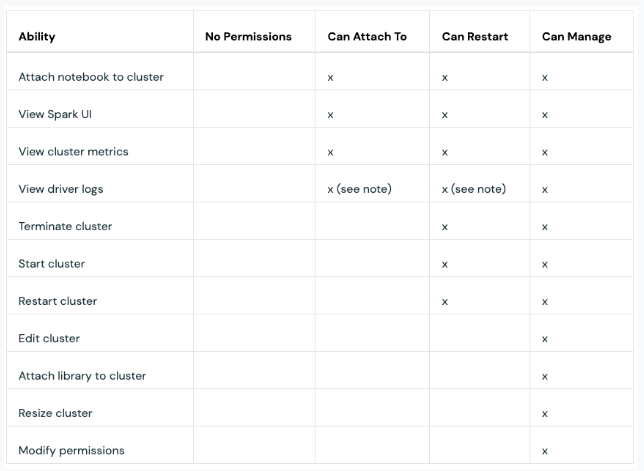

## Exan questions for Databricks Data Engineer Professional
------------------------------------------------------------

**Question 1.  
Tranlsate that code from Python to SQL ?**

**Python**  
```python
from pyspark.sql.window import Window

window = Window.partitionBy("customer_id").orderBy(F.col("row_time").desc())

ranked_df = (customers_df.withColumn("rank", F.rank().over(window))
                          .filter("rank == 1")
                          .drop("rank"))
display(ranked_df)
```

**SQL**
```sql
SELECT newest.*
FROM 
(
    SELECT 
        *,
        RANK() OVER (PARTITION BY customer_id ORDER BY row_time DESC) AS rank
    FROM 
        customer_window
) AS newest
WHERE 
    newest.rank = 1;
```


**Question 2.    
The following code produces an error. Can you determine why ?** 

```python
window = Window.partitionBy("customer_id").orderBy(F.col("row_time").desc())

ranked_df = (spark.readStream
                   .table("bronze")
                   .filter("topic = 'customers'")
                   .select(F.from_json(F.col("value").cast("string"), schema).alias("v"))
                   .select("v.*")
                   .filter(F.col("row_status").isin(["insert", "update"]))
                   .withColumn("rank", F.rank().over(window))
                   .filter("rank == 1")
                   .drop("rank")
             )

display(ranked_df)
```

&nbsp;&nbsp;&nbsp;&nbsp;Stream DataFrames do not support windows functions. The data would need to be processed in micro-Batches.

**Question 3.  
You are creating a Table in Databricks with the following Code, A senior Data Engineer comes to you and let you know that you dont need to initializing "SparkSession" do you know why ?**  

```python
from pyspark.sql import SparkSession

# Initialize Spark session
spark = SparkSession.builder.appName("CreateCustomerTable").getOrCreate()

# Create customer table
spark.sql("""
CREATE OR REPLACE TABLE customer_window (
    customer_id INT,
    email STRING,
    first_name STRING,
    last_name STRING,
    gender STRING,
    row_time TIMESTAMP
)
""")
```

&nbsp;&nbsp;&nbsp;&nbsp;In a management environments like Databricks a SparkSession is automatically created for you. When you start a Spark cluster. As
part of this process, Databricks automatically initializates a SparkSession named `spark`. This is why you can directly start running Spark commands using the `spark` object without
explicitly creating a session.  

&nbsp;&nbsp;&nbsp;&nbsp;Databricks simplifies many of the setup and configuration steps for Spark, making it user-friendly. However, if you wre to run your PySpark code outise of such 
management environments, that´s when explicit initialization would be necessary.  

**Question 4  
What does `microBatchDF` and what is it used for ?**  
&nbsp;&nbsp;&nbsp;&nbsp;In structured streaming, certain operations, like window functions, required processing in discrete chunks rather than on a continuous stream. this is achive using micro-batches
`microBatchDF` represents the data of a single micro-batch, allowing stateful operations to be applied efficiently on streamed data.


**Question 5  
As a data architect you are in charge of implementing an Analytics system on the following company that has a specific use case:
Use Case: Updating Customer Profiles in an E-commerce Data Lake Hause**
  
**Background**
An e-commerce company stores detailed profiles of its customers in a data lake house to support various operations such as personalized marketing, customer support, and sales analytics. This data is sourced from multiple touchpoints like user sign-ups,
 order histories, customer support interactions, and browsing behaviors.
 
**Solution**
We will implement a medallion architecture, where we will enrich the user profiles in the silver layer and finally reach the gold layer to apply advanced analysis (ML/BI).

**Quesiton 6  
The data engineers of the above company are wondering whether they should apply CDF to their tables or whether it does not apply in this case.
 What is your decision as a data architect ?**

The table in the scneario described above should be applied to CDFs as they meet the 2 fundamental requiremetns for the use of CDF´s 

- **Tables changes include updates and/or deletes**
	- **Updates:** As customers interact with the platform, their preferences, recent activity, or personal information might change.
	For instance, they might update their delivery address, change their associated phone number, or modify their email subscription preferences.  
	- **Deletes:** Sometimes, customers may choose to delete their accounts or the company might need to remove records for compliance reasons.  

- **Small fraction of records updated in each batch (from CDC feed)**
	- Given the vast number of customers, in each batch (daily/weekly), only a small fraction of the total customer profiles might change. 
	For example, only a small percentage of users might update their information or delete their accounts in any given batch interval.
	- CDC (Change Data Capture) from the operational database can detect and send only these changed records to be processed and updated in the data lake house.
	
**Question 7
Determinate if in the following scneario do we need a CDF:    
"Use Case: Tracking User Activities on an Online News Portal"  
A popular online news portal wants to understand its readers' behaviors better. Every time a user interacts with an article - be 
it reading an article, clicking on an ad, leaving a comment, or sharing an article on social media - an event is generated.**

&nbsp;&nbsp;&nbsp;&nbsp;No.  We should not apply CDF as the Table is a Append-Only Table.

**Why append only?**  
&nbsp;&nbsp;&nbsp;&nbsp;- **Immutable Events** Each user interaction is a unique event with its timestamp. Once an event is generated, it doesnt´change. Instead of updating existing records, new interacions    
&nbsp;&nbsp;&nbsp;&nbsp;- **Scalability** Given the large number of reader and the multitude of interactions they can have on the platform, the system generates a massive volume of events daily. An append only system scales well to handle such high-velocity data.

**Question 8  
The data engineering team wants to build a pipeline that receives customers data as change data capture (CDC) feed from a source system. The CDC events logged at the source 
contain the data of the records along with metadata information. This metadata indicates whether the specified record was inserted, updated, or deleted. 
In addition to a timestamp column identified by the field update_time indicating the order in which the changes happened. 
Each record has a primary key identified by the field customer_id.In the same batch, multiple changes for the same customer could be received with different update_time. 
The team wants to store only the most recent information for each customer in the target Delta Lake table.**

&nbsp;&nbsp;&nbsp;&nbsp;Use MERGE INTO with SEQUENCE BY clause on the update_time for ordering how operations should be applied.

```sql
MERGE INTO target_table AS target
USING source_table AS source
ON target.id = source.id
WHEN MATCHED THEN
    UPDATE SET ...
WHEN NOT MATCHED THEN
    INSERT ...
SEQUENCE BY source.timestamp;
```

**Question 9
Wich statement regarding checkpointing in Spark Structured Streaming is not correct ?**

A)checkpoints stores the current state of a streaming job to cloud storage  
B)checkpoiting allows the streaming engine to track the progress of a stream processing  
C)Checkpoints can be shared between separates streams  


&nbsp;&nbsp;&nbsp;&nbsp;*Solution* Checkpoints can be shared between separates streams.   	

As checkpoints are designed to store the progress and state of a specific streaming query. They should not be shared between multiple streaming quereis. 


**Question 10

What is the trigger configuration of a stream table that need to fetch the data in near real time process without any wait and shold be active continuously making that**

**Solution**  
 
**Available Now (using trigger(availableNow=True))**

- This is a Databricks-specific trigger. When set to True, it will only process the data that's available right now and will not wait for new data.  
- Is very similar to *trigger-once* but can run multiple batches untill all availabe data is consumed, instead of once big batch.  
*Use Case: When you want to clear the existing backlog of data without waiting for new data to arrive.*

```
(spark.table("your_table")
.writeStream
.format("delta")
... # other configurations
.trigger(availableNow=True)
.table("output_table"))
```

**Question 11
A data engineer wants to pass multiple parameters from a Databricks Job to a notebook. They already configured the key and value of each parameter in the configurations of the job.
Which of the following utilities can the data engineer use to read the passed parameters inside the notebook ?**

&nbsp;&nbsp;&nbsp;&nbsp;dbutils.widgets

**Question 12 
Which of the following describes the minimal permissions a data engineer needs to view the metrics, driver logs, and Spark UI of an existing cluster ?**

&nbsp;&nbsp;&nbsp;&nbsp;"Can Attach To" privilege on the cluster.

*Explination*: You can configure two types of cluster permissions:

1- The "Allow cluster creation" entitlement controls your ability to create clusters.   
2- Cluster-level permissions control you ability to use and  modify a specific cluster. There are foru permissions levels for a cluster    




**Question 13

For production Databricks jobs, which of the following cluster types is recommended to use ?**

&nbsp;&nbsp;&nbsp;&nbsp;Job clusters

*Explination* Job clusters are dedicated clusters for a job or task run. A job cluster auto terminates once the job is completed, which save costs compared to all-purpose clusters.
In addition, Databricks recommends using job clusters in production so that each job rns, in a fully isolate enviroment.

**Question 14 
The data engineering team ahs a Delta Lake table creted with following query:**

```sql
CREATE TABLE target
AS SELECT * FROM source
```

**A Data engineer wants to drop the source table with the following query:**

`DROP TABLE source`

**Which statement describes the result of running this drop command ?**

&nbsp;&nbsp;&nbsp;&nbsp;Only the source table will be dropped, while the target table will not be affected.


**Question 15 Which of the following describes the minimal permissions a data engineer needs to start and terminate and existing cluster?**

&nbsp;&nbsp;&nbsp;&nbsp;"Can Restart" privilege on the cluster

**Question 16 
The data engineering team has a Delta Lake table created with following querey**

```sql
CREATE TABLE customers_clone
LOCATION 'somelocation'
AS SELECT * FROM customers
```

A data engineer wants to drop the table with the following query:

`DROP TABLE customers_clone`

Wich statements describes the result of running this drop command?

&nbsp;&nbsp;&nbsp;&nbsp;Only the table´s metadata will be deleted from the catalog, while the data files will be kept in the storage.

*Explination* External tables are whose dat is stored in an external storage path by using LOCATION clause, when drop table in a external table just the metadata its dropped while the underlying data files are kept.


**Question 17 
Which of the following describes the minimal permissions a data engineer needs to edit the configurations of an existing cluster ?**

&nbsp;&nbsp;&nbsp;&nbsp;"Can Manage" privilege on the cluster

**Question 18
Given the following code block in a notegook**

```python
db_password = dbutils.secret.get(scope="dev", key=""database_password)
print(db_password)
```

&nbsp;&nbsp;&nbsp;&nbsp;The string "REDACTED" will be printed.


**Question 19
A junior data engineer is using the %sh magic command to run some legacy code. A senior data engineer has recommended refactoring the code instead.
Which of the following could explain why a data engineer may need to avoid using the %sh magic command ?**

&nbsp;&nbsp;&nbsp;&nbsp;%sh executes shell code only on the local driver machine which leads to significant performance overhead.

**Question 20
The data engineering team has a table ‘orders_backup’ that was created using Delta Lake’s SHALLOW CLONE functionality from the table ‘orders’. Recently, the team started getting an error when querying the ‘orders_backup’ table indicating that some data files are no longer present.
Which of the following correctly explains this error ?**


&nbsp;&nbsp;&nbsp;&nbsp;The VACUUM command was run on the orders table.


Wtih Shallow Clone you create a copy of a table just copyin the Delta transactions logs, no data moving during Shallow Cloning, Running the VACUUM command on the source table may
purge data files referenced in the trasaction log of the clone.

**Question 21
A data engineer has a Delta Lake table named 'orders_archive' created using the following command**

```sql
CREATE TABLE orders_archive
DEEP CLONE orders
```
**They want to sync up the new changes in the order table to the clone**


```sql
CREATE OR REPLACE  orders_archive 
DEEP CLONE orders
```

Executing `CREATE OR REPLACE TABLE` command can sync changes from the source to the target location.


The data engineering team has a Delta Lake table named ‘daily_activities’ that is completely overwritten each night with new data received from the source system.


**Questions 22
For auditing purposes, the team wants to set up a post-processing task that uses Delta Lake Time Travel functionality to determine the difference between the new version
and the previous version of the table. They start by getting the current table version via this code**
 
```python

current_version = spark.sql("SELECT max(version) FROM (DESCRIBE HISTORY daily_activities)").collect()[0][0]
```

**Which of the following queries can be used by the team to complete this task**?

```sql
SELECT * FROM daily_activities
EXECPT
SELECT * FROM daily_activities@v{current_version-1}
```


**Question 23
The data engineering team wants to build a pipeline that receives customers data as change data capture (CDC) feed from a source system.
The CDC events logged at the source contain the data of the records along with metadata information. 
This metadata indicates whether the specified record was inserted, updated, or deleted.
In addition to a timestamp column identified by the field update_time indicating the order in which the changes happened.
Each record has a primary key identified by the field customer_id.
In the same batch, multiple changes for the same customer could be received with different update_time. 
The team wants to store only the most recent information for each customer in the target Delta Lake table.
Which of the following solutions meets these requirements?**


&nbsp;&nbsp;&nbsp;&nbsp;Use MERGE INTO to upsert the most recent entry for each customer_id into the table.

**Quesiton 24
A data engineer is using a foreachBatch logic to upsert data in a target Delta table.
The function to be called at each new microbatch processing is displayed below with a blank:**

```python
def upsert_to_delta(microBatchDF, batchId):
    microBatchDF.createOrReplaceTempView("updates")
	
   sql_query = """
        MERGE INTO silver s
        USING updates u
        ON s.mrn = u.mrn
        WHEN MATCHED AND s.dob <> u.dob 
            THEN UPDATE SET *
        WHEN NOT MATCHED
            THEN INSERT *
        """
	------------------
```

Which option correctly fills in the blank to execute the sql query in the function on a cluster with Databricks **Runtime below 10.5** ?


For clusters with Databricks Runtime version below 10.5, the syntax to access the local spark session is:

`microBatchDF._jdf.sparkSession().sql(sql_query)`


**Question 25
The data engineering team has a singleplex bronze table called ‘orders_raw’ where new orders data is appended every night. 
They created a new Silver table called ‘orders_cleaned’ in order to provide a more refined view of the orders data.
The team wants to create a batch processing pipeline to process all new records inserted in the orders_raw table and propagate them to the orders_cleaned table.
Which solution minimizes the compute costs to propagate this batch of data?**


&nbsp;&nbsp;&nbsp;&nbsp;Use Spark Struture Streaming to process the new records from orders_raw in batch mode using the trigger availabeNow option


**Question 26
The data engineering team has a Silver table called ‘sales_cleaned’ where new sales data is appended in near real-time.
They want to create a new Gold-layer entity against the ‘sales_cleaned’ table to calculate the year-to-date (YTD) of the sales amount. 
The new entity will have the following schema:
country_code STRING, category STRING, ytd_total_sales FLOAT, updated TIMESTAMP
It’s enough for these metrics to be recalculated once daily. But since they will be queried very frequently by several business teams, the data engineering team wants to cut
 down the potential costs and latency associated with materializing the results.
Which of the following solutions meets these requirements?**

&nbsp;&nbsp;&nbsp;&nbsp;Configuring a nightly batch job to recalculate the metrics and store them as table overwritten with each update

**Question 27
Which of the following commands can a data engineer use to compact small data files of a Delta table into larger ones ?**

&nbsp;&nbsp;&nbsp;&nbsp;OPTIMIZE


**Question 28
“A Delta Lake’s functionality that automatically compacts small files during individual writes to a table by performing two complementary operations on the table”
Which of the following is being described in the above statement?**

&nbsp;&nbsp;&nbsp;&nbsp;Auto OPTIMIZE

Auto optimize consistes of 2 complementary operations:  

- Optimize write: Attempt to write out 128 MB  
- Auto compaction


**Question 29
The data engineering team has a large external Delta table where new changes are merged very frequently. 
They enabled Optimized writes and Auto Compaction on the table in order to automatically compact small data files to target files of size 128 MB. 
However, when they look at the table directory, they see that most data files are smaller than 128 MB.
Which of the following likely explains these smaller file sizes ?**

&nbsp;&nbsp;&nbsp;&nbsp;Optimize Writes and Auto Compaction automatically generate smaller data files to reduce teh duracion of future MERGE operations


**Quesiton 30
Which statement regarding streaming state in Stream-Stream Joins is correct?**

&nbsp;&nbsp;&nbsp;&nbsp;Spark buffers past inputs as a streaming state for both input streams, so that it can match every future input with past inputs.


**Quesiton 31
Which statement regarding streaming state in Stream-Static Joins is correct?**

&nbsp;&nbsp;&nbsp;&nbsp;The last version of static Delta table is returned each time it is queried by a microbatch of the streaming-static join


**Question 32 Give the following query, which of the following statemenst best describe this query?**

```python
spark.readStream
		.table("orders_cleaned")
		.withWatermark("order_timestamp", "10 minutes")
	.groupBy(window("order_timestamp", "5 minutes").alias ("time"), "author")
	.agg(
		count("order_id").alias("orders_count"),
		avg("quantity").alias("avg_quantity")
		)
	.writeStream
	.option("checkpointLocation", "dbfs:/path/checkpoint")
	.table("orders_stats")
```

&nbsp;&nbsp;&nbsp;&nbsp;It calculates business-level aggregates for each non-overlapping five-minutes interval. Incremental stat4e information is maintained for 10 minutes for late-arriving data.

**Which statement regarding checkpointing in Spark Structure Streaming is NOT correct?**

&nbsp;&nbsp;&nbsp;&nbsp;Checkpoints can be shared between separates streams 


**Question 33 Which of the following statements best describes Detla Lake Auto Commpaction?**

&nbsp;&nbsp;&nbsp;&nbsp;Auto Compaction occurs after a write to a table has succeeded to check if files can further be compacted; if yes , it runs an OPTIMIZE job without Z-Ordering toward a file size of 128 MB


**Question 34 Which of the following approaches allows to correctly perform streaming deduplication ?**

&nbsp;&nbsp;&nbsp;&nbsp;De-duplicate records within each batch, and then merge the result into the target table using insert-only merge.

We ensure that records to be inserted are not already in the target table. We can achieve this using insert-only merge.


**Question 35** 

```pthon
spark.readStream
	.option("readChangeFeed", "true")
	.option("startingVersion", 0)
	.table ("customers")
	.filter (col("_change_type").isin(["update_postimage"]))
 .writeStream
	.option ("checkpointLocation", "dbfs:/checkpoints")
	.trigger (availableNow=True)
	.table("customers_updates")
```	

&nbsp;&nbsp;&nbsp;&nbsp;Newly update records will be append to the target table --> that is thanks to the readChangeFeed that is activate. 

*Databricks supports reading table’s changes captured by CDF in streaming queries using spark.readStream. This allows you to get only the new changes captured since the last time the streaming query was run.
The checkpointLocation ensures that Spark keeps track of which records it has already processed.
So, only the newly updated records (after the last checkpoint) will be appended to the target table.*

**Question 36**

```pthon
spark.readStream
	.option("readChangeFeed", "true")
	.option("startingVersion", 0)
	.table ("customers")
	.filter (col("_change_type").isin(["update_postimage"]))
 .writeStream
	.mode("overwrite")
	.table("customers_updates")
```	

The enrie hisotry of update records will overwite the target table at each execution.


**Question 37 A data engineer wants to ingest input json data into a target Delta table. They want the data ingestion to happen incrementally in near real-time.
Which option correctly meets the specified requirement ?**

```python

spark.readStream
	.fromat("cloudFiles")
	.option("cloudFiles.format", "json")
	.load(source_path)
   .writeStream
	.option("checpintLokation", checkpointPath)
	.start("target_table")
```

**Question 38 Which statemetn regarding Delta Lake File Statistics is correct**

&nbsp;&nbsp;&nbsp;&nbsp;By default Delta lake captures statistics in the transaction log on the first 32 coluns of each table


**Question 39 Where can we check if a CONSTRAINT has been successfully added ?**

`DESCRIBE EXTENDED my_table`

**Question 40 Which of the following is the benefit of Delta Lalke File Statistics**

&nbsp;&nbsp;&nbsp;&nbsp;They are leveraged for data skipping when executing selective queries.


**Question 41 The data engineering team noticed that a partitioned Delta Lake table is suffering greatly. They are experiencing slowdowns for most general queries on this table.
The team tried to run an OPTIMIZE command on the table, but this did not help to resolve the issue.
Which of the following likely explains the cause of these slowdowns?**


&nbsp;&nbsp;&nbsp;&nbsp;The table is over-partitioned or incorreclty partitioned. This requires a full rewite of all data files to resolver the issue.

**Question 42 Which of the following is Not part of the Ganglia UI ?**
&nbsp;&nbsp;&nbsp;&nbsp;Lifecycle events of the cluster


**Question 43 In Spark UI, which of the following is Not part of the metrics displayed in a stage’s details page ?**

&nbsp;&nbsp;&nbsp;&nbsp;DBU Cost

*Explination*
In Spark UI, the stage’s details page shows summary metrics for completed tasks. This includes:

Duration of tasks.
- GC time: is the total JVM garbage collection time.
- Shuffle spill (memory): is the size of the deserialized form of the shuffled data in memory.
- Shuffle spill (disk): is the size of the serialized form of the data on disk.
and others …

**Question 44 Wich of the following statements best describes DBFS ?**

&nbsp;&nbsp;&nbsp;&nbsp;Abstraction on top os scalabe object storagte that maps Unix-like file system calls to native cloud storage API calls.


**Question 45 what happend  If there is an error in the notebook 2 that is associated with Task 2, and previous task 1 succeed which statement describes the run result of this job ? its a completely fail or partial fail ?**
&nbsp;&nbsp;&nbsp;&nbsp;The failure of a task will always be aprtion which means that the operaitions in the notebook before the coee failure will be sucesfully run and commited, while the opeariotn after code failure will be skipped


**Question 46 A data engineer wants to calculate predictions using a MLFlow model logged in a given “model_url”. They want to register the model as a Spark UDF in order to apply it to a test dataset.
Which code block allows the data engineer to register the MLFlow model as a Spark UDF ?**

`predict_udf = mlflow.pyfunc.spark_udf(spark, "model_url")`

**Question 47 For production Structured Streaming jobs, which of the following retry policies is recommended to use ?**  

&nbsp;&nbsp;&nbsp;&nbsp;Unlimit Retries, with 1 Maximum Concurrent Run

**A data engineer has a MLFlow model logged in a given “model_url”. They have registered the model as a Spark UDF using the following code:
predict_udf = mlflow.pyfunc.spark_udf(spark, "model_url")
The data engineer wants to apply this model UDF to a test dataset loaded in the “test_df” DataFrame in order to calculate predictions in a new column “prediction”
Which of the following code blocks allows the data engineer to accomplish this task ?**

```python

test_df.select("record_id", predict_udf(*column_list).allas("prediction"))
)
```

**Question 48 
A data engineer has a MLFlow model logged in a given “model_url”. They have registered the model as a Spark UDF using the following code:
The data engineer wants to apply this model UDF to a test dataset loaded in the “test_df” DataFrame in order to calculate predictions in a new column “prediction”
Which of the following code blocks allows the data engineer to accomplish this task ?**


`predict_udf = mlflow.pyfunc.spark_udf(spark, "model_url")`


`test_df.select("record_id", predict_udf(*column_list).allas("prediction"))`

**Question 49 In Delta Lake tables, which of the following is the file format for the transaction log ?**

&nbsp;&nbsp;&nbsp;&nbsp;Both, parquet and JSON


**Question 50 which of the following is the default target file size  when compacting small files of a Delta table by manually running OPTIMIZE command ?**

&nbsp;&nbsp;&nbsp;&nbsp;1024MB


**A junior data engineer is using the following code to de-duplicate raw streaming data and insert them in a target Delta table


```python
spark.readStream
        .table("orders_raw")
        .dropDuplicates(["order_id", "order_timestamp"])
    .writeStream
        .option("checkpointLocation", "dbfs:/checkpoints")
        .table("orders_unique")
```

**Question 51 A senior data engineer pointed out that this approach is not enough for having distinct records in the target table when there are late-arriving, duplicate records.
Which of the following could explain the senior data engineer’s remark?**

&nbsp;&nbsp;&nbsp;&nbsp;The new records need also to be deduplicate against previously inserted data into the table.

**Question 52 Which of the following statements regarding the retention policy of Delta lake CDF is correct ?**

&nbsp;&nbsp;&nbsp;&nbsp;Running the VACUUM command on the table deletes CDF data as well.


**Question 53 A data engineer has a streaming job that updates a Delta table named ‘user_activities’ by the results of a join between a streaming Delta table ‘activity_logs’ and a static Delta table ‘users’.
They noticed that adding new users into the ‘users’ table does not automatically trigger updates to the ‘user_activities’ table, even when there were activities for those users in the ‘activity_logs’ table.
Which of the following likely explains this issue ?**

&nbsp;&nbsp;&nbsp;&nbsp;The streaming portion of this stream-static join drives the join process. Only new data appearing on the streaming side of the join will trigger the processing.


**Question 54
Given the following query on the Delta table ‘customers’ on which Change Data Feed is enabled:
Which statement describes the result of this query each time it is executed ?**

```python
spark.read
        .option("readChangeFeed", "true")
        .option("startingVersion", 0)
        .table ("customers")
        .filter (col("_change_type").isin(["update_postimage"]))
    .write
        .table("customers_updates")
```

&nbsp;&nbsp;&nbsp;&nbsp;The entire history of update records will be appended to the target table at each execution, which leads to duplicate entries. The reason is because there is not checkpoint in the write part

**Question 55
Given the following query: Which statement describes the result of executing this query?**


```
spark.table("stream_sink")
        .filter("recent = true")
        .dropDuplicates(["item_id", "item_timestamp"])
    .write
        .mode ("overwrite")
        .table("stream_data_stage")
```

&nbsp;&nbsp;&nbsp;&nbsp;A batch job will overwrite the stream_data_stage table by those deduplicate records from stream_sink that have been added since the las time the job was run.


**Question 56
A data engineer has the following streaming query with a blank:
They want to calculate the orders count and average quantity for each non-overlapping 15-minute interval.
Which option correctly fills in the blank to meet this requirement ?**

```python
spark.readStream
       .table("orders_cleaned")
       .groupBy(
           ___________________________,
           "author")
       .agg(
           count("order_id").alias("orders_count"),
           avg("quantity").alias("avg_quantity"))
    .writeStream
       .option("checkpointLocation", "dbfs:/path/checkpoint")
       .table("orders_stats")
```

&nbsp;&nbsp;&nbsp;&nbsp;`window("order_timestamp", "15 minutes")`


**Question 57
A data engineer is using the following spark configurations in a pipeline to enable Optimized Writes and Auto Compaction:
They also want to enable Z-order indexing with Auto Compaction to leverage data skipping on all the pipeline’s tables.
Which of the following solutions allows the data engineer to complete this task ?**

```python
spark.conf.set("spark.databricks.delta.optimizeWrite.enabled", True)
spark.conf.set("spark.databricks.delta.autoCompact.enabled", True)
```

&nbsp;&nbsp;&nbsp;&nbsp;There is no way to enable Z-Ordering indexing with Auto Compaction since it does not support Z-Ordering. 

*Explination: Auto Compaction does not support Z-Ordering as Z-Ordering is significantly more expensive than just compaction*


**Question 56
The data engineering team has a large Delta Lake table named ‘user_posts’ which is partitioned over the ‘year’ column. The table is used as an input streaming source in a streaming job. The streaming query is displayed below with a blank:
They want to remove previous 2 years data from the table without breaking the append-only requirement of streaming sources.
Which option correctly fills in the blank to enable stream processing from the table after deleting the partitions ?**


```python
spark.readStream
       .table("user_posts")
       ________________
       .groupBy(
           "post_category", "post_date")
       .agg(
           count("psot_id").alias("posts_count"),
           sum("likes").alias("total_likes"))
    .writeStream
       .option("checkpointLocation", "dbfs:/path/checkpoint")
       .table("psots_stats")
```


&nbsp;&nbsp;&nbsp;&nbsp;.option("ignoreDeletes", True)


**Question 57
The data engineering team maintains a Delta Lake table of SCD Type 1. A junior data engineer noticed a folder named ‘_change_data’ in the table directory, and wants to understand what this folder is used for.
Which of the following describes the purpose of this folder ?**

&nbsp;&nbsp;&nbsp;&nbsp;CDF feature is enable on the table. The `_change_data` folder is the location where CDF data is stored.


**Quesiton 58
A data engineer is analyzing a Spark job via the Spark UI. They have the following summary metrics for 27 completed tasks in a particular stage,
Which conclusion can the data engineer draw from the above statistics ?**


Usually, if your computation was completely symmetric across tasks, you would see all of the statistics clustered tightly around the 50th percentile value.
Here, we see the distribution is reasonable, except that we have a bunch of “Min” values near zero. This suggests that we have almost empty partitions.

and that one ?


Usually, if your computation was completely symmetric across tasks, you would see all of the statistics clustered tightly around the 50th percentile value.


Here, the “Max” metrics task took 10x the time and read about 5x the data of the 75th-percentile task. 
This suggests a number of “straggler” tasks that operating over partitions with larger skewed amounts of data.