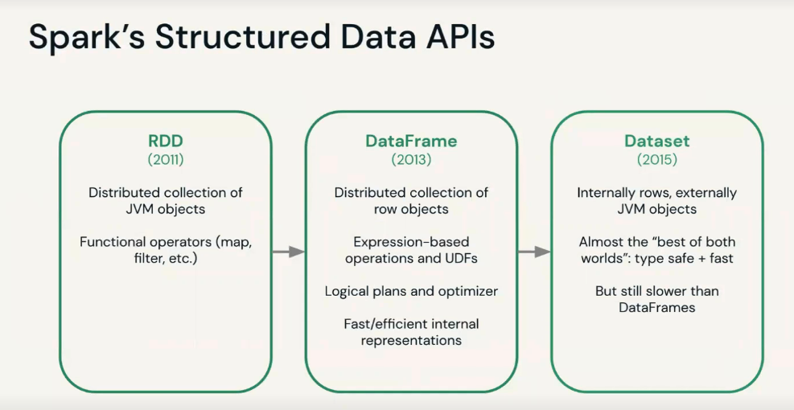

# Databricks Certified Machine Leaning Associate.

## Objetives

- Create Data Processing pipelines with Spark.  
- Build a tune machine learning models with Spark ML.  
- Track, Version, and deploy machine learning models with MLflow.  
- Perform distributed hyperparameter tuning with Hyperopt.  
- Scale the inference of single-node models with Spark.  

## Introduction

### Spark Review

#### Spark Structure Data

### Delta Lake Review  

- Open-source Storage Layer.
- ACID Transactions.  
- Time Travel.  
- Schema enforcement and evolution.(validation schema + allow schema evolotuion over time.).  
- Parquet fromat.  
- Compatible with Apache Spark API.  

### Machine Learning Engineer

- What is machine learning ? Learn patterns and relationships in your data without explicitly programming them.  

#### Machine Learning Workflow

- 1. Define Business Use Case.  
- 2. Define Success, Constraints and infrastructure.  
- 3. Data Collation.  
- 4. Feature Engineering.  
- 5. Modeling.  
- 6. Deployment.  

(Loop)

#### Importance of Data Visualization

## AutoML
AutoML, or Automated Machine Learning, is a process that automates the end-to-end tasks of applying machine learning to real-world problems.
It simplifies the model selection, preprocessing, feature engineering, and hyperparameter tuning steps, making machine learning more accessible and efficient, particularly for non-experts.

## Feature Store

A Feature Store is a centralized repository for storing, managing, and serving pre-processed features for machine learning models. 
It ensures consistency in feature calculations, reduces redundancy, and facilitates easier and more efficient access to features for training and inference across various ML models.

## MLflow

MLflow is an open-source platform for managing the end-to-end machine learning lifecycle, encompassing experiment tracking,
reproducible runs, and model packaging. It simplifies the process of tracking experiments, packaging code into reproducible runs,
 and sharing or deploying models across diverse platforms.
 
`MLflow components` MLflow Tracking for experiment logging, MLflow Projects for packaging ML code, MLflow Models for model packaging and sharingm and MLflow Registry for model versioning.

`What is MLflow used for` Used for managin the n-2-n ml lifecycle including experiment tracking, model development, deployment and lifecycle management.

`MLflow Tracking`: API for logging parameters, code version, metrics etc... Has a UI for reviewing and comparing runs and their results.

`MLflow Models`: Model packaging format and suit of tools that let you easyily deploy a trained model.

`MLflow Model Registry`: A Centralized model store, set of APIs, and UI focused on the appoval quality assurance.

`MLflow Projects`: A standard format for packaging reusable data science code.

`MLflow Recipes`: Predefined templates for developing high-quality models for a variety of common task, including classification and regression.

`MLflow used for`: USed to manage the ML lifecycle from initial model development through deployment and beyond tho sunsetting.

