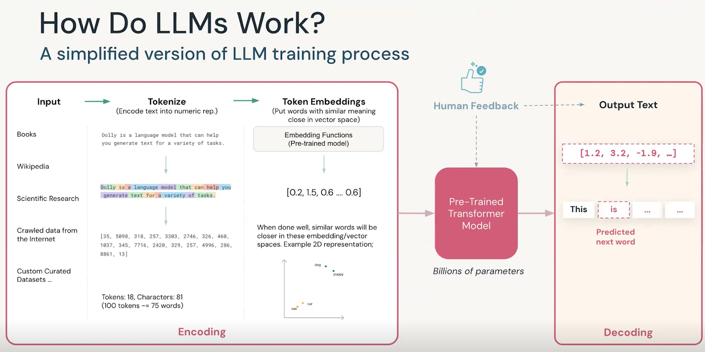
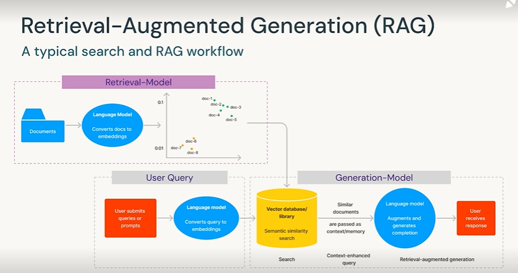
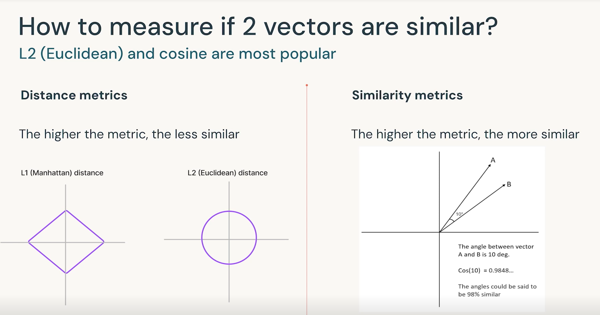
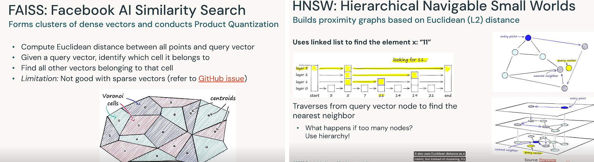
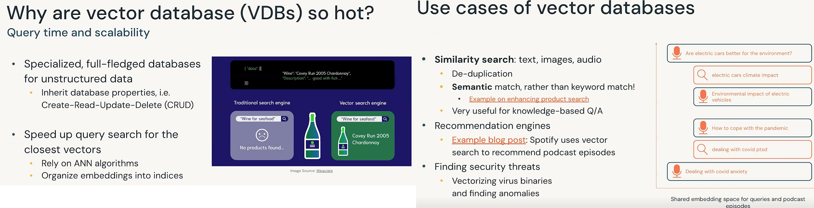

# Generative AI Engineer Associate: Theorie 80-20%

## Index

- [01 Generative AI Basics](#01-generative-ai-basics)
- [02 Databricks Generative AI and NLP](#02-databricks-generative-ai-and-nlp)
- [03 Common Applications with LLM](#03-common-applications-with-llm)
- [04 RAG with Vector Search and Storage](#04-rag-with-vector-search-and-storage)
- [05 Multi-stage Reasoning with LLM Chains](#05-multi-stage-reasoning-with-llm-chains)
- [06 Fine-Tuning LLMs](#06-fine-tuning-llms)
- [07 Evaluating LLMs](#07-evaluating-llms)
- [08 Society and LLMs](#08-society-and-llms)
- [09 LLMs Operations](#09-llms-operations)

## 01 Generative AI Basics

AI --> ML --> DL --> Generative AI:

Generative AI is a Sub-field of AI that focuses on generating new conent such as: 
	- Images
	- Text Audio
	- Code 
	- Synthetic data
	
**Why now ?**  Large Datasets, Computations Power, Innovative DL models (GANs, Transformes, RLHF)   
**Generative AI Use Cases** Image generator, Video Synthesis, 3D Generation, Audio Generation.

### LLMs and Generative AI

Generative AI:
- LLMs: Trained on massive dataset to achive advanced language processing capabilities. Based on Deep Learning NN
	- How LLM work: Encoding Transformer Model Decoding
	
	Propietary Models: Positive - Speed of development, Quality. Negative :- Cost, Data Privacy, Vendor lock-in
	Open Source Models: Task-tailoring, Inference Costs, Control. Netative:- Upfrom time investment, Data requirements, Skill Sets.
	
	**Fine-tuning** The process of further training a pre-trained model on a specific task or datast to adapt it for a particular application or domain.
	
- Fundation Model: Large ML model trained on vast amount of data fine-tuned for more specific language understanding and generation task.
	
## 02 Databricks Generative AI and NLP

Some useful NLP definitions

`Token`: Basic building block.   
`Sequence`: Sequential list of tokents.  
`Vocabulary`: Complete list of tokents.  

#### Word Embeddings

The goal of word embedding is to try and conserve teh context that particula token ahst in this vocabulary.

Langue Model can be spliting in two cathegories: 
- Generate content.
- Classify.

#### What is a Large Language Model 

Language Model - Tranformer: NN architecture that processes sequence of variable lenght using a self-attention mechanism. 2017-Present.

#### How Do LLMs Work?
A simplified version of LLM training process.

1)encoding(input-tokenize-embeddings)
2)Pre-Trained-Transormer-Model.
3)DecodingOutput Text

)

Your data, will be your competitive advantage.

#### Summary

- Common LL; business use cases are; contentcretion, process automation, personalization, code generation.  
- LLMs generate outputs for NLP task such as summarization, classificatin, question anwering, content creation, etc.  
- Databricks Lakehouse AI is a data-centrig Genrative AI platform.  
- With Databricks + MosaicML customers can build their own custom models in a secure enviorment using their own data.
- NLP
	- Is a field of methods to process text.
	- Is useful summarization, tanslation, classificationm, etc.
	- Tokens are the smalles builidng blocks to convert text to numerical vectors, aka N-dimensional embeddings.
	- Language models (LMs) predict words by looking at word probabilities.  
	- LLMs are just LMs with transormer architecutres, but bigger.  
	
	
#### Language Modeling

**TF-IDF**
	TF-IDF, short for Term Frequency-Inverse Document Frequency, is a numerical statistic used in natural language processing to reflect the importance of a word
	to a document in a collection or corpus. It increases proportionally with the number of times a word appears in a document but is offset by the frequency
	of the word in the corpus, helping to adjust for the fact that some words appear more frequently in general.  

**Bag of words**
	
The Bag of Words model is a simplifying representation used in natural language processing where text (such as a sentence or a document) is represented as the bag (multiset) of its words, disregarding grammar and even word order but keeping multiplicity.
Consider the sentence: "The cat chased the mouse."
In the Bag of Words model, this sentence would be represented as a set of word occurrences. The model doesn't care about the order of words, just their presence.
If we create a simple count for each word, the representation might look like this:

- The: 2
- cat: 1
- chased: 1
- mouse: 1

This count indicates the frequency of each word in the sentence. 
The words "the", "cat", "chased", and "mouse" are the individual tokens, and their respective counts reflect how many times they appear in the sentence.

**LSTMs**

#### Word Embeddings

Word embeddings are a type of representation where words from a vocabulay are mapped to vectors of real numbers in a low-dimensional space, relative to the vocabulary size.
This technique captures the semantic meaning, relationships, and context of words, enabling algorithms to undestand language similarly to humans.

**Word2vect**  

**Tensorflow Page on Embeddings**

#### Tokenization

**Byte-Pair Encoding**

**SentencesPiece**

**WordPiece**

**Tokenization Schema**

A tokenization schema defines how text is split into meaningful elements, called tokens, which are the basic units used in text processing and analysis. 
For example, in the sentence "I'm learning NLP!", a simple tokenization might split the sentence into the tokens: ["I'm", "learning", "NLP!"].

## 03 Common Applications with LLM

**Tokenizers**
Tokenizers are tools used to convert text into tokens, which are smaller components such as words or subwords, facilitating easier an d more effetive processing by machine learning models.

**Tasks**

- Task: Sentiment analysis.Stock market analysis: I need to monitor the stock market, and I want to use Twitter commentary as a early indicator of trends.  
- Translation.  
- Zero-shot classification: Categorize articles with a custom set of topic labels, using an existing LLM.  
- Few-shot learning: show a model what you want.  Instead of fine-tuning a model for a task, provide a few examples of that task.  **Powerfull Technie** !!

**Prompt engineering**

A good prompt usually consists of:
- Instruction   
- Context  
- Input/question  
- Output type/format  

Describe the high-level taks with clear commands

- Use specific keywords:"Classify", "Translate", "Summarize", "Extract",...
- Include detailed instructions,  

Test different variations of the promt across different samples  

- Which promt does a better job on average ?

**Hacking prompts**
- Injection: Adding maliciouse content.  
- leaking: Extract sensitive information.  
- Jailbreaking: Byapas moderation rule.

## 04 RAG with Vector Search and Storage

- Explain vector seach strategies and how to evaluate search results.  
- Define the utility of vector databases.  
- Differentiate between vector databases, vector libaries, and vector plugins.  
- Discuss best practices for when to use vector stores and how to improve search-retrieval perfomance.  

**How do language models leanr knowledge ?**

Through `model training` or `fine-tuning`
 is usually better-suied to teach a model specialized tasks.
 
Through model inputs.
	- Insert knowledge or **context** into the input-tokenize-embeddings.  
	- Ask the LM to incorpate the context in its output.  
	
	
### Passing conext to LMs heps factual recall.

Analogy: Take an exam with **open notes**
Downside:
	Context length limitation
		- OpenAI gpt-3.5 accepts a maximum of 4000 tokens as context.
		- Commom mitigation method: pass document summaries instead.
		- Anthropic´s Claude: 100k token limit
	

)

### Vector Search

Vector search strategies.

- k-nearest neighbors(KNN)  
- Approximate nearest neighbors(ANN)  
 - Trade accuracy for speed gains.  
 
### How to measure if 2 vectors are similar ?

### Filtering

### Vector Stores

**Vector libraries or plugings**

- **Libraries**  
  - ANN.  
  - Suficient for small, static data.  
  - Do not have CRUD.   
  - Stored in-memory.    
  - No data replication.  

- **Plugins**  
  - Relational database or search systems may offer vector search plugings.  
  - Less rich features.  
    - Fewer ANN choices.  
  - Less user-freindly APIs.  