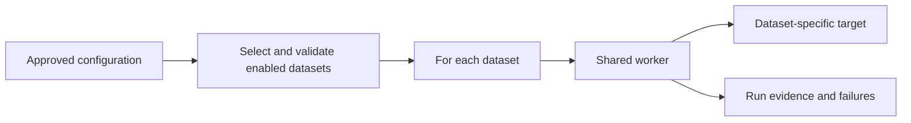

# Processing Many Tables with a Metadata-Driven Job

Status: **Reviewed** documentation; illustrative examples, workspace execution pending.

Last reviewed: 2026-10-03

For data engineers deciding how to reuse Bronze-to-Silver processing across similar tables. The job examples refer to Databricks on AWS with Unity Catalog and Lakeflow Jobs. This is a design guide, not a deployed pipeline.

## Remember first

**Keep shared processing in code; put each dataset's approved configuration in a control table.**

| Approach for N datasets | Reusable logic | Configuration | Main trade-off |
| --- | --- | --- | --- |
| Separate notebook and job per dataset | Little | Embedded in each notebook/job | Simple isolation; repeated changes across N copies |
| One worker, separately configured jobs | One worker | N job configurations | Code reuse with independent scheduling |
| Control table and an orchestrator | One worker per processing pattern | N configuration rows | Central coordination with more validation and operational responsibility |

The old notebook-count model is a maintenance comparison. N notebooks grow **linearly**, not exponentially. A shared worker does not make processing N datasets constant-cost: data volume, compute, configuration, retries, and monitoring still grow with the workload.

## When the pattern fits

Suppose `orders` and `customers` both need the same contract: select approved columns, check required keys, write to a separate target, and record the outcome. A new dataset should mostly add configuration when it obeys that contract.

Keep different transformation families separate. A snapshot replacement, an append-only feed, and an ordered CDC stream have different correctness and recovery requirements. A single generic notebook that hides all three behind arbitrary SQL strings is difficult to reason about.



## Minimal control-table example

Use a disposable `study_lab` catalog and a fresh `orchestration_demo` schema. A setup identity needs permission to create the schema and table. These statements create only configuration; the source and target names are synthetic references, not objects created by this example.

```sql
CREATE SCHEMA study_lab.orchestration_demo;

CREATE TABLE study_lab.orchestration_demo.dataset_config (
  dataset_id STRING NOT NULL,
  source_table STRING NOT NULL,
  target_table STRING NOT NULL,
  processing_pattern STRING NOT NULL,
  enabled BOOLEAN NOT NULL,
  config_version INT NOT NULL
) USING DELTA;

INSERT INTO study_lab.orchestration_demo.dataset_config VALUES
  ('orders', 'study_lab.bronze.orders', 'study_lab.silver.orders',
   'snapshot', true, 1),
  ('customers', 'study_lab.bronze.customers', 'study_lab.silver.customers',
   'snapshot', true, 1);
```

The selector must reject duplicate dataset IDs within the selected version and conflicting target assignments before launching workers. `NOT NULL` does not establish uniqueness. Treat configuration edits as code changes: review them, retain immutable versions for running/retried work, and restrict who can redirect a write. A version number is not sufficient if its row can be overwritten in place.

## Connect configuration to orchestration

One possible Lakeflow Jobs graph is `select_datasets → For each → process_dataset`. The selection task publishes a small array of dataset IDs and versions. The nested worker receives one pair and loads that exact configuration version.

Illustrative output of the selection task:

```python
selected = [
    {"dataset_id": "orders", "config_version": 1},
    {"dataset_id": "customers", "config_version": 1},
]
dbutils.jobs.taskValues.set(key="datasets", value=selected)
```

Configure the `For each` input as `{{tasks.select_datasets.values.datasets}}`; pass `{{input.dataset_id}}` and `{{input.config_version}}` to the nested task. Set concurrency deliberately for source limits and target contention. Large inventories need a bounded selection or a configuration lookup rather than an unlimited task-value payload. See [For each task inputs and limits](https://docs.databricks.com/aws/en/jobs/tasks/for-each).

The literal array above demonstrates the handoff only. A production selector must read and validate the control table; changing that table alone will not change this literal example.

## Worker contract

| Stage | Required behavior |
| --- | --- |
| Resolve | Load exactly one approved dataset/version; reject missing, disabled, or duplicate configuration |
| Authorize | Check source/target namespaces against an allowlist; restrict the job identity's privileges |
| Plan | Dispatch to a supported processing pattern; validate keys, columns, and write semantics |
| Execute | Apply that pattern's idempotency, checkpoint, or transaction strategy |
| Record | Persist dataset ID, configuration version, run ID, source boundary, target, status, and error context |
| Recover | Retry only with the recorded configuration and source boundary; isolate failures per dataset |

An append write is not automatically safe to retry. A shared configuration table is not a checkpoint or an audit log. Keep desired configuration, streaming progress, and execution evidence as separate concepts.

## Failure cases to reason through

| Change or failure | Expected design response |
| --- | --- |
| An operator edits a target during a run | The run uses its pinned version, or stops because that version is unavailable |
| Two enabled rows write the same target | Reject the plan unless an explicitly designed concurrency contract permits it |
| One dataset fails after others succeed | Record each outcome and retry the failed work without duplicating successful writes |
| A source adds a column | Apply that dataset's schema contract; shared code must not silently accept every change |
| A new dataset needs different business rules | Add a reviewed processing pattern or dedicated worker rather than unbounded configuration logic |

Use the [Bronze ingestion guide](bronze-ingestion-patterns.md) for source and checkpoint choices and the [governed-ingestion project](../../projects/governed-ingestion/README.md) for an existing single-source implementation. That project has not been extended into the orchestrator described here.

## Validation and cleanup

Documentation and handoff syntax were checked against the linked official references. No job was deployed and no data-processing result is claimed.

Before treating an implementation as validated, exercise duplicate IDs, invalid targets, a configuration change during a run, a failed worker retry, and an empty selection. Record target row counts and source boundaries, not just a green job status. Measure scheduling overhead and concurrency before assuming the shared design is cheaper.

After the configuration-only exercise, remove the two demo objects as their owner:

```sql
DROP TABLE study_lab.orchestration_demo.dataset_config;
DROP SCHEMA study_lab.orchestration_demo;
```

No source or target datasets are deleted by those statements. A separately deployed job would need its own teardown.

## Check your understanding

**A shared notebook replaces 80 nearly identical notebooks. Have you eliminated the cost of processing 80 datasets?**

<details>
<summary>Show reasoning</summary>

You reduced duplicated implementation work. You still process 80 datasets and maintain their configuration, contracts, permissions, and recovery evidence. Compare operational cost and failure isolation before choosing between separate jobs and one orchestrator.

</details>

## Sources

- [Use a For each task](https://docs.databricks.com/aws/en/jobs/tasks/for-each)
- [Use task values to pass information between tasks](https://docs.databricks.com/aws/en/jobs/task-values)
- [Configure job parameters](https://docs.databricks.com/aws/en/jobs/job-parameters)

The design comparison develops a concept from the owner's historical Professional study notes. The configuration, contract, and practice scenario here are original illustrative examples.
