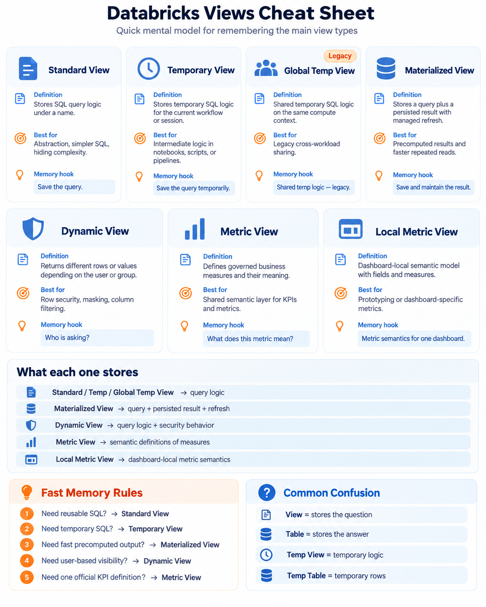

# Databricks Views: A Practical Mental Model

Status: **Reviewed** documentation; SQL/YAML examples are illustrative and have not been executed in a Databricks workspace.

Last reviewed: 2026-10-03

This guide is for data engineers, analytics engineers, architects, and BI developers choosing among Databricks view types. Examples use Databricks on AWS documentation; availability, compute requirements, and Preview status can differ by cloud, region, SQL warehouse, and Databricks Runtime version.



Original study visual retained from the owner's September 2026 notes. Read the sections below for scope and compute requirements that the memory hooks omit. Return to the [study index](../study/README.md) for related topics.

## The core idea

Use this short model first:

- **Table** — stores data.
- **Standard view** — stores query logic.
- **Temporary view** — stores query logic for a limited scope.
- **Global temporary view** — shares temporary logic on one compute resource; this is a legacy feature.
- **Materialized view** — stores a query, persisted results, and managed refresh behavior.
- **Dynamic view** — changes row or column exposure according to the querying identity.
- **Metric view** — centrally defines business measures and the fields used to analyze them.
- **Local metric view** — keeps metric semantics inside one AI/BI dashboard.

## Comparison

| Object | What it stores or controls | Main purpose | Key trade-off |
| --- | --- | --- | --- |
| Standard view | SQL query text | Reusable abstraction | Recomputes when queried |
| Temporary view | Short-lived SQL query text | Intermediate logic | Limited scope and lifetime |
| Global temporary view | Temporary logic shared on one compute resource | Legacy cross-workload sharing | Legacy; avoid in new designs |
| Materialized view | Query, persisted result, and refresh flow | Faster repeated consumption | Refresh cost and data freshness |
| Dynamic view | SQL logic with identity-aware predicates or masking | Fine-grained access control | Security logic must be governed and tested |
| Metric view | Fields, measures, relationships, filters, and semantic metadata | Reusable business definitions | Requires semantic governance |
| Local metric view | Dashboard-local semantic model | Prototyping or dashboard-specific metrics | Not reusable outside that dashboard until promoted |

## Standard views

A standard view registers a SQL query under a name. Creating it does not process or write the query result.

```sql
CREATE VIEW active_customers AS
SELECT
  customer_id,
  customer_name,
  country
FROM customers
WHERE active = true;
```

When a consumer queries the view, Databricks evaluates the registered logic against its sources.

Typical uses include:

- hiding unnecessary columns;
- filtering rows;
- simplifying joins or complex SQL;
- presenting a stable interface over physical tables;
- decoupling consumers from source-model changes.

> **Memory hook:** Save the query.

## Temporary views

A temporary view is short-lived named query logic. It does not materialize a copy of the rows.

```sql
CREATE OR REPLACE TEMP VIEW recent_orders AS
SELECT *
FROM orders
WHERE order_date >= current_date() - INTERVAL 7 DAYS;
```

Its exact scope depends on the environment:

- in notebooks and jobs, it is scoped to the notebook or script and disappears when the notebook detaches from compute;
- in Databricks SQL, it is scoped to one multi-statement query and is unavailable to other queries.

Use a temporary view to name intermediate logic in a transformation:

```text
source data
    ↓
TEMP VIEW clean_orders
    ↓
TEMP VIEW enriched_orders
    ↓
final result
```

> **Memory hook:** Save the query temporarily.

## Global temporary views: legacy

A global temporary view makes temporary logic available to workloads running against the same compute resource and is referenced through the `global_temp` namespace.

```python
df.createGlobalTempView("customers")
```

```sql
SELECT *
FROM global_temp.customers;
```

Databricks classifies global temporary views as a legacy feature and recommends against using them in new designs. Use a Unity Catalog view to share logic or a Unity Catalog table to share data.

> **Memory hook:** Shared temporary logic on one compute resource; legacy.

## Materialized views

A materialized view combines:

```text
defining query
+ persisted result
+ managed refresh flow
```

```sql
CREATE OR REPLACE MATERIALIZED VIEW daily_sales AS
SELECT
  sale_date,
  SUM(amount) AS revenue
FROM sales
GROUP BY sale_date;
```

Databricks materialized views are declarative pipeline objects backed by stored data. A refresh schedule or pipeline update processes upstream changes. Databricks attempts incremental refresh when it is supported and cost-effective, but some changes or queries require a full recomputation.

Consider a materialized view when an expensive result is consumed repeatedly and its refresh plan can meet the consumer's freshness requirement:

```text
large source tables
        ↓
expensive joins and aggregation
        ↓
MATERIALIZED VIEW
        ↓
repeated consumption
```

A table created from a query can hold the same shape of data, but your pipeline must manage scheduling, change detection, write strategy, and recovery. A materialized view moves much of that refresh responsibility into Databricks.

Consider:

- freshness requirements and refresh schedules;
- whether the query can refresh incrementally;
- compute and storage cost;
- full-recomputation risk;
- monitoring and operational ownership.

> **Memory hook:** Save and maintain the result.

## Dynamic views

A dynamic view is a standard SQL view whose logic uses the querying identity or account-group membership to control exposure.

```sql
CREATE VIEW secure_sales AS
SELECT
  region,
  customer,
  CASE
    WHEN is_account_group_member('auditors') THEN email
    ELSE 'REDACTED'
  END AS email,
  revenue
FROM sales
WHERE
  is_account_group_member('management')
  OR region = 'Germany';
```

Two users can run the same query and receive different rows or values.

Typical uses include:

- row-level filtering;
- column-level filtering;
- data masking;
- curated access without direct access to underlying tables.

For Unity Catalog data, prefer `is_account_group_member()` to the workspace-local `is_member()` compatibility function. At larger scale, compare dynamic views with Unity Catalog ABAC policies, row filters, and column masks so access rules remain maintainable.

For a table-level policy driven by project membership, see the [row-security example](../guides/project-membership-row-security.md). A dynamic view is a SQL security pattern; a row filter is a policy attached to a table. They are different enforcement surfaces.

> **Memory hook:** Who is asking, and what may they see?

## Metric views

A Unity Catalog metric view is a governed semantic object. It separates reusable measure definitions from the fields used to group and filter them.

For example:

```text
Business metric: Total Revenue
Technical definition: SUM(units * price)
```

The metric is the business concept. The aggregate expression is its implementation.

Without a shared definition, different consumers can all label incompatible calculations as `Movement Count`:

```text
Power BI        COUNTROWS(fact_movements)
Notebook        COUNT(*)
Dashboard       COUNT(DISTINCT movement_id)
Genie           another interpretation
```

A metric view provides one governed definition.

### Example definition

Metric views can be authored through the Catalog Explorer editor or defined with YAML and SQL DDL. A simplified YAML definition looks like this:

```yaml
version: 1.1
source: catalog.schema.sales

fields:
  - name: store
    expr: store

  - name: product
    expr: product

measures:
  - name: total_revenue
    expr: SUM(units * price)

  - name: units_sold
    expr: SUM(units)

  - name: number_of_sales
    expr: COUNT(DISTINCT sale_id)
```

The same measure can then be grouped in different ways:

```sql
SELECT
  store,
  MEASURE(total_revenue)
FROM catalog.schema.sales_metrics
GROUP BY store;
```

```sql
SELECT
  product,
  MEASURE(total_revenue)
FROM catalog.schema.sales_metrics
GROUP BY product;
```

```sql
SELECT
  store,
  product,
  MEASURE(total_revenue)
FROM catalog.schema.sales_metrics
GROUP BY store, product;
```

The definition of `total_revenue` remains consistent while the query chooses the grouping.

### Metric view versus standard view

A standard view can lock a measure to a grouping:

```sql
SELECT
  store,
  SUM(units * price) AS total_revenue
FROM sales
GROUP BY store;
```

A metric view defines the measure independently and lets consumers group it by the available fields at query time.

> **Standard view:** Save a query.<br>
> **Metric view:** Save the governed meaning of business measures.

Metric views are most valuable when dashboards, notebooks, Genie Agents, SQL users, and downstream BI tools must agree on definitions such as revenue, profit, conversion rate, passenger count, or average delay.

They normally sit above the modeled data:

```text
Bronze
   ↓
Silver
   ↓
Gold or star schema
   ↓
Metric view
   ↓
Dashboards, Genie, BI, and SQL consumers
```

The data model defines entities, facts, relationships, and grain. The metric view defines how consumers measure and interpret that model.

> **Memory hook:** What does this business measure mean?

## Local metric views

Local metric views keep fields, measures, joins, filters, and parameters inside one AI/BI dashboard. They are suitable for:

- prototyping and iteration;
- dashboard-specific analysis;
- authors without Unity Catalog write access;
- validating a semantic definition before broader publication.

When the definition is ready for shared use, it can be exported to Unity Catalog as a reusable metric view.

> **Memory hook:** Metric semantics for one dashboard.

## Temporary view versus temporary table

These objects solve different problems.

| Object | Stores | Use it when |
| --- | --- | --- |
| Temporary view | SQL logic | You want to name an intermediate query |
| Temporary table | Materialized rows | You want to reuse a calculated intermediate result |

```sql
CREATE OR REPLACE TEMP TABLE calculated_orders AS
SELECT ...;
```

Temporary tables are available in Databricks SQL and Databricks Runtime 18.1 or above on supported compute; dedicated compute is not supported. They exist only for the creating session, ending when that session ends or seven days after session creation, whichever comes first. They are not catalog objects and cannot be shared with another user or session.

## Decision guide

Ask these questions in order:

1. **Do I only want to reuse SQL logic?** Use a standard view.
2. **Do I need that logic only inside a short-lived scope?** Use a temporary view.
3. **Do I need to reuse already calculated intermediate rows?** Use a temporary table when supported.
4. **Do I want Databricks to maintain an expensive precomputed result?** Use a materialized view.
5. **Should different identities see different rows or values?** Use a dynamic view or evaluate Unity Catalog policy features.
6. **Must multiple consumers share one definition of a business measure?** Use a Unity Catalog metric view.
7. **Is the semantic definition experimental or limited to one dashboard?** Use a local metric view.

## Validation notes

The SQL and YAML samples are illustrative and use placeholder schemas and tables. Validate them in a non-production catalog with the compute type and Databricks Runtime required by the current documentation. For security examples, test positive and negative access cases with representative account groups before granting consumer access.

## Official references

- [Views](https://docs.databricks.com/aws/en/views)
- [Dynamic views](https://docs.databricks.com/aws/en/views/dynamic)
- [Materialized views](https://docs.databricks.com/aws/en/ldp/concepts/materialized-views)
- [Unity Catalog metric views](https://docs.databricks.com/aws/en/uc-semantics/metric-views/)
- [Create a metric view](https://docs.databricks.com/aws/en/uc-semantics/metric-views/create)
- [Metric view YAML reference](https://docs.databricks.com/aws/en/uc-semantics/metric-views/yaml-reference)
- [Local metric views](https://docs.databricks.com/aws/en/dashboards/manage/data-modeling/local-metric-views)
- [Temporary tables](https://docs.databricks.com/aws/en/tables/temporary-tables)
